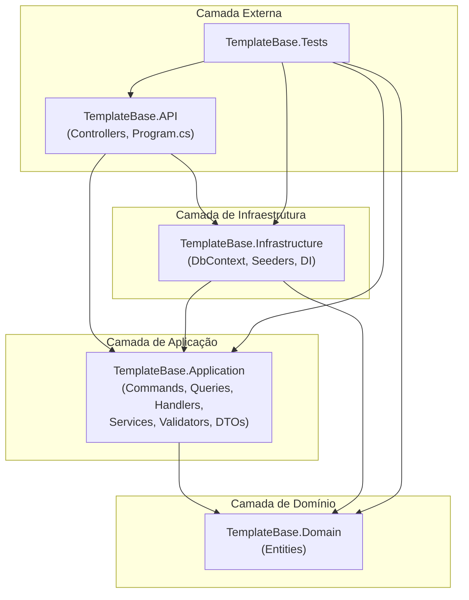
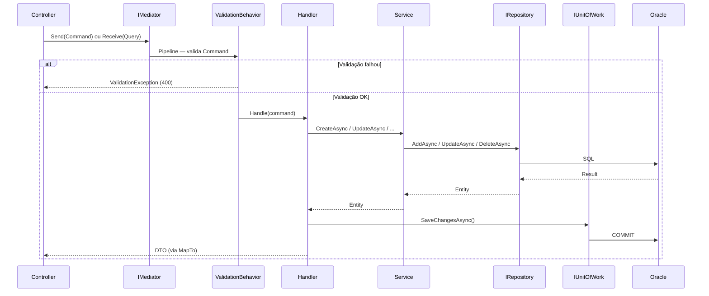
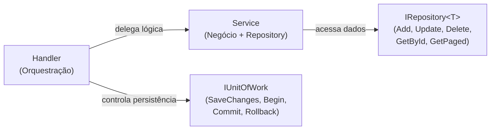

<h1 align="center">TemplateBase</h1>

<p align="center">
  <strong>O ponto de partida oficial para APIs REST no ecossistema FUNCEF.</strong><br/>
  .NET 10 · Clean Architecture · CQRS/Mediator · Service Layer — com Oracle, Entra ID,<br/>
  Key Vault, auditoria e telemetria já integrados e demonstrados em um domínio de exemplo.
</p>

<p align="center">
  <a href="https://dotnet.microsoft.com/download/dotnet/10.0"></a>
  <a href="https://docs.microsoft.com/dotnet/csharp/"></a>
  
  <a href="docs/LICENCA.md"></a>
</p>

<p align="center">
  
  
  
  
  
  
</p>

<p align="center">
  <code>dotnet run --project src/TemplateBase.API</code> &nbsp;→&nbsp; <strong>https://localhost:56055</strong> &nbsp;·&nbsp; Swagger em <code>/swagger</code>
</p>

---

## Sumário

| | Seção | Descrição |
|:---:|-------|---------|
| 1 | [Sobre o projeto](#sec-1) | O que é, o que demonstra e a stack |
| 2 | [Pré-requisitos](#sec-2) | Ferramentas e acessos necessários |
| 3 | [Quick Start](#sec-3) | Da clonagem à API rodando |
| 4 | [Configuração e secrets](#sec-4) | `appsettings`, Key Vault e ambientes |
| 5 | [Docker](#sec-5) | Build e execução em contêiner |
| 6 | [Arquitetura](#sec-6) | Clean Architecture + CQRS/Mediator + Service Layer |
| 7 | [Estrutura do projeto](#sec-7) | Árvore de diretórios e convenções |
| 8 | [Padrão CQRS/Mediator](#sec-8) | Commands, Queries, Handlers e IMediator |
| 9 | [Service Layer](#sec-9) | Papel dos Services vs Handlers |
| 10 | [Estratégia de exceções](#sec-10) | NotFound, Business, Conflict, Validation |
| 11 | [Validação com FluentValidation](#sec-11) | Validators no pipeline do Mediator |
| 12 | [Tutorial: novo CRUD completo](#sec-12) | Passo a passo com a entidade Produto |
| 13 | [Registro de dependências (DI)](#sec-13) | `AddMediatorWithDefaults` e Services |
| 14 | [Testes](#sec-14) | Como testar Handlers, Services e Controllers |
| 15 | [Endpoints da API](#sec-15) | Catálogo completo de rotas |
| 16 | [Troubleshooting](#sec-16) | Erros comuns e como resolver |
| 17 | [Documentação complementar](#sec-17) | Links para os docs detalhados |

---

<a id="sec-1"></a>
## 1. Sobre o projeto

O **TemplateBase** é o template de referência para APIs REST do ecossistema FUNCEF. Ele demonstra o uso integrado dos componentes corporativos em uma aplicação com **Clean Architecture**, **CQRS/Mediator** e **Service Layer**, servindo simultaneamente como **base** para novos projetos e como **guia** dos padrões adotados.

O domínio de exemplo contém as entidades **Cliente** e **Ordem**, com CRUD completo, paginação, filtros, busca e ordenação — pronto para ser estudado e depois substituído pelo domínio real.

> [!TIP]
> Procurando só rodar o projeto? Vá direto para [Pré-requisitos](#sec-2) e [Quick Start](#sec-3). Quer entender os padrões? Comece pela [Arquitetura](#sec-6).

| Recurso | Descrição |
|---------|-----------|
| **CQRS/Mediator** | Commands e Queries processados via `IMediator` com pipeline de validação automático |
| **Service Layer** | Lógica de negócio em Services; controle de transação nos Handlers |
| **Transações** | EF Core (`IUnitOfWork`) e Dapper (SQL direto) na mesma aplicação |
| **Auditoria** | Rastreamento automático via `[Auditable]` com persistência no Oracle Lakehouse (`LOG_AUDIT`) |
| **Autenticação** | Azure Entra ID com OAuth2 + PKCE (interativo) e Client Credentials (M2M) |
| **Validação** | FluentValidation no pipeline do Mediator — rejeita commands inválidos antes do Handler |
| **Mapeamento** | DTOs com `[MapFrom]` e `[NestedMap]` para conversão automática entidade → DTO |
| **Telemetria** | OpenTelemetry + Azure Application Insights (connection string via Key Vault) |
| **Segurança HTTP** | CORS e rate limiting via FuncefEssenciais, `SecurityHeadersMiddleware`, HSTS fora de Dev |

### Stack de tecnologias

| Camada | Tecnologia | Componente FUNCEF |
|:------:|------------|:-----------------:|
| **Runtime** | .NET 10.0 / C# 13 | — |
| **Arquitetura** | Clean Architecture + CQRS/Mediator | `FuncefEssenciais` |
| **Banco** | Oracle (schema `TEMPLATETESTE`) | `FuncefORM` |
| **ORM** | EF Core + Dapper (híbrido) | `FuncefORM` |
| **Autenticação** | Azure Entra ID (OAuth2 + PKCE, M2M) | `FuncefAutenticacao` |
| **Cache** | Redis 7+ | `FuncefNoSql` |
| **Documentos** | MongoDB 8+ (`IDocumentStore<T>`, histórico de ordens) | `FuncefNoSql` |
| **Banco secundário** | SQL Server 2022 — interoperabilidade (opcional, seção `SqlServer`) | `FuncefORM` (`BaseDbContext`) + repositório/UoW locais |
| **Auditoria** | Oracle Lakehouse (`LOG_AUDIT`) | `FuncefORM` |
| **Secrets** | Azure Key Vault | `FuncefCofre` |
| **Telemetria** | OpenTelemetry + Application Insights | `FuncefEssenciais` |
| **Storage** | Azure Blob / Queue / Table | `FuncefArmazenamentos` |
| **Validação** | FluentValidation (pipeline Mediator) | `FuncefEssenciais` |
| **Testes** | MSTest + NSubstitute | — |

> [!NOTE]
> As versões dos componentes FUNCEF são centralizadas em `Directory.Packages.props` (Central Package Management) usando o range `[3.0.0,4.0.0)` — a **linha 3.0** unificada do ecossistema funcef-componentes.

---

<a id="sec-2"></a>
## 2. Pré-requisitos

| Ferramenta / acesso | Versão | Para quê |
|---------------------|--------|----------|
| **.NET SDK** | **10.0.100+** (fixado em `global.json`, `rollForward: latestFeature`) | Build, execução e testes |
| **GitHub PAT** | escopo `read:packages` | Restaurar os pacotes `FUNCEF.*` do GitHub Packages |
| **Oracle** | 23ai+ (schema `TEMPLATETESTE` + `LOG_AUDIT`) — local: container `gvenzl/oracle-free` | **Banco principal**: registro do domínio e auditoria (DDL em `scripts/banco-dados/`). Obrigatório |
| **SQL Server** | 2022 (banco `TEMPLATETESTE`) — local: container `mcr.microsoft.com/mssql/server` | **Banco secundário**: interoperabilidade — dados que não pertencem ao Oracle. Opcional: remova a seção `SqlServer` para desabilitar |
| **Redis** | 7+ — local: container `redis:7-alpine` | Cache distribuído e refresh tokens |
| **MongoDB** | 8+ — local: container `mongo:8.0` | Documentos (`IDocumentStore<T>`, histórico de ordens) |
| **Azure Key Vault** | cofre do sistema, por ambiente | Connection strings e segredos |
| **Azure Entra ID** | App Registration | Autenticação OAuth2/PKCE e M2M |
| **Azure CLI** | última (`az login`) | Acesso ao Key Vault em desenvolvimento |
| **Docker** | última (opcional) | Execução em contêiner |
| **IDE** | Visual Studio 2022+ ou VS Code + C# Dev Kit | Desenvolvimento |

> [!IMPORTANT]
> Os pacotes corporativos vêm do feed privado **GitHub Packages** (`funcef-componentes`). Sem um `GITHUB_TOKEN` válido com escopo `read:packages`, o `dotnet restore` falha com **401**. Veja como configurar no [Quick Start](#sec-3).

---

<a id="sec-3"></a>
## 3. Quick Start

### 3.1 Autenticar no feed e restaurar

```bash
git clone <url-do-repositorio>
cd TemplateBase

# PAT com escopo read:packages (necessário para os pacotes FUNCEF.*)
export GITHUB_TOKEN=<seu_token>          # Linux/macOS
$env:GITHUB_TOKEN = "<seu_token>"        # Windows PowerShell

dotnet restore
```

> [!NOTE]
> O `nuget.config` já aponta para o feed `funcef-componentes` e usa `%GITHUB_TOKEN%` para autenticar, com **package source mapping** (`FUNCEF.*` → GitHub Packages, demais → nuget.org). Não é preciso configurar fontes manualmente.

### 3.2 Configurar o ambiente

Preencha o `appsettings.Development.json` com a URL do Key Vault e os dados do Entra ID. A referência completa está na seção [Configuração e secrets](#sec-4).

### 3.3 Executar a API

```bash
dotnet run --project src/TemplateBase.API
```

A API sobe em **`https://localhost:56055`**.

### 3.4 Verificar saúde e documentação

```bash
curl -k https://localhost:56055/health
```

Swagger UI: **`https://localhost:56055/swagger`** (habilitado em Development).

### 3.5 Executar testes

```bash
dotnet test
```

---

<a id="sec-4"></a>
## 4. Configuração e secrets

A configuração é dividida por ambiente (`appsettings.json` + `appsettings.{Environment}.json`). Valores **públicos** (TenantId, ClientId, Audience, URLs) ficam no `appsettings`; **segredos** ficam no Azure Key Vault e são resolvidos em runtime.

### 4.1 Seções do `appsettings`

| Seção | O que configura |
|-------|-----------------|
| `KeyVault:Url` | URL do Key Vault **deste** sistema, por ambiente (ex.: `https://kv-<sistema>-<env>-001.vault.azure.net/`). Vem como placeholder e **derruba o startup** enquanto não for trocada |
| `FuncefORM:Connection` | Provider Oracle, referência ao cofre (`ConnectionStringFromKeyVault`), timeouts e pool |
| `FuncefORM:Audit` | Auditoria de entidades `[Auditable]` no Oracle Lakehouse (`LOG_AUDIT`) |
| `NoSql:RedisCache` | Cache distribuído e store de refresh tokens |
| `Auth:EntraId` | Azure Entra ID — apenas as referências `*FromKeyVault`, o `CredentialType`, `Instance` e flags de validação |
| `Auth:Audit` | Auditoria de acesso (login/logout/falhas) no Oracle |
| `Auth:RefreshToken` | Rotação de refresh tokens (storage em Redis) |
| `Auth:Pat` | Aceite de PAT do GAP por introspecção (desligado por padrão) |
| `Storage` | Azure Blob / Queue / Table / File Share / Data Lake |
| `Cors` | Política e origens permitidas (`Politica`, `OriginsPermitidas`) |
| `RateLimiting` | Limite por IP, janela e rotas excluídas |
| `ApplicationInsights` | Telemetria (connection string via Key Vault) |

### 4.2 Secrets no Key Vault do seu sistema

Não existe cofre corporativo único: **cada microsserviço tem o seu, um por ambiente** (`kv-api-<sistema>-dev-001`, `-hml-`, `-prd-`). Crie estes secrets no cofre do ambiente — os nomes são referenciados pelo `appsettings`, e é a **chave** do appsettings que é fixa, nunca o nome do segredo:

| Secret | Usado por | Conteúdo | Obrigatório |
|--------|-----------|----------|-------------|
| `glb-entraid-tenantid` | `Auth:EntraId:TenantIdFromKeyVault` | Tenant ID do Entra (compõe a Authority) | ✅ |
| `glb-entraid-clientid` | `Auth:EntraId:ClientIdFromKeyVault` | Client ID do App Registration **desta** API | ✅ |
| `glb-entraid-audience` | `Auth:EntraId:AudienceFromKeyVault` | Audience aceita nos tokens desta API | ✅ |
| `glb-auth-refresh-jwt` | `Auth:RefreshToken:SigningKeyFromKeyVault` | Chave HMAC-SHA256 (mín. 32 caracteres) | ✅ enquanto `Auth:RefreshToken:Enabled` |
| `glb-appinsights-key` | `ApplicationInsights:ConnectionStringFromKeyVault` | Connection string do Application Insights | — |
| `api-oracle-conn` | `FuncefORM:Connection:ConnectionStringFromKeyVault` | Connection string Oracle (dados da aplicação) | ✅ |
| `api-oracle-audit` | `FuncefORM:Audit` + `Auth:Audit` (`ConnectionStringFromKeyVault`) | Connection string Oracle de **auditoria** (`LOG_AUDIT`) | — |
| `api-redis-conn` | `NoSql:RedisCache:ConnectionStringFromKeyVault` | Connection string Redis (cache + refresh tokens) | — |
| `api-sqlserver-conn` | `SqlServer:ConnectionStringFromKeyVault` | Connection string do banco secundário (opcional) | — |
| `api-blob-uri` | `Storage:StorageAccountUriFromKeyVault` | URI da Storage Account | — |

> [!TIP]
> **Convenção de nomes.** `glb-*` para segredos **globais**, compartilhados entre sistemas (identificadores do Entra, chave de assinatura, App Insights); `api-*` para os **da própria API** (bancos, cache, storage). O prefixo comunica o raio de impacto de uma rotação: mexer num `glb-*` atinge outros sistemas.
>
> Para `CredentialType: "ClientSecret"` ou `"Certificate"`, acrescente também `Auth:EntraId:ClientSecretFromKeyVault` ou `ClientCertificateFromKeyVault` — o template não os declara porque nasce secretless (`ManagedIdentity`).

> [!IMPORTANT]
> **Forma canônica única.** Toda referência a segredo é uma subseção `<Coisa>FromKeyVault` com `Enabled` + `SecretName` (o tipo `SecretRef` de `FUNCEF.Abstractions`). É fixa a **chave** do `appsettings`, nunca o **nome do segredo** — que é do cofre do seu sistema. As sintaxes antigas (`*KeyName`, `SecretName` cru, `UseKeyVaultForX` + `XSecretName`) foram **removidas** dos componentes: uma chave antiga não quebra o build nem o startup, apenas é ignorada — e o segredo nunca é resolvido. Mapa completo em `FUNCEF.Abstractions/docs/CONFIGURACAO-FUNCEF.md`.

> [!IMPORTANT]
> Os identificadores do Entra ID **não** ficam no `appsettings` — só as referências `*FromKeyVault`. Se `glb-entraid-tenantid`, `glb-entraid-clientid` ou `glb-entraid-audience` não resolverem, a API **não sobe** e a exceção nomeia a chave e o segredo esperado (vale em todos os ambientes, inclusive `Development`, que exige `az login` + role **Key Vault Secrets User**). Ao criar um projeto novo, cadastre os três no cofre do ambiente apontando para o **seu** App Registration — antes, o startup falha de propósito, em vez de autenticar silenciosamente contra a aplicação errada.

> [!TIP]
> `Auth:EntraId:Scope` e `Auth:M2M:AllowedTenantIds`, quando vazios, são derivados do ClientId/TenantId resolvidos (`api://{ClientId}/user_impersonation` e o próprio tenant) — não ocupam segredo no cofre.

> [!TIP]
> A auditoria de **entidades** (`FuncefORM:Audit`) e a de **acesso** (`Auth:Audit`) são duas auditorias distintas sobre **uma** conexão: as duas seções apontam para o mesmo secret `api-oracle-audit` em `ConnectionStringFromKeyVault`. Repetir o **nome do segredo** é seguro (não é o segredo) e deixa a coincidência visível; repetir a connection string em texto plano, não.

> [!TIP]
> **Credencial de client secretless.** O padrão do template é `Auth:EntraId:CredentialType: "ManagedIdentity"` (Workload Identity Federation), por isso as referências ao client secret e ao certificado vêm com `Enabled: false`. Em `Development` isso não funciona — o `DefaultAzureCredential` devolve token de **usuário** e o Entra o rejeita como assertion federada (`AADSTS700222`) —, então `AddInfrastructureDevelopment` registra a `DeveloperUserCredential`, que usa o token delegado do `az login`. Ela **só** atende recursos que aceitam token delegado (o Microsoft Graph é o caso típico); recursos que exigem app role atribuída à aplicação continuam respondendo 403 em dev.

### 4.3 Ambientes

| Arquivo | Ambiente | Observação |
|---------|----------|------------|
| `appsettings.json` | Produção (base) | Tudo via Key Vault; Swagger desabilitado; CORS restrito |
| `appsettings.Development.json` | Desenvolvimento local | Swagger habilitado; valores diretos permitidos |
| `appsettings.Homologation.json` | Homologação | Mesma postura de Produção, com endpoints de HML |

> [!WARNING]
> Nunca faça commit de `ClientSecret`, connection strings ou tokens no `appsettings`. Use sempre `<Coisa>FromKeyVault` (`Enabled` + `SecretName`) apontando para o Key Vault. Em desenvolvimento, autentique-se com `az login` (role **Key Vault Secrets User**).

---

<a id="sec-5"></a>
## 5. Docker

O `Dockerfile` é multi-stage (SDK para build, ASP.NET runtime para execução) e restaura os pacotes FUNCEF usando um **build secret** com o `GITHUB_TOKEN` — o token não fica gravado na imagem.

### 5.1 Build

```bash
# o token é passado como secret de build (não persiste em camada nenhuma)
docker build --secret id=github_token,env=GITHUB_TOKEN -t templatebase-api .
```

### 5.2 Execução

```bash
docker run --rm -p 8080:8080 \
  -e ASPNETCORE_ENVIRONMENT=Development \
  templatebase-api
```

| Aspecto | Valor |
|---------|-------|
| Portas expostas | `8080` (HTTP), `8443` (HTTPS) |
| `ASPNETCORE_URLS` | `http://+:8080` |
| Healthcheck | `curl /health/live` a cada 30s |
| Entrypoint | `dotnet TemplateBase.API.dll` |

> [!NOTE]
> O `--secret` exige BuildKit (padrão no Docker atual). Exporte `GITHUB_TOKEN` antes do `docker build`, exatamente como no [Quick Start](#sec-3).

---

<a id="sec-6"></a>
## 6. Arquitetura

O projeto segue **Clean Architecture** com 4 camadas e **CQRS/Mediator com Service Layer**:



### Fluxo de uma requisição



### Responsabilidades por camada

| Camada | Responsabilidade |
|--------|-----------------|
| **Domain** | Entidades de negócio, sem dependência de frameworks |
| **Application** | Commands, Queries, Handlers, Services, Validators, DTOs, Exceptions |
| **Infrastructure** | DbContext, Seeders, registro de DI (ORM, Auth, NoSQL, Storage, Telemetria) |
| **API** | Controllers, `Program.cs`, pipeline HTTP |

> [!NOTE]
> Detalhes completos em [docs/ARQUITETURA.md](docs/ARQUITETURA.md).

---

<a id="sec-7"></a>
## 7. Estrutura do projeto

```
TemplateBase/
│
├── src/
│   ├── TemplateBase.API/
│   │   ├── Controllers/                   ← ClientesController, OrdensController
│   │   ├── Diagnostics/                   ← EntraTokenDiagnosticsHandler, M2MStartupValidator, StartupDiagnostics
│   │   ├── HealthChecks/                  ← Checks de Redis, MongoDB, SQL Server
│   │   ├── Middleware/                    ← SecurityHeadersMiddleware
│   │   ├── Stores/                        ← Módulos de registro: Presentation, Security, HealthCheck
│   │   ├── wwwroot/                       ← Páginas estáticas (login, dashboard)
│   │   ├── DependencyInjection.cs         ← AddApiServices() — compõe as três camadas
│   │   ├── ApiPipeline.cs                 ← UseApiPipeline() — middlewares e endpoints
│   │   ├── Program.cs                     ← ~20 linhas: registra, constrói, monta o pipeline
│   │   └── appsettings.*.json             ← Configurações por ambiente
│   │
│   ├── TemplateBase.Application/
│   │   ├── Abstractions/
│   │   │   ├── Configuration/             ← ConfigurationSections (fonte única das seções/condições)
│   │   │   └── Persistence/               ← ISqlServerRepository<T>, ISqlServerUnitOfWork
│   │   ├── Commands/                      ← Command + Validator + Handler por operação de escrita
│   │   │   ├── Cliente/                   ← Create, Update, Delete, CreateComOrdemEf, CreateComOrdemDapper
│   │   │   └── Ordem/                     ← Create, Update, UpdateStatus, Delete
│   │   ├── Queries/                       ← Query + Handler por operação de leitura
│   │   │   ├── Cliente/                   ← GetById, GetPaged
│   │   │   └── Ordem/                     ← GetById, GetPaged, GetByCliente, GetHistorico
│   │   ├── Services/                      ← Orquestração de negócio (Cliente, Ordem)
│   │   ├── Documents/                     ← OrdemHistoricoDocumento (POCO, sem driver Mongo)
│   │   ├── DTOs/                          ← Request, Response, Resume por entidade
│   │   ├── Stores/                        ← Mediator + DomainServices (módulos de registro)
│   │   └── DependencyInjection.cs         ← AddApplication(configuration)
│   │
│   ├── TemplateBase.Domain/
│   │   └── Entities/                      ← Cliente, Ordem, StatusOrdem (entidades ricas + máquina de estados)
│   │
│   └── TemplateBase.Infrastructure/
│       ├── Configuration/                 ← VaultBootstrap, KeyVault e validação de config
│       ├── Persistence/
│       │   ├── Context/                   ← AppDbContext (Oracle), SqlServerDbContext
│       │   ├── SqlServer/                 ← SqlServerRepository<T>, SqlServerUnitOfWork
│       │   ├── Documents/                 ← Mapeamento Bson (BsonClassMap)
│       │   └── Seeders/                   ← ClienteSeeder, OrdemSeeder (Oracle, dev)
│       ├── Services/                      ← OrdemHistoricoService (MongoDB)
│       ├── Stores/                        ← 10 módulos de registro (um por preocupação)
│       └── DependencyInjection.cs         ← AddInfrastructure() / AddInfrastructureDevelopment()
│
├── tests/
│   └── TemplateBase.Tests/                ← MSTest + NSubstitute
│
├── docs/                                  ← Documentação técnica
├── Directory.Packages.props              ← Versões centralizadas (CPM)
├── nuget.config                          ← Feed GitHub Packages + source mapping
├── global.json                           ← Pin do SDK .NET
├── Dockerfile                            ← Build/execução em contêiner
└── TemplateBase.slnx                      ← Solution file (.slnx)
```

### Convenções de nomenclatura

| Artefato | Padrão | Exemplo |
|:---------|--------|---------|
| Command | `{Ação}{Entidade}Command` | `CreateClienteCommand`, `UpdateOrdemCommand` |
| Query | `Get{Entidade}{Detalhe}Query` | `GetClienteByIdQuery`, `GetOrdemPagedQuery` |
| Command Handler | `{Ação}{Entidade}Handler` | `CreateClienteHandler`, `DeleteOrdemHandler` |
| Query Handler | `Get{Entidade}{Detalhe}Handler` | `GetClienteByIdHandler`, `GetOrdemPagedHandler` |
| Validator | `{Ação}{Entidade}Validator` | `CreateClienteValidator`, `UpdateOrdemStatusValidator` |
| Service Interface | `I{Entidade}Service` | `IClienteService`, `IOrdemService` |
| Service | `{Entidade}Service` | `ClienteService`, `OrdemService` |
| DTO Request | `{Entidade}Request` ou `{Ação}{Entidade}Request` | `ClienteRequest`, `CreateOrdemRequest` |
| DTO Response | `{Entidade}Response` | `ClienteResponse`, `OrdemResponse` |
| DTO Resume | `{Entidade}Resume` | `ClienteResume`, `OrdemResume` |
| Pasta Command | `Commands/{Entidade}/{Ação}/` | `Commands/Cliente/Create/` |
| Pasta Query | `Queries/{Entidade}/{Detalhe}/` | `Queries/Cliente/GetById/` |

---

<a id="sec-8"></a>
## 8. Padrão CQRS/Mediator

O TemplateBase usa CQRS onde **Commands** modificam estado e **Queries** apenas leem dados. Ambos são enviados ao **IMediator**, que os roteia para o Handler correspondente, passando pelo pipeline de validação.

### 8.1 Interfaces do FuncefEssenciais

```csharp
// Comando que retorna resultado
public interface ICommand<TResult> { }

// Comando void (sem retorno)
public interface ICommand { }

// Query que retorna resultado
public interface IQuery<TResponse> { }

// Handler de Command com retorno
public interface ICommandHandler<TCommand, TResponse>
    where TCommand : ICommand<TResponse>
{
    Task<TResponse> Handle(TCommand command, CancellationToken cancellationToken);
}

// Handler de Command void
public interface ICommandHandler<TCommand>
    where TCommand : ICommand
{
    Task Handle(TCommand command, CancellationToken cancellationToken);
}

// Handler de Query
public interface IQueryHandler<TQuery, TResponse>
    where TQuery : IQuery<TResponse>
{
    Task<TResponse> Handle(TQuery query, CancellationToken cancellationToken);
}

// Mediator — ponto central de despacho
public interface IMediator
{
    Task<TResponse> Send<TResponse>(ICommand<TResponse> command, CancellationToken ct = default);
    Task Send(ICommand command, CancellationToken ct = default);
    Task<TResponse> Receive<TResponse>(IQuery<TResponse> query, CancellationToken ct = default);
}
```

### 8.2 Exemplo de Command

```csharp
using FuncefEssenciais.Application.Commands;
using TemplateBase.Application.DTOs.ClienteDto.Request;
using TemplateBase.Application.DTOs.ClienteDto.Response;

namespace TemplateBase.Application.Commands.Cliente.Create;

public class CreateClienteCommand : ICommand<ClienteResponse>
{
    public ClienteRequest Request { get; set; } = new();
}
```

### 8.3 Exemplo de Command Handler

O Handler recebe o Command, delega ao Service e controla persistência via `IUnitOfWork`:

```csharp
using FuncefEssenciais.Application.Commands;
using FuncefORM.Contracts;
using FuncefORM.Mapping.Extensions;
using TemplateBase.Application.DTOs.ClienteDto.Response;
using TemplateBase.Application.Services;

namespace TemplateBase.Application.Commands.Cliente.Create;

public class CreateClienteHandler : ICommandHandler<CreateClienteCommand, ClienteResponse>
{
    private readonly IClienteService _service;
    private readonly IUnitOfWork _unitOfWork;

    public CreateClienteHandler(IClienteService service, IUnitOfWork unitOfWork)
    {
        _service = service;
        _unitOfWork = unitOfWork;
    }

    public async Task<ClienteResponse> Handle(CreateClienteCommand command, CancellationToken cancellationToken)
    {
        var cliente = await _service.CreateAsync(command.Request, cancellationToken);
        await _unitOfWork.SaveChangesAsync(cancellationToken);
        return cliente.MapTo<Domain.Entities.Cliente, ClienteResponse>();
    }
}
```

### 8.4 Exemplo de Query

```csharp
using FuncefEssenciais.Application.Queries;
using TemplateBase.Application.DTOs.ClienteDto.Response;

namespace TemplateBase.Application.Queries.Cliente.GetById;

public class GetClienteByIdQuery : IQuery<ClienteResponse>
{
    public long Id { get; set; }
    public bool IncluirOrdens { get; set; }
}
```

### 8.5 Exemplo de Query Handler

Queries não usam `IUnitOfWork` — apenas leem dados:

```csharp
using FuncefEssenciais.Application.Queries;
using FuncefEssenciais.Exceptions;
using FuncefORM.Mapping.Extensions;
using TemplateBase.Application.DTOs.ClienteDto.Response;
using TemplateBase.Application.Services;

namespace TemplateBase.Application.Queries.Cliente.GetById;

public class GetClienteByIdHandler : IQueryHandler<GetClienteByIdQuery, ClienteResponse>
{
    private readonly IClienteService _service;

    public GetClienteByIdHandler(IClienteService service)
    {
        _service = service;
    }

    public async Task<ClienteResponse> Handle(GetClienteByIdQuery query, CancellationToken cancellationToken)
    {
        var cliente = query.IncluirOrdens
            ? await _service.GetByIdWithAutoIncludesAsync(query.Id, cancellationToken)
            : await _service.GetByIdAsync(query.Id, cancellationToken);

        if (cliente is null)
            throw NotFoundException.ForResource("Cliente", query.Id);

        return cliente.MapTo<Domain.Entities.Cliente, ClienteResponse>();
    }
}
```

### 8.6 Controller com IMediator

Os controllers recebem `IMediator` e usam `Send()` para Commands e `Receive()` para Queries:

```csharp
[Route("[controller]")]
[ApiController]
public class ClientesController(ITelemetry telemetry, IMediator mediator) : BaseController(telemetry)
{
    private readonly IMediator _mediator = mediator;

    [HttpPost]
    [FuncefAuthorize(Acao = "Funcef.Template/clientes/write")]
    public async Task<IActionResult> Create(
        [FromBody] ClienteRequest request,
        CancellationToken cancellationToken = default)
    {
        var result = await _mediator.Send(
            new CreateClienteCommand { Request = request },
            cancellationToken);

        return ApiCreated(result);
    }

    [HttpGet("{id:long}")]
    [FuncefAuthorize(Acao = "Funcef.Template/clientes/read")]
    public async Task<IActionResult> Get(
        long id,
        [FromQuery] bool incluirOrdens = false,
        CancellationToken cancellationToken = default)
    {
        var result = await _mediator.Receive(
            new GetClienteByIdQuery { Id = id, IncluirOrdens = incluirOrdens },
            cancellationToken);

        return ApiOk(result);
    }

    [HttpDelete("{id:long}")]
    [FuncefAuthorize(Acao = "Funcef.Template/clientes/write")]
    public async Task<IActionResult> Delete(
        long id,
        CancellationToken cancellationToken = default)
    {
        await _mediator.Send(new DeleteClienteCommand { Id = id }, cancellationToken);
        return ApiNoContent();
    }
}
```

| Método do Controller | Retorno | HTTP Status |
|---------------------|---------|:-----------:|
| `ApiOk(result)` | Dados | 200 |
| `ApiCreated(result)` | Dados criados | 201 |
| `ApiNoContent()` | Sem corpo | 204 |

---

<a id="sec-9"></a>
## 9. Service Layer

A Service Layer encapsula a **lógica de negócio** e o **acesso a dados** via `IRepository<T>`. Os Handlers orquestram os Services e controlam a **persistência** via `IUnitOfWork`.

### 9.1 Regra de responsabilidade



| Componente | Responsabilidade | Injeta |
|-----------|-----------------|--------|
| **Handler** | Orquestra o fluxo, controla transação, faz mapeamento DTO | `IService`, `IUnitOfWork` |
| **Service** | Validações de negócio, acesso a dados, regras de domínio | `IRepository<T>` |

### 9.2 Exemplo de interface de Service

```csharp
public interface IClienteService
{
    Task<Cliente> CreateAsync(ClienteRequest request, CancellationToken cancellationToken = default);
    Task<Cliente> UpdateAsync(long id, ClienteRequest request, CancellationToken cancellationToken = default);
    Task ValidateAndDeleteAsync(long id, CancellationToken cancellationToken = default);
    Task<Cliente?> GetByIdAsync(long id, CancellationToken cancellationToken = default);
    Task<Cliente?> GetByIdWithAutoIncludesAsync(long id, CancellationToken cancellationToken = default);
    Task<PaginatedResult<Cliente>> GetPagedAsync(PagedRequest request, ...);
}
```

### 9.3 Exemplo de implementação de Service

O Service usa `IRepository<T>` para acesso a dados e lança exceções para regras de negócio. As **invariantes da entidade** (nome obrigatório, limites de tamanho) ficam na própria entidade — a factory `Cliente.Criar` é a única forma de nascer um `Cliente` válido (DDD). O Service fica com as regras que envolvem **outros registros** (ex.: unicidade de e-mail):

```csharp
public class ClienteService : IClienteService
{
    private readonly IRepository<Cliente> _repository;
    private readonly IRepository<Ordem> _ordemRepository;

    public ClienteService(IRepository<Cliente> repository, IRepository<Ordem> ordemRepository)
    {
        _repository = repository;
        _ordemRepository = ordemRepository;
    }

    public virtual async Task<Cliente> CreateAsync(ClienteRequest request, CancellationToken cancellationToken = default)
    {
        if (!string.IsNullOrEmpty(request.Email)
            && await _repository.ExistsAsync(c => c.Email == request.Email, cancellationToken: cancellationToken))
        {
            throw new ConflictException("Cliente", "Já existe um cliente com este email");
        }

        // Factory da entidade garante as invariantes; o Id (identity) é gerado pelo banco.
        var entity = Cliente.Criar(request.Nome, request.Email);

        await _repository.AddAsync(entity, cancellationToken);
        return entity;
    }

    public virtual async Task ValidateAndDeleteAsync(long id, CancellationToken cancellationToken = default)
    {
        var cliente = await _repository.GetByIdAsync(id, cancellationToken: cancellationToken)
            ?? throw NotFoundException.ForResource("Cliente", id);

        var temOrdens = await _ordemRepository.ExistsAsync(
            o => o.ClienteId == id, cancellationToken: cancellationToken);

        if (temOrdens)
            throw new ConflictException("Cliente", "Não é possível excluir cliente que possui ordens");

        await _repository.DeleteAsync(cliente, cancellationToken);
    }
}
```

### 9.4 Transações explícitas (EF Core)

Para operações que envolvem múltiplos Services, o Handler controla a transação explicitamente:

```csharp
public class CreateClienteComOrdemEfHandler : ICommandHandler<CreateClienteComOrdemEfCommand, ClienteComOrdemResponse>
{
    private readonly IClienteService _clienteService;
    private readonly IOrdemService _ordemService;
    private readonly IUnitOfWork _unitOfWork;

    public async Task<ClienteComOrdemResponse> Handle(
        CreateClienteComOrdemEfCommand command, CancellationToken cancellationToken)
    {
        await _unitOfWork.BeginAsync(cancellationToken);

        try
        {
            var cliente = await _clienteService.CreateAsync(clienteRequest, cancellationToken);
            await _unitOfWork.SaveChangesAsync(cancellationToken);

            var ordem = await _ordemService.CreateAsync(ordemRequest, cancellationToken);
            await _unitOfWork.SaveChangesAsync(cancellationToken);

            await _unitOfWork.CommitAsync(cancellationToken);
            return new ClienteComOrdemResponse { /* ... */ };
        }
        catch
        {
            await _unitOfWork.RollbackAsync(cancellationToken);
            throw;
        }
    }
}
```

### 9.5 Transações com Dapper (SQL direto)

Os Services também expõem métodos Dapper para SQL direto, mantendo a mesma estrutura de transação no Handler:

```csharp
// No Service — CLIENTE_ID é identity: o banco gera o Id e o devolve via RETURNING INTO
public virtual async Task<long> CreateWithDapperAsync(
    ClienteComOrdemRequest request, DateTime dataAtual, CancellationToken ct = default)
{
    const string sql = @"
        INSERT INTO TEMPLATETESTE.TB_CLIENTES (NOME, EMAIL, DATA_CRIACAO, DATA_INCLUSAO_ALTERACAO)
        VALUES (:Nome, :Email, :DataCriacao, :DataInclusaoAlteracao)
        RETURNING CLIENTE_ID INTO :Id";

    var parameters = new DynamicParameters();
    parameters.Add("Nome", request.NomeCliente, DbType.String);
    parameters.Add("Email", request.EmailCliente, DbType.String);
    parameters.Add("DataCriacao", dataAtual, DbType.DateTime);
    parameters.Add("DataInclusaoAlteracao", dataAtual, DbType.DateTime);
    parameters.Add("Id", dbType: DbType.Int64, direction: ParameterDirection.Output);

    await _repository.ExecuteAsync(sql, parameters, ct);
    return parameters.Get<long>("Id");
}
```

---

<a id="sec-10"></a>
## 10. Estratégia de exceções

Os Handlers e Services lançam exceções tipadas que são capturadas pelo `GlobalExceptionMiddleware` e convertidas em respostas HTTP padronizadas.

| Exceção | HTTP Status | Uso |
|---------|:-----------:|-----|
| `NotFoundException` | 404 | Recurso não encontrado |
| `BusinessException` | 422 | Violação de regra de negócio |
| `ConflictException` | 409 | Conflito de unicidade ou estado |
| `ValidationException` | 400 | Falha de validação FluentValidation (automático via pipeline) |

### Exemplos de uso

```csharp
// 404 — recurso não encontrado
throw NotFoundException.ForResource("Cliente", id);

// 422 — regra de negócio violada
throw new BusinessException("Status inválido para esta operação", "INVALID_STATUS");

// 409 — conflito (unicidade, estado)
throw new ConflictException("Cliente", "Já existe um cliente com este email");
```

### ConflictException (fornecida pelo FuncefEssenciais)

> [!NOTE]
> A partir da v4, a `ConflictException` é parte do **FuncefEssenciais** (`FuncefEssenciais.Exceptions`) e já é mapeada nativamente para **409 Conflict** pelo `GlobalExceptionMiddleware`. Não é mais necessário declarar uma exceção customizada nem registrar mapeamentos manuais.

```csharp
using FuncefEssenciais.Exceptions;

// nomeRecurso + mensagem (expõe a propriedade NomeRecurso)
throw new ConflictException("Cliente", "Já existe um cliente com este email");
```

### Registro no Program.cs

```csharp
// ConflictException já é tratada pelo handler global — sem mapeamentos customizados.
app.UseGlobalExceptionHandler();
```

---

<a id="sec-11"></a>
## 11. Validação com FluentValidation

Os Validators são executados **automaticamente** pelo pipeline do Mediator (`ValidationBehavior`) antes do Handler processar o Command. Se a validação falhar, uma `ValidationException` é lançada e o request é rejeitado com HTTP 400.

### 11.1 Validators validam o Command

Os Validators validam o **Command** (não o DTO Request diretamente):

```csharp
using FluentValidation;
using FuncefEssenciais.Core.Validation.FluentValidation;

namespace TemplateBase.Application.Commands.Cliente.Create;

public class CreateClienteValidator : AbstractValidator<CreateClienteCommand>
{
    public CreateClienteValidator()
    {
        this.RuleForRequiredText(x => x.Request.Nome, "nome", 100);
        this.RuleForOptionalEmail(x => x.Request.Email, maxLength: 150);
    }
}
```

### 11.2 Queries não possuem Validators

Apenas Commands possuem Validators. Queries são validadas no próprio Handler quando necessário.

### 11.3 Métodos de conveniência (FuncefEssenciais)

| Método | Uso |
|--------|-----|
| `RuleForRequiredText(x => x.Nome, "nome", 100)` | Texto obrigatório com tamanho máximo |
| `RuleForOptionalText(x => x.Descricao, "descrição", 500)` | Texto opcional com tamanho máximo |
| `RuleForOptionalEmail(x => x.Email, maxLength: 150)` | Email opcional, formato válido |
| `RuleForRequiredId(x => x.Id, "ID do cliente")` | Identificador obrigatório — genérico (`long`, `int`, `Guid` ou `string`) |
| `RuleForPositiveDecimal(x => x.Valor)` | Decimal maior que zero |
| `RuleForRequiredAllowedValues(x => x.Status, valores, "status")` | Valor em lista permitida |
| `RuleForPagination(x => x.Pagina, x => x.TamanhoPagina)` | Página e tamanho válidos |
| `RuleForSortField(x => x.OrdenarPor, allowedFields)` | Campo de ordenação permitido |
| `RuleForSortDirection(x => x.DirecaoOrdenacao)` | Direção asc/desc válida |

### 11.4 Registro automático

Os Validators são registrados automaticamente via `AddMediatorWithDefaults()` (Scrutor scan). Não é necessário registrar cada um manualmente.

---

<a id="sec-12"></a>
## 12. Tutorial: novo CRUD completo

Passo a passo para adicionar uma entidade **Produto** com CRUD completo seguindo a arquitetura padrão.

### Passo 1 — Entidade no Domain

Crie `src/TemplateBase.Domain/Entities/Produto.cs` seguindo o padrão de **entidade rica (DDD)** usado por `Cliente`/`Ordem`: setters `internal`, factory estática que garante as invariantes e Id `long` gerado pelo banco (coluna identity):

```csharp
using System.ComponentModel.DataAnnotations;
using System.ComponentModel.DataAnnotations.Schema;
using FuncefEssenciais.Exceptions;
using FuncefORM.Audit.Attributes;

namespace TemplateBase.Domain.Entities;

[Table("TB_PRODUTOS", Schema = "TEMPLATETESTE")]
[Auditable("Produto")]
public class Produto
{
    public const int NomeTamanhoMaximo = 200;

    /// <summary>Construtor de infraestrutura: EF Core e testes (via InternalsVisibleTo).</summary>
    internal Produto()
    {
    }

    [Key]
    [Column("PRODUTO_ID")]
    [DatabaseGenerated(DatabaseGeneratedOption.Identity)]
    public long Id { get; internal set; }

    [Required]
    [Column("NOME")]
    [MaxLength(NomeTamanhoMaximo)]
    public string Nome { get; internal set; } = string.Empty;

    [Column("DESCRICAO")]
    [MaxLength(1000)]
    public string? Descricao { get; internal set; }

    [Required]
    [Column("PRECO")]
    public decimal Preco { get; internal set; }

    [Required]
    [Column("FLAG_ATIVO")]
    public bool Ativo { get; internal set; } = true;

    [Required]
    [Column("DATA_CRIACAO")]
    public DateTime DataCriacao { get; internal set; } = DateTime.UtcNow;

    /// <summary>Coluna de controle obrigatória do PadraoBD (carga incremental).</summary>
    [Required]
    [Column("DATA_INCLUSAO_ALTERACAO")]
    public DateTime DataInclusaoAlteracao { get; internal set; } = DateTime.UtcNow;

    /// <summary>Única forma de nascer um Produto nas camadas de produção.</summary>
    public static Produto Criar(string nome, decimal preco, string? descricao = null)
    {
        ValidarNome(nome);
        ValidarPreco(preco);

        var agora = DateTime.UtcNow;

        // O Id é gerado pelo banco (coluna identity PRODUTO_ID); não é definido aqui.
        return new Produto
        {
            Nome = nome.Trim(),
            Preco = preco,
            Descricao = string.IsNullOrWhiteSpace(descricao) ? null : descricao.Trim(),
            DataCriacao = agora,
            DataInclusaoAlteracao = agora
        };
    }

    /// <summary>Atualiza os dados mantendo as invariantes e a coluna de controle.</summary>
    public void AtualizarDados(string nome, decimal preco, string? descricao)
    {
        ValidarNome(nome);
        ValidarPreco(preco);

        Nome = nome.Trim();
        Preco = preco;
        Descricao = string.IsNullOrWhiteSpace(descricao) ? null : descricao.Trim();
        DataInclusaoAlteracao = DateTime.UtcNow;
    }

    private static void ValidarNome(string nome)
    {
        if (string.IsNullOrWhiteSpace(nome))
            throw new BusinessException("O nome do produto é obrigatório", "PRODUTO_NOME_OBRIGATORIO");

        if (nome.Trim().Length > NomeTamanhoMaximo)
            throw new BusinessException(
                $"O nome do produto deve ter no máximo {NomeTamanhoMaximo} caracteres",
                "PRODUTO_NOME_TAMANHO_MAXIMO");
    }

    private static void ValidarPreco(decimal preco)
    {
        if (preco <= 0)
            throw new BusinessException("O preço do produto deve ser maior que zero", "PRODUTO_PRECO_INVALIDO");
    }
}
```

> [!NOTE]
> Os setters `internal` impedem que Application/Infrastructure coloquem a entidade em estado inválido; o projeto de testes tem acesso via `InternalsVisibleTo` (já configurado no `TemplateBase.Domain.csproj`). Os validators FluentValidation da borda continuam existindo para respostas 400 amigáveis — a entidade é a última linha de defesa.

### Passo 2 — Registrar no AppDbContext

Em `src/TemplateBase.Infrastructure/Persistence/Context/AppDbContext.cs`:

```csharp
public DbSet<Produto> Produtos { get; set; } = null!;

// No OnModelCreating (o Id identity já vem do atributo [DatabaseGenerated] na entidade —
// aqui entra só o que não dá para expressar por atributo, como índices e constraints):
modelBuilder.Entity<Produto>(entity =>
{
    entity.HasIndex(e => e.Nome);
});
```

### Passo 3 — DTOs

Crie os arquivos em `DTOs/ProdutoDto/`:

**`DTOs/ProdutoDto/Request/ProdutoRequest.cs`:**

```csharp
namespace TemplateBase.Application.DTOs.ProdutoDto.Request;

public class ProdutoRequest
{
    public string Nome { get; set; } = string.Empty;
    public string? Descricao { get; set; }
    public decimal Preco { get; set; }
    public bool Ativo { get; set; } = true;
}
```

**`DTOs/ProdutoDto/Response/ProdutoResponse.cs`:**

```csharp
using FuncefORM.Mapping.Attributes;

namespace TemplateBase.Application.DTOs.ProdutoDto.Response;

public class ProdutoResponse
{
    [MapFrom("Id")]    public long Id { get; set; }
    [MapFrom("Nome")]  public string Nome { get; set; } = string.Empty;
    [MapFrom("Descricao")] public string? Descricao { get; set; }
    [MapFrom("Preco")] public decimal Preco { get; set; }
    [MapFrom("Ativo")] public bool Ativo { get; set; }
    [MapFrom("DataCriacao")] public DateTime DataCriacao { get; set; }
}
```

**`DTOs/ProdutoDto/Resume/ProdutoResume.cs`:**

```csharp
using FuncefORM.Mapping.Attributes;

namespace TemplateBase.Application.DTOs.ProdutoDto.Resume;

public class ProdutoResume
{
    [MapFrom("Id")]    public long Id { get; set; }
    [MapFrom("Nome")]  public string Nome { get; set; } = string.Empty;
    [MapFrom("Preco")] public decimal Preco { get; set; }
    [MapFrom("Ativo")] public bool Ativo { get; set; }
}
```

### Passo 4 — Service

**`Services/IProdutoService.cs`:**

```csharp
using TemplateBase.Application.DTOs.ProdutoDto.Request;
using TemplateBase.Domain.Entities;

namespace TemplateBase.Application.Services;

public interface IProdutoService
{
    Task<Produto> CreateAsync(ProdutoRequest request, CancellationToken ct = default);
    Task<Produto> UpdateAsync(long id, ProdutoRequest request, CancellationToken ct = default);
    Task ValidateAndDeleteAsync(long id, CancellationToken ct = default);
    Task<Produto?> GetByIdAsync(long id, CancellationToken ct = default);
    Task<PaginatedResult<Produto>> GetPagedAsync(PagedRequest request, ...);
}
```

**`Services/ProdutoService.cs`:**

```csharp
using FuncefEssenciais.Exceptions;
using FuncefORM.Contracts;
using TemplateBase.Application.DTOs.ProdutoDto.Request;
using TemplateBase.Domain.Entities;

namespace TemplateBase.Application.Services;

public class ProdutoService : IProdutoService
{
    private readonly IRepository<Produto> _repository;

    public ProdutoService(IRepository<Produto> repository)
    {
        _repository = repository;
    }

    public virtual async Task<Produto> CreateAsync(ProdutoRequest request, CancellationToken ct = default)
    {
        // Factory da entidade garante as invariantes; o Id (identity) é gerado pelo banco.
        var entity = Produto.Criar(request.Nome, request.Preco, request.Descricao);

        await _repository.AddAsync(entity, ct);
        return entity;
    }

    public virtual async Task ValidateAndDeleteAsync(long id, CancellationToken ct = default)
    {
        var produto = await _repository.GetByIdAsync(id, cancellationToken: ct)
            ?? throw NotFoundException.ForResource("Produto", id);

        await _repository.DeleteAsync(produto, ct);
    }
}
```

### Passo 5 — Command + Validator + Handler

Crie a pasta `Commands/Produto/Create/`:

**`CreateProdutoCommand.cs`:**

```csharp
using FuncefEssenciais.Application.Commands;
using TemplateBase.Application.DTOs.ProdutoDto.Request;
using TemplateBase.Application.DTOs.ProdutoDto.Response;

namespace TemplateBase.Application.Commands.Produto.Create;

public class CreateProdutoCommand : ICommand<ProdutoResponse>
{
    public ProdutoRequest Request { get; set; } = new();
}
```

**`CreateProdutoValidator.cs`:**

```csharp
using FluentValidation;
using FuncefEssenciais.Core.Validation.FluentValidation;

namespace TemplateBase.Application.Commands.Produto.Create;

public class CreateProdutoValidator : AbstractValidator<CreateProdutoCommand>
{
    public CreateProdutoValidator()
    {
        this.RuleForRequiredText(x => x.Request.Nome, "nome", 200);
        this.RuleForOptionalText(x => x.Request.Descricao, "descrição", 1000);
        this.RuleForPositiveDecimal(x => x.Request.Preco);
    }
}
```

**`CreateProdutoHandler.cs`:**

```csharp
using FuncefEssenciais.Application.Commands;
using FuncefORM.Contracts;
using FuncefORM.Mapping.Extensions;
using TemplateBase.Application.DTOs.ProdutoDto.Response;
using TemplateBase.Application.Services;

namespace TemplateBase.Application.Commands.Produto.Create;

public class CreateProdutoHandler : ICommandHandler<CreateProdutoCommand, ProdutoResponse>
{
    private readonly IProdutoService _service;
    private readonly IUnitOfWork _unitOfWork;

    public CreateProdutoHandler(IProdutoService service, IUnitOfWork unitOfWork)
    {
        _service = service;
        _unitOfWork = unitOfWork;
    }

    public async Task<ProdutoResponse> Handle(CreateProdutoCommand command, CancellationToken cancellationToken)
    {
        var produto = await _service.CreateAsync(command.Request, cancellationToken);
        await _unitOfWork.SaveChangesAsync(cancellationToken);
        return produto.MapTo<Domain.Entities.Produto, ProdutoResponse>();
    }
}
```

### Passo 6 — Query + Handler

Crie a pasta `Queries/Produto/GetById/`:

**`GetProdutoByIdQuery.cs`:**

```csharp
using FuncefEssenciais.Application.Queries;
using TemplateBase.Application.DTOs.ProdutoDto.Response;

namespace TemplateBase.Application.Queries.Produto.GetById;

public class GetProdutoByIdQuery : IQuery<ProdutoResponse>
{
    public long Id { get; set; }
}
```

**`GetProdutoByIdHandler.cs`:**

```csharp
using FuncefEssenciais.Application.Queries;
using FuncefEssenciais.Exceptions;
using FuncefORM.Mapping.Extensions;
using TemplateBase.Application.DTOs.ProdutoDto.Response;
using TemplateBase.Application.Services;

namespace TemplateBase.Application.Queries.Produto.GetById;

public class GetProdutoByIdHandler : IQueryHandler<GetProdutoByIdQuery, ProdutoResponse>
{
    private readonly IProdutoService _service;

    public GetProdutoByIdHandler(IProdutoService service) => _service = service;

    public async Task<ProdutoResponse> Handle(GetProdutoByIdQuery query, CancellationToken cancellationToken)
    {
        var produto = await _service.GetByIdAsync(query.Id, cancellationToken)
            ?? throw NotFoundException.ForResource("Produto", query.Id);

        return produto.MapTo<Domain.Entities.Produto, ProdutoResponse>();
    }
}
```

### Passo 7 — Registrar Service no DI

Em `Stores/DomainServicesRegistration.cs` (camada Application):

```csharp
internal static IServiceCollection AddDomainServices(
    this IServiceCollection services,
    IConfiguration configuration)
{
    services.AddScoped<IClienteService, ClienteService>();
    services.AddScoped<IOrdemService, OrdemService>();
    services.AddScoped<IProdutoService, ProdutoService>();  // novo

    return services;
}
```

> [!NOTE]
> Handlers e Validators são registrados automaticamente pelo `AddMediatorWithDefaults()` (em `Stores/MediatorRegistration.cs`). Apenas o **Service** precisa de registro manual.

> [!IMPORTANT]
> Se o Service depender de infraestrutura **opcional** (SQL Server, MongoDB, Redis), condicione o registro com `ConfigurationSections` e declare a dependência como **opcional** no handler (`IProdutoService? service = null`), lançando `BusinessException` de configuração quando ausente. Registrar sem a infraestrutura troca uma mensagem clara por um erro de resolução de DI.

### Passo 8 — Controller

Crie `src/TemplateBase.API/Controllers/ProdutosController.cs`:

```csharp
using FuncefEssenciais.Application;
using FuncefEssenciais.Http.Controllers;
using Funcef.Abstractions.Telemetry;
using FuncefAutenticacao.Authorization;
using Microsoft.AspNetCore.Mvc;
using TemplateBase.Application.Commands.Produto.Create;
using TemplateBase.Application.DTOs.ProdutoDto.Request;
using TemplateBase.Application.DTOs.ProdutoDto.Response;
using TemplateBase.Application.Queries.Produto.GetById;

namespace TemplateBase.API.Controllers;

[Route("[controller]")]
[ApiController]
public class ProdutosController(ITelemetry telemetry, IMediator mediator) : BaseController(telemetry)
{
    private readonly IMediator _mediator = mediator;

    [HttpPost]
    [FuncefAuthorize(Acao = "Funcef.Template/produtos/write")]
    [ProducesResponseType(typeof(ProdutoResponse), StatusCodes.Status201Created)]
    [ProducesResponseType(StatusCodes.Status400BadRequest)]
    public async Task<IActionResult> Create(
        [FromBody] ProdutoRequest request,
        CancellationToken cancellationToken = default)
    {
        var result = await _mediator.Send(
            new CreateProdutoCommand { Request = request },
            cancellationToken);

        return ApiCreated(result);
    }

    [HttpGet("{id:long}")]
    [FuncefAuthorize(Acao = "Funcef.Template/produtos/read")]
    [ProducesResponseType(typeof(ProdutoResponse), StatusCodes.Status200OK)]
    [ProducesResponseType(StatusCodes.Status404NotFound)]
    public async Task<IActionResult> Get(
        long id,
        CancellationToken cancellationToken = default)
    {
        var result = await _mediator.Receive(
            new GetProdutoByIdQuery { Id = id },
            cancellationToken);

        return ApiOk(result);
    }
}
```

> [!NOTE]
> A ação canônica em `[FuncefAuthorize(Acao = ...)]` precisa existir no catálogo do GAP (veja `scripts/banco-dados/gap/`). Sem `Acao`, o atributo faz apenas autenticação + conformidade Entra, sem autorização fina.

### Checklist para novo CRUD

- [ ] Entidade **rica** no Domain (factory `Criar`, invariantes, setters `internal`) com `[Auditable]`, `[Table]`, `[Column]` e Id `long` identity
- [ ] DbSet no AppDbContext + OnModelCreating
- [ ] DTOs (Request, Response, Resume) com `[MapFrom]`
- [ ] Service (Interface + Implementação) com lógica de negócio
- [ ] Commands em `Commands/{Entidade}/{Ação}/` (Command, Validator, Handler)
- [ ] Queries em `Queries/{Entidade}/{Detalhe}/` (Query, Handler)
- [ ] Registro do Service em `Application/Stores/DomainServicesRegistration.cs` (Handlers e Validators são automáticos)
- [ ] Controller com `IMediator`, `[FuncefAuthorize]`, herança de `BaseController`
- [ ] Testes unitários (Validators, Handlers, Services, Controllers)
- [ ] Seeder (opcional, para desenvolvimento)

---

<a id="sec-13"></a>
## 13. Registro de dependências (DI)

### Padrão: orquestrador + módulos de registro

Cada camada tem **um** `DependencyInjection.cs` que só define a ordem, e uma pasta `Stores/` com um módulo por preocupação. Nenhum arquivo de registro cobre mais de um assunto.

| Camada | Orquestrador | Módulos em `Stores/` |
|--------|--------------|----------------------|
| Application | `AddApplication(configuration)` | `MediatorRegistration`, `DomainServicesRegistration` |
| Infrastructure | `AddInfrastructure()` / `AddInfrastructureDevelopment()` | `Secrets`, `Telemetry`, `Oracle`, `SqlServer`, `Cache`, `Documents`, `Audit`, `Authentication`, `FileStorage`, `Mapping` |
| API | `AddApiServices()` + `UseApiPipeline()` | `Presentation`, `Security`, `HealthCheck` |

### Application

```csharp
// DependencyInjection.cs — só orquestra
public static IServiceCollection AddApplication(
    this IServiceCollection services,
    IConfiguration configuration)
{
    services.AddMediator();                      // Stores/MediatorRegistration
    services.AddDomainServices(configuration);   // Stores/DomainServicesRegistration

    return services;
}
```

O `AddMediatorWithDefaults` usa Scrutor para escanear o assembly e registrar automaticamente:
- Todos os `ICommandHandler<,>` e `ICommandHandler<>`
- Todos os `IQueryHandler<,>`
- Todos os `AbstractValidator<>` (FluentValidation)
- O `IMediator`
- Os `IPipelineBehavior<,>` (como `ValidationBehavior`)

### Infrastructure — a ordem é semântica

```csharp
services.AddSecrets(configuration);         //  1. Key Vault — origem das connection strings
services.AddTelemetry(configuration);       //  2. ITelemetry para os módulos seguintes
services.AddOracle(configuration, isDev);   //  3. Banco PRINCIPAL
services.AddSqlServer(configuration);       //  4. Banco SECUNDÁRIO (opcional)
services.AddCache(configuration);           //  5. Redis — ANTES da autenticação
services.AddDocuments(configuration);       //  6. MongoDB (opcional)
services.AddEntityAuditing(configuration);  //  7. Exige o AppDbContext do passo 3
services.AddAuthentication(configuration);  //  8. Exige o cache do passo 5
services.AddAccessAuditing(configuration);  //  9. DEPOIS da autenticação
services.AddFileStorage(configuration);     // 10. Azure Storage (opcional)
services.AddMapping();                      // 11. Object mapper
```

> [!WARNING]
> **Passo 5 antes do passo 8, obrigatoriamente.** Com `Auth:RefreshToken:StorageType = Redis`, o store de refresh tokens reaproveita o `ICacheStore` do passo 5. Invertido, cai no store em memória **sem erro no startup** — e os refresh tokens deixam de ser compartilhados entre réplicas. As dependências de cada passo estão documentadas em `Infrastructure/DependencyInjection.cs`.

### Program.cs

```csharp
var builder = WebApplication.CreateBuilder(args);

builder.Configuration.AddAuthSecretsFromKeyVault();   // Entra ID + segredos → IConfiguration
builder.AddApiServices();                             // API + Application + Infrastructure

var app = builder.Build();

await app.LogDatabaseConnectivityAsync();             // diagnóstico não-fatal (Dev/Hml)
app.UseApiPipeline();                                 // middlewares e endpoints

app.Run();
```

> [!NOTE]
> `AddAuthSecretsFromKeyVault()` (em `TemplateBase.Infrastructure.Configuration`) resolve do Key Vault o que alguns componentes leem **direto do `IConfiguration`**: os identificadores do Entra ID (`Auth:EntraId:TenantId`/`ClientId`/`Audience` — lidos pelo `AddSwaggerBearerAuthentication`, pelo gate do health check e pelo `M2MStartupValidator`) e os segredos (`Auth:EntraId:ClientSecret`, `Auth:RefreshToken:SigningKey`, connection strings de auditoria). Injeta tudo como fonte in-memory de maior precedência e **falha o startup** se um identificador obrigatório não resolver. Deve ser chamado **antes** de `AddApiServices()`.

### Fonte única das condições de habilitação

`ConfigurationSections` (em `Application/Abstractions/Configuration`) centraliza os nomes das seções e os predicados. A mesma condição é avaliada em camadas diferentes — a seção `SqlServer` decide na Infrastructure se o contexto sobe **e** na API se o health check entra em `/health/ready`. Com strings literais repetidas, um rename deixaria o recurso meio-registrado.

---

<a id="sec-14"></a>
## 14. Testes

O projeto usa **MSTest** como framework e **NSubstitute** para mocking.

### 14.1 Teste de Validator

```csharp
using FluentValidation.TestHelper;

[TestClass]
public class CreateClienteValidatorTests
{
    private CreateClienteValidator _validator = null!;

    [TestInitialize]
    public void Setup() => _validator = new CreateClienteValidator();

    [TestMethod]
    public void DevePassar_ComDadosValidos()
    {
        var command = new CreateClienteCommand
        {
            Request = new ClienteRequest { Nome = "João Silva", Email = "joao@email.com" }
        };
        var result = _validator.TestValidate(command);
        result.ShouldNotHaveAnyValidationErrors();
    }

    [TestMethod]
    public void DeveFalhar_SemNome()
    {
        var command = new CreateClienteCommand
        {
            Request = new ClienteRequest { Nome = string.Empty }
        };
        var result = _validator.TestValidate(command);
        result.ShouldHaveValidationErrorFor(x => x.Request.Nome);
    }
}
```

### 14.2 Teste de Handler

```csharp
using NSubstitute;

[TestClass]
public class CreateClienteHandlerTests
{
    private IClienteService _service = null!;
    private IUnitOfWork _unitOfWork = null!;
    private CreateClienteHandler _handler = null!;

    [TestInitialize]
    public void Setup()
    {
        _service = Substitute.For<IClienteService>();
        _unitOfWork = Substitute.For<IUnitOfWork>();
        _handler = new CreateClienteHandler(_service, _unitOfWork);
    }

    [TestMethod]
    public async Task Handle_ComDadosValidos_DeveCriarCliente()
    {
        // O initializer só compila no projeto de testes: os setters da entidade são internal
        // e o Domain expõe InternalsVisibleTo("TemplateBase.Tests").
        var cliente = new Cliente { Id = 1001L, Nome = "João", Email = "joao@email.com" };
        _service.CreateAsync(Arg.Any<ClienteRequest>(), Arg.Any<CancellationToken>())
            .Returns(cliente);

        var command = new CreateClienteCommand
        {
            Request = new ClienteRequest { Nome = "João", Email = "joao@email.com" }
        };

        var result = await _handler.Handle(command, CancellationToken.None);

        Assert.IsNotNull(result);
        await _service.Received(1).CreateAsync(Arg.Any<ClienteRequest>(), Arg.Any<CancellationToken>());
        await _unitOfWork.Received(1).SaveChangesAsync(Arg.Any<CancellationToken>());
    }
}
```

### 14.3 Teste de Controller

```csharp
using NSubstitute;

[TestClass]
public class ClientesControllerTests
{
    private IMediator _mediator = null!;
    private ClientesController _controller = null!;

    [TestInitialize]
    public void Setup()
    {
        _mediator = Substitute.For<IMediator>();
        var telemetry = Substitute.For<ITelemetry>();
        _controller = new ClientesController(telemetry, _mediator);
    }

    [TestMethod]
    public async Task Create_DeveRetornarCreated()
    {
        var response = new ClienteResponse { Id = 1001L, Nome = "João" };
        _mediator.Send(Arg.Any<CreateClienteCommand>(), Arg.Any<CancellationToken>())
            .Returns(response);

        var result = await _controller.Create(
            new ClienteRequest { Nome = "João" }, CancellationToken.None);

        Assert.IsInstanceOfType<ObjectResult>(result);
    }
}
```

### Executar testes

```bash
dotnet test

dotnet test --filter "FullyQualifiedName~Validators"
dotnet test --filter "FullyQualifiedName~Handlers"
dotnet test --filter "FullyQualifiedName~Controllers"
```

---

<a id="sec-15"></a>
## 15. Endpoints da API

### Clientes — `/Clientes` — `[FuncefAuthorize(Acao = "Funcef.Template/clientes/read|write")]`

| Método | Rota | Command/Query | Retorno |
|:------:|------|---------------|---------|
| `GET` | `/Clientes` | `GetClientePagedQuery` | `PaginatedResult<ClienteResume>` |
| `GET` | `/Clientes/{id}` | `GetClienteByIdQuery` | `ClienteResponse` |
| `POST` | `/Clientes` | `CreateClienteCommand` | `ClienteResponse` (201) |
| `POST` | `/Clientes/com-ordem` | `CreateClienteComOrdemEfCommand` | `ClienteComOrdemResponse` (201) |
| `POST` | `/Clientes/com-ordem-dapper` | `CreateClienteComOrdemDapperCommand` | `ClienteComOrdemResponse` (201) |
| `PUT` | `/Clientes/{id}` | `UpdateClienteCommand` | `ClienteResponse` |
| `DELETE` | `/Clientes/{id}` | `DeleteClienteCommand` | 204 No Content |

### Ordens — `/Ordens` — `[FuncefAuthorize(Acao = "Funcef.Template/ordens/read|write")]`

| Método | Rota | Command/Query | Retorno |
|:------:|------|---------------|---------|
| `GET` | `/Ordens` | `GetOrdemPagedQuery` | `PaginatedResult<OrdemResume>` |
| `GET` | `/Ordens/{id}` | `GetOrdemByIdQuery` | `OrdemResponse` |
| `GET` | `/Ordens/cliente/{clienteId}` | `GetOrdensByClienteQuery` | `PaginatedResult<OrdemResume>` |
| `POST` | `/Ordens` | `CreateOrdemCommand` | `OrdemResponse` (201) |
| `PUT` | `/Ordens/{id}` | `UpdateOrdemCommand` | `OrdemResponse` |
| `PATCH` | `/Ordens/{id}/status` | `UpdateOrdemStatusCommand` | `OrdemResponse` |
| `DELETE` | `/Ordens/{id}` | `DeleteOrdemCommand` | 204 No Content |

### Health — `/health` — acesso público

| Método | Rota | Descrição |
|:------:|------|-----------|
| `GET` | `/health` | Status mínimo (`Healthy`/`Unhealthy`, apenas checks `live`) — não expõe dependências |
| `GET` | `/health/detalhado` | JSON detalhado por dependência — só em Development ou com `HealthChecks:ExposeDetailed` |
| `GET` | `/health/live` | Liveness probe (self-check em memória) |
| `GET` | `/health/ready` | Readiness probe (Oracle + dependências opcionais habilitadas) |
| `GET` | `/health/version` | Versão da API (alias: `/info`) |

> [!NOTE]
> Os endpoints de health são mapeados em `ApiPipeline.cs` via `MapHealthChecks()` e `MapGet()`. Detalhes e configuração Kubernetes em [docs/ENDPOINTS_HEALTH.md](docs/ENDPOINTS_HEALTH.md).

### Autenticação — `FuncefAutenticacao`

Auto-registrados via `AddFuncefAuthControllers()`.

| Método | Rota | Descrição |
|:------:|------|-----------|
| `GET` | `/auth/login` | Inicia fluxo OAuth2 + PKCE |
| `GET` | `/auth/callback` | Callback do Azure Entra ID |
| `GET` | `/auth/logout` | Encerra a sessão |
| `GET` | `/auth/session-token` | Token da sessão atual |
| `GET` | `/auth/tokens` | Access + refresh token (entregues uma única vez) |
| `POST` | `/auth/refresh` | Renova o access token |
| `POST` | `/auth/validate-refresh` | Valida um refresh token |
| `GET` | `/auth/user/me` | Informações completas do usuário |
| `GET` | `/auth/user/profile` | Perfil resumido |
| `GET` | `/auth/user/provider` | Provedor de autenticação |
| `GET` | `/auth/user/claims` | Claims do token |
| `POST` | `/auth/m2m/token` | Token via Client Credentials (M2M) |
| `GET` | `/auth/m2m/config` | Diagnóstico da configuração M2M (`hasClientSecret`) |

---

<a id="sec-16"></a>
## 16. Troubleshooting

### `dotnet restore` falha com 401 nos pacotes `FUNCEF.*`

O feed `funcef-componentes` (GitHub Packages) é privado. Defina o `FUNCEF_PACKAGES_TOKEN` (PAT com escopo `read:packages`) **antes** do restore:

```bash
export FUNCEF_PACKAGES_TOKEN=<seu_token>          # Linux/macOS
$env:FUNCEF_PACKAGES_TOKEN = "<seu_token>"        # Windows PowerShell
```

O nome da variável e a chave da fonte (`FUNCEF`) no `nuget.config` acompanham o contrato dos reusable workflows de `funcef-devops/pipelines`, que injetam o token com esse nome como build secret do Docker. Divergir aqui faz o restore do container falhar com 401 — ou, se a chave da fonte diferir, com *"The source specified has already been added to the list of available package sources"*.

### `NU1507` — "There are 2 package sources... map your package sources"

Aparece com Central Package Management + 2 fontes **sem** `packageSourceMapping` (e vira erro por causa de `TreatWarningsAsErrors`). O `nuget.config` do projeto **já tem** o mapeamento; o erro surge quando a restauração ocorre a partir de um diretório **acima** dele — por exemplo, ao abrir no Visual Studio uma solução "wrapper" criada um nível acima do projeto. Soluções:

- Restaure/abra a solução na **raiz do projeto** (onde está o `nuget.config`); ou
- Adicione um `nuget.config` com `packageSourceMapping` (`FUNCEF.*` → `FUNCEF`, `*` → `nuget.org`) no diretório de onde a restauração é disparada.

### Deploy — pipelines de DEV e HML

`.github/workflows/development.yml` (pull request) e `homologation.yml` (push em `main`) chamam os reusable workflows de `funcef-devops/pipelines`: build da imagem, deploy no Web App e publicação no API Management. Ao gerar um microsserviço a partir deste template, ajuste **apenas** o valor de `environment` em cada job (ex.: `sis-internos-dev` / `sis-internos-hom`) e crie o GitHub Environment correspondente com os secrets `ARM_*`, `APP_*`, `APIM_*`, `DOCKER_REGISTRY` e `FUNCEF_PACKAGES_TOKEN`.

> [!NOTE]
> O `ARG ASPNETCORE_ENVIRONMENT` do `Dockerfile` é usado como **configuração de build** (`dotnet build -c`) para acompanhar o contrato da pipeline. Só `Release` é uma configuração declarada: um valor como `Homologation` compila, mas sem as otimizações do Release. Prefira manter `Release` no build e diferenciar o ambiente por `ASPNETCORE_ENVIRONMENT` em **runtime** (que é o que seleciona `appsettings.Homologation.json`).

### Erro ao conectar no Key Vault

```bash
az login
az account show
```

Verifique se: a `KeyVault:Url` está correta no `appsettings.Development.json` (a do `appsettings.json` é um placeholder e derruba o startup de propósito); você está logado no Azure CLI; e sua conta tem a role **Key Vault Secrets User** no cofre de DEV do seu sistema.

### Auditoria não aparece no Oracle

- Confirme `FuncefORM:Audit:Enabled = true` **e** `Auth:Audit:Enabled = true` (em Development eles podem estar `false`).
- Confirme que o secret `api-oracle-audit` existe no Key Vault e aponta para a connection string de auditoria.
- Falhas de auditoria são **silenciosas** (vão só para telemetria) — não derrubam a requisição.

### M2M retorna `AADSTS501051`

É configuração no Entra ID, não código: crie um **App Role** com *member type* **Applications**, atribua em **API permissions → My APIs** e faça **Grant admin consent**. Use `GET /auth/m2m/config` para inspecionar (`hasClientSecret`).

---

<a id="sec-17"></a>
## 17. Documentação complementar

| Documento | Conteúdo |
|-----------|----------|
| [**ARQUITETURA.md**](docs/ARQUITETURA.md) | Clean Architecture, CQRS/Mediator, camadas, pipeline HTTP, DI, autenticação, auditoria, persistência |
| [**GUIA_DESENVOLVIMENTO.md**](docs/GUIA_DESENVOLVIMENTO.md) | Criação de entidade, CRUD completo, validação, DTOs, transações, auditoria, autenticação, testes |
| [**ANALISE_PROJETO.md**](docs/ANALISE_PROJETO.md) | Inventário de arquivos, endpoints, handlers, validators, DTOs, cobertura de testes |
| [**RELATORIO_GERENCIAL.md**](docs/RELATORIO_GERENCIAL.md) | Relatório executivo: ganhos estratégicos, ROI, segurança embarcada |
| [**ENDPOINTS_HEALTH.md**](docs/ENDPOINTS_HEALTH.md) | Detalhes dos endpoints de health e configuração Kubernetes |
| [**LICENCA.md**](docs/LICENCA.md) | Licença proprietária FUNCEF |

---

## Contato

| | |
|:---|:---|
| **Equipe** | FUNCEF |
| **E-mail** | operador@exemplo.local |

---

<div align="center">

**TemplateBase**

Template de referência do ecossistema FUNCEF

`.NET 10` · `Clean Architecture` · `CQRS/Mediator` · `Service Layer`

© FUNCEF 2025–2026 · Todos os direitos reservados

</div>
