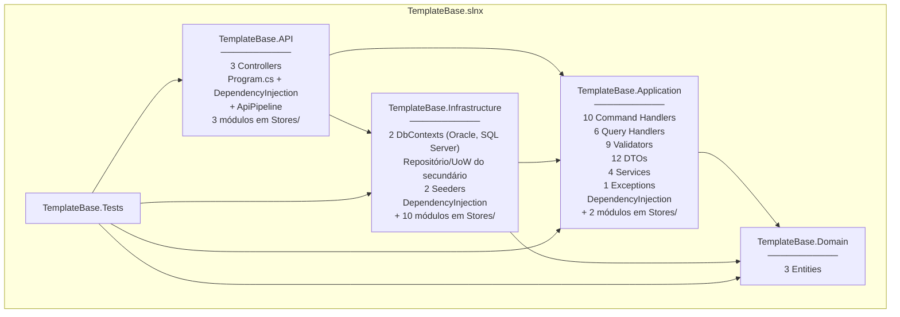
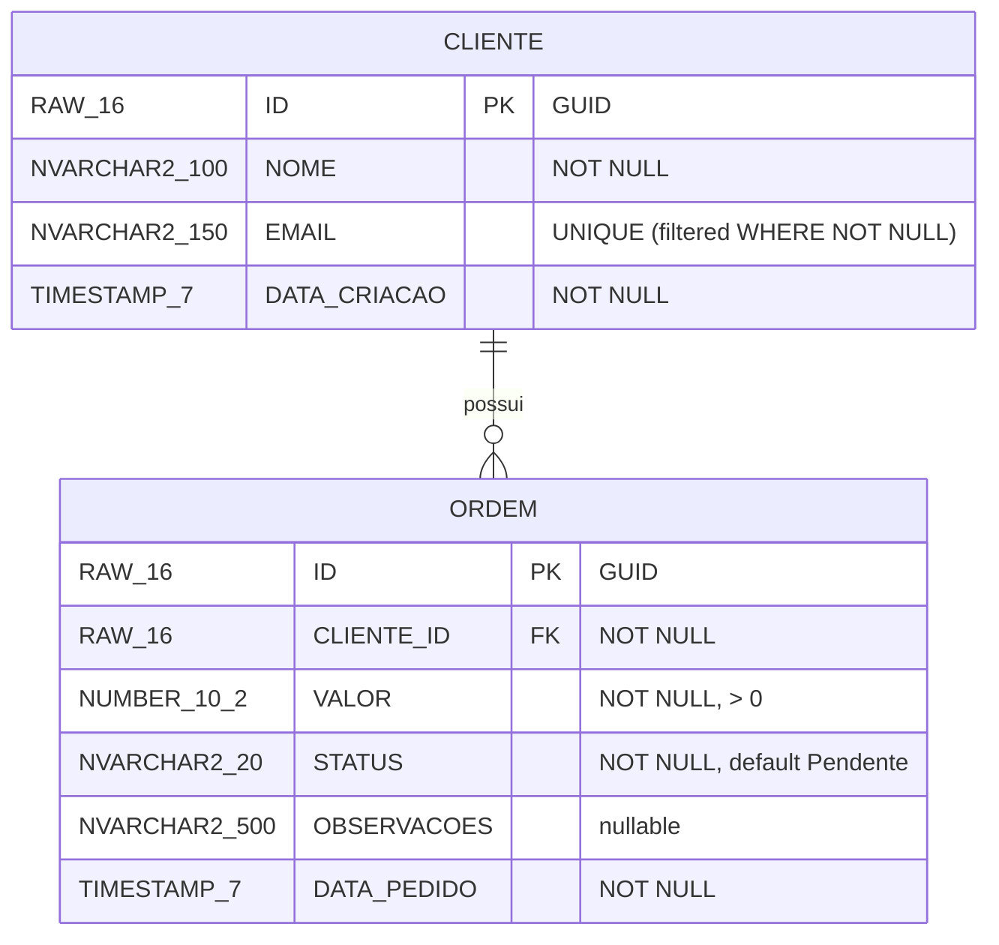

<h1 align="center">Análise Completa do Projeto</h1>
<p align="center"><strong>TemplateBase — Inventário, catálogos, configurações e cobertura de testes</strong></p>
<p align="center">
  
  
  
</p>

> Documento de inventário e análise abrangente do projeto TemplateBase API, incluindo catálogos de componentes, mapeamentos, configurações e cobertura de testes.

> [!NOTE]
> Stack FUNCEF **linha 3.0** (`[3.0.0,4.0.0)`): autenticação via `FuncefAutenticacao`, auditoria no
> **Oracle Lakehouse**, paginação/`ITelemetry` em `FUNCEF.Abstractions`, Central Package Management.

---

## Sumário

| | Seção | Descrição |
|:---:|-------|-----------|
| 1 | [Visão Geral do Projeto](#1-visão-geral-do-projeto) | Framework, stack e diagrama |
| 2 | [Inventário de Arquivos por Camada](#2-inventário-de-arquivos-por-camada) | Arquivos por camada |
| 3 | [Diagrama de Entidades](#3-diagrama-de-entidades) | Modelo de dados e mapeamentos |
| 4 | [Catálogo de Endpoints da API](#4-catálogo-de-endpoints-da-api) | Rotas e controllers |
| 5 | [Catálogo de Commands e Queries](#5-catálogo-de-commands-e-queries) | Handlers e messages |
| 6 | [Catálogo de Validators](#6-catálogo-de-validators) | Validadores FluentValidation |
| 7 | [Catálogo de DTOs](#7-catálogo-de-dtos) | Request, Response, Resume |
| 8 | [Catálogo de Services](#8-catálogo-de-services) | Service Layer |
| 9 | [Configurações por Ambiente](#9-configurações-por-ambiente) | appsettings e Key Vault |
| 10 | [Cobertura de Testes](#10-cobertura-de-testes) | Arquivos e cobertura |
| 11 | [Componentes FUNCEF Utilizados](#11-componentes-funcef-utilizados) | Pacotes e dependências |
| 12 | [Métricas do Projeto](#12-métricas-do-projeto) | Contagens e stack |

---

<a id="1-visão-geral-do-projeto"></a>
## 1. Visão Geral do Projeto

| Atributo | Valor |
|----------|-------|
| **Nome** | TemplateBase |
| **Tipo** | API REST (Web API) |
| **Framework** | ASP.NET Core (.NET 10.0) |
| **Linguagem** | C# 13.0 |
| **Arquitetura** | Clean Architecture + CQRS/Mediator + Service Layer |
| **Banco de Dados** | Oracle (schema TEMPLATETESTE) |
| **ORM** | FuncefORM (EF Core + Dapper) |
| **Cache** | Redis 7+ (FuncefNoSql) |
| **Auditoria** | Oracle Lakehouse `LOG_AUDIT` (FuncefORM) |
| **Autenticação** | Azure Entra ID (OAuth2 + PKCE + M2M) |
| **Secrets** | Azure Key Vault (FuncefCofre) |
| **Telemetria** | OpenTelemetry + Azure Monitor |
| **Validação** | FluentValidation (pipeline Mediator) |
| **Testes** | MSTest + NSubstitute |
| **Solution** | TemplateBase.slnx (4 projetos + 1 teste) |

### Diagrama de Projetos



---

<a id="2-inventário-de-arquivos-por-camada"></a>
## 2. Inventário de Arquivos por Camada

### 2.1 TemplateBase.Domain (3 arquivos)

| Arquivo | Descrição |
|---------|-----------|
| `Entities/BaseEntity.cs` | Classe abstrata base (Id: Guid) |
| `Entities/Cliente.cs` | [Table("CLIENTE")], [Auditable("Cliente")] |
| `Entities/Ordem.cs` | [Table("ORDEM")], [Auditable("Ordem")] |

### 2.2 TemplateBase.Application

<details>
<summary>Injeção de dependência (3 arquivos)</summary>

| Arquivo | Descrição |
|---------|-----------|
| `DependencyInjection.cs` | Orquestrador — `AddApplication(configuration)` |
| `Stores/MediatorRegistration.cs` | `AddMediatorWithDefaults()` — handlers, validators e behaviors por convenção |
| `Stores/DomainServicesRegistration.cs` | Registro manual dos Services por interface (condicional quando dependem de infra opcional) |

</details>

<details>
<summary>Services (4 arquivos)</summary>

| Arquivo | Descrição |
|---------|-----------|
| `Services/IClienteService.cs` | Interface do serviço de clientes |
| `Services/ClienteService.cs` | Implementação: CRUD, email único, Dapper |
| `Services/IOrdemService.cs` | Interface do serviço de ordens |
| `Services/OrdemService.cs` | Implementação: CRUD, status, Dapper |

</details>

<details>
<summary>Exceptions (1 arquivo)</summary>

| Arquivo | Descrição |
|---------|-----------|
| `Exceptions/ConflictException.cs` | Herda de BusinessException, mapeada para HTTP 409 |

</details>

<details>
<summary>DTOs (10 arquivos)</summary>

| Arquivo | Tipo | Descrição |
|---------|------|-----------|
| `DTOs/ClienteDto/Request/ClienteRequest.cs` | Request | Nome, Email |
| `DTOs/ClienteDto/Request/ClienteComOrdemRequest.cs` | Request | NomeCliente, EmailCliente, ValorOrdem, ObservacoesOrdem |
| `DTOs/ClienteDto/Response/ClienteResponse.cs` | Response | Id, Nome, Email, DataCriacao, Ordens ([NestedMap]) |
| `DTOs/ClienteDto/Response/ClienteComOrdemResponse.cs` | Response | ClienteId, NomeCliente, OrdemId, ValorOrdem |
| `DTOs/ClienteDto/Resume/ClienteResume.cs` | Resume | Id, Nome, Email, DataCriacao |
| `DTOs/OrdemDto/Request/CreateOrdemRequest.cs` | Request | ClienteId, Valor, Observacoes |
| `DTOs/OrdemDto/Request/UpdateOrdemRequest.cs` | Request | Valor, Status, Observacoes |
| `DTOs/OrdemDto/Request/UpdateOrdemStatusRequest.cs` | Request | Status |
| `DTOs/OrdemDto/Response/OrdemResponse.cs` | Response | Id, ClienteId, Valor, Status, NomeCliente ([NestedMap]) |
| `DTOs/OrdemDto/Resume/OrdemResume.cs` | Resume | Id, ClienteId, Valor, Status + campos calculados |

</details>

<details>
<summary>Commands — Cliente (15 arquivos em 5 pastas)</summary>

| Pasta | Command | Validator | Handler |
|-------|---------|-----------|---------|
| `Commands/Cliente/Create/` | `CreateClienteCommand` | `CreateClienteValidator` | `CreateClienteHandler` |
| `Commands/Cliente/Update/` | `UpdateClienteCommand` | `UpdateClienteValidator` | `UpdateClienteHandler` |
| `Commands/Cliente/Delete/` | `DeleteClienteCommand` | `DeleteClienteValidator` | `DeleteClienteHandler` |
| `Commands/Cliente/CreateComOrdemEf/` | `CreateClienteComOrdemEfCommand` | `CreateClienteComOrdemEfValidator` | `CreateClienteComOrdemEfHandler` |
| `Commands/Cliente/CreateComOrdemDapper/` | `CreateClienteComOrdemDapperCommand` | `CreateClienteComOrdemDapperValidator` | `CreateClienteComOrdemDapperHandler` |

</details>

<details>
<summary>Commands — Ordem (12 arquivos em 4 pastas)</summary>

| Pasta | Command | Validator | Handler |
|-------|---------|-----------|---------|
| `Commands/Ordem/Create/` | `CreateOrdemCommand` | `CreateOrdemValidator` | `CreateOrdemHandler` |
| `Commands/Ordem/Update/` | `UpdateOrdemCommand` | `UpdateOrdemValidator` | `UpdateOrdemHandler` |
| `Commands/Ordem/UpdateStatus/` | `UpdateOrdemStatusCommand` | `UpdateOrdemStatusValidator` | `UpdateOrdemStatusHandler` |
| `Commands/Ordem/Delete/` | `DeleteOrdemCommand` | `DeleteOrdemValidator` | `DeleteOrdemHandler` |

</details>

<details>
<summary>Queries — Cliente (4 arquivos em 2 pastas)</summary>

| Pasta | Query | Handler |
|-------|-------|---------|
| `Queries/Cliente/GetById/` | `GetClienteByIdQuery` | `GetClienteByIdHandler` |
| `Queries/Cliente/GetPaged/` | `GetClientePagedQuery` | `GetClientePagedHandler` |

</details>

<details>
<summary>Queries — Ordem (6 arquivos em 3 pastas)</summary>

| Pasta | Query | Handler |
|-------|-------|---------|
| `Queries/Ordem/GetById/` | `GetOrdemByIdQuery` | `GetOrdemByIdHandler` |
| `Queries/Ordem/GetPaged/` | `GetOrdemPagedQuery` | `GetOrdemPagedHandler` |
| `Queries/Ordem/GetByCliente/` | `GetOrdensByClienteQuery` | `GetOrdensByClienteHandler` |

</details>

### 2.3 TemplateBase.Infrastructure

| Arquivo | Descrição |
|---------|-----------|
| `DependencyInjection.cs` | Orquestrador — define a ordem dos 11 passos de registro |
| `Stores/` (10 arquivos) | Um módulo por preocupação: Secrets, Telemetry, Oracle, SqlServer, Cache, Documents, Audit, Authentication, FileStorage, Mapping |
| `Configuration/VaultBootstrap.cs` | Fonte única da leitura de segredos em tempo de registro |
| `Configuration/KeyVaultConfigurationExtensions.cs` | Injeta segredos no `IConfiguration` |
| `Configuration/ConfigurationValidationExtensions.cs` | Fail-fast de configuração em produção |
| `Persistence/Context/AppDbContext.cs` | Contexto do Oracle (principal), herdando `BaseDbContext` |
| `Persistence/Context/SqlServerDbContext.cs` | Contexto do SQL Server (secundário) |
| `Persistence/SqlServer/SqlServerRepository.cs` | Repositório do banco secundário |
| `Persistence/SqlServer/SqlServerUnitOfWork.cs` | Unidade de trabalho do banco secundário |
| `Persistence/Documents/OrdemHistoricoDocumentoMapping.cs` | Mapeamento Bson via `BsonClassMap` |
| `Persistence/Seeders/ClienteSeeder.cs` | 2 clientes de exemplo |
| `Persistence/Seeders/OrdemSeeder.cs` | 3 ordens de exemplo |
| `Services/OrdemHistoricoService.cs` | Histórico em MongoDB via `IDocumentStore<T>` |

### 2.4 TemplateBase.API (3 arquivos .cs)

| Arquivo | Descrição |
|---------|-----------|
| `Program.cs` | Startup, pipeline HTTP, health endpoints (MapHealthChecks) |
| `Controllers/ClientesController.cs` | 7 endpoints de clientes via IMediator |
| `Controllers/OrdensController.cs` | 7 endpoints de ordens via IMediator |

> Health endpoints são configurados no `Program.cs` via `MapHealthChecks()` e `MapGet()`.

### 2.5 Resumo de Arquivos

| Camada | Arquivos .cs |
|--------|:------------:|
| API | 3 |
| Application | 53 |
| Domain | 3 |
| Infrastructure | 4 |
| **Total src** | **63** |

---

<a id="3-diagrama-de-entidades"></a>
## 3. Diagrama de Entidades

### Modelo de Dados



### Relacionamentos

| De | Para | Tipo | FK | DeleteBehavior |
|----|------|------|----|----------------|
| Ordem | Cliente | Many-to-One | CLIENTE_ID | Restrict |

---

<a id="4-catálogo-de-endpoints-da-api"></a>
## 4. Catálogo de Endpoints da API

### 4.1 ClientesController (`/Clientes`) — `[FuncefAuthorize]`

| # | Método | Rota | Command/Query | Retorno |
|---|--------|------|---------------|---------|
| 1 | `GET` | `/Clientes` | `GetClientePagedQuery` | `PaginatedResult<ClienteResume>` |
| 2 | `GET` | `/Clientes/{id}` | `GetClienteByIdQuery` | `ClienteResponse` |
| 3 | `POST` | `/Clientes` | `CreateClienteCommand` | `ClienteResponse` (201) |
| 4 | `POST` | `/Clientes/com-ordem` | `CreateClienteComOrdemEfCommand` | `ClienteComOrdemResponse` (201) |
| 5 | `POST` | `/Clientes/com-ordem-dapper` | `CreateClienteComOrdemDapperCommand` | `ClienteComOrdemResponse` (201) |
| 6 | `PUT` | `/Clientes/{id}` | `UpdateClienteCommand` | `ClienteResponse` |
| 7 | `DELETE` | `/Clientes/{id}` | `DeleteClienteCommand` | 204 No Content |

### 4.2 OrdensController (`/Ordens`) — `[FuncefAuthorize]`

| # | Método | Rota | Command/Query | Retorno |
|---|--------|------|---------------|---------|
| 1 | `GET` | `/Ordens` | `GetOrdemPagedQuery` | `PaginatedResult<OrdemResume>` |
| 2 | `GET` | `/Ordens/{id}` | `GetOrdemByIdQuery` | `OrdemResponse` |
| 3 | `GET` | `/Ordens/cliente/{clienteId}` | `GetOrdensByClienteQuery` | `PaginatedResult<OrdemResume>` |
| 4 | `POST` | `/Ordens` | `CreateOrdemCommand` | `OrdemResponse` (201) |
| 5 | `PUT` | `/Ordens/{id}` | `UpdateOrdemCommand` | `OrdemResponse` |
| 6 | `PATCH` | `/Ordens/{id}/status` | `UpdateOrdemStatusCommand` | `OrdemResponse` |
| 7 | `DELETE` | `/Ordens/{id}` | `DeleteOrdemCommand` | 204 No Content |

### 4.3 Health Endpoints (Program.cs — MapHealthChecks + MapGet)

| Rota | Descrição |
|------|-----------|
| `/health` | Todos os checks (JSON detalhado) |
| `/health/live` | Liveness probe |
| `/health/ready` | Readiness probe |
| `/health/version` | Informações de versão |
| `/info` | Equivalente a `/health/version` |

### 4.4 Autenticação — FuncefAutenticacao (24 endpoints auto-registrados)

| Grupo | Endpoints |
|-------|:---------:|
| `/auth` (Auth) | 7 |
| `/auth/user` (User Info) | 14 |
| `/auth/m2m` (M2M) | 3 |

### Resumo de Endpoints

| Origem | Endpoints |
|--------|:---------:|
| ClientesController | 7 |
| OrdensController | 7 |
| Health (Program.cs) | 5 |
| FuncefAutenticacao | 24 |
| **Total** | **43** |

---

<a id="5-catálogo-de-commands-e-queries"></a>
## 5. Catálogo de Commands e Queries

### 5.1 Commands de Cliente

| Ação | Command | Handler | Regras de Negócio |
|------|---------|---------|-------------------|
| Create | `CreateClienteCommand` | `CreateClienteHandler` | Email único (via Service) |
| Update | `UpdateClienteCommand` | `UpdateClienteHandler` | Existência, email único |
| Delete | `DeleteClienteCommand` | `DeleteClienteHandler` | Existência, sem ordens vinculadas |
| CreateComOrdemEf | `CreateClienteComOrdemEfCommand` | `CreateClienteComOrdemEfHandler` | Transação EF Core (Begin/Commit/Rollback) |
| CreateComOrdemDapper | `CreateClienteComOrdemDapperCommand` | `CreateClienteComOrdemDapperHandler` | Transação Dapper (Begin/Commit/Rollback) |

### 5.2 Commands de Ordem

| Ação | Command | Handler | Regras de Negócio |
|------|---------|---------|-------------------|
| Create | `CreateOrdemCommand` | `CreateOrdemHandler` | Cliente deve existir |
| Update | `UpdateOrdemCommand` | `UpdateOrdemHandler` | Existência, status válido |
| UpdateStatus | `UpdateOrdemStatusCommand` | `UpdateOrdemStatusHandler` | Existência, status válido |
| Delete | `DeleteOrdemCommand` | `DeleteOrdemHandler` | Existência |

### 5.3 Queries de Cliente

| Consulta | Query | Handler |
|----------|-------|---------|
| Por ID | `GetClienteByIdQuery` | `GetClienteByIdHandler` |
| Paginada | `GetClientePagedQuery` | `GetClientePagedHandler` |

### 5.4 Queries de Ordem

| Consulta | Query | Handler |
|----------|-------|---------|
| Por ID | `GetOrdemByIdQuery` | `GetOrdemByIdHandler` |
| Paginada | `GetOrdemPagedQuery` | `GetOrdemPagedHandler` |
| Por Cliente | `GetOrdensByClienteQuery` | `GetOrdensByClienteHandler` |

### Resumo

| Métrica | Quantidade |
|---------|:----------:|
| Command Handlers | 9 |
| Query Handlers | 5 |
| **Total de Handlers** | **14** |
| Commands | 9 |
| Queries | 5 |
| Com Transação explícita | 2 |
| Com Dapper (SQL direto) | 1 |

---

<a id="6-catálogo-de-validators"></a>
## 6. Catálogo de Validators

> Validators validam **Commands** (não DTOs). Queries não possuem Validators.

### 6.1 Validators de Cliente

| Validator | Target (Command) | Regras |
|-----------|-------------------|--------|
| `CreateClienteValidator` | `CreateClienteCommand` | Nome obrigatório (max 100), Email opcional (max 150) |
| `UpdateClienteValidator` | `UpdateClienteCommand` | Id obrigatório, Nome, Email |
| `DeleteClienteValidator` | `DeleteClienteCommand` | Id obrigatório |
| `CreateClienteComOrdemEfValidator` | `CreateClienteComOrdemEfCommand` | NomeCliente, EmailCliente, ValorOrdem > 0, Observacoes |
| `CreateClienteComOrdemDapperValidator` | `CreateClienteComOrdemDapperCommand` | NomeCliente, EmailCliente, ValorOrdem > 0, Observacoes |

### 6.2 Validators de Ordem

| Validator | Target (Command) | Regras |
|-----------|-------------------|--------|
| `CreateOrdemValidator` | `CreateOrdemCommand` | ClienteId obrigatório, Valor > 0, Observacoes (max 500) |
| `UpdateOrdemValidator` | `UpdateOrdemCommand` | Id obrigatório, Valor > 0, Status válido, Observacoes |
| `UpdateOrdemStatusValidator` | `UpdateOrdemStatusCommand` | Id obrigatório, Status válido |
| `DeleteOrdemValidator` | `DeleteOrdemCommand` | Id obrigatório |

### Status Válidos para Ordens

```
Pendente | Processando | Enviado | Concluido | Cancelado
```

### Resumo

| Métrica | Quantidade |
|---------|:----------:|
| Total de Validators | 9 |
| Validators de Cliente | 5 |
| Validators de Ordem | 4 |

---

<a id="7-catálogo-de-dtos"></a>
## 7. Catálogo de DTOs

### 7.1 DTOs de Cliente

| DTO | Tipo | Propriedades | Uso |
|-----|------|:------------:|-----|
| ClienteRequest | Request | Nome, Email | Criação/atualização |
| ClienteComOrdemRequest | Request | NomeCliente, EmailCliente, ValorOrdem, ObservacoesOrdem | Criação cliente + ordem |
| ClienteResponse | Response | Id, Nome, Email, DataCriacao, Ordens ([NestedMap]) | Resposta completa |
| ClienteComOrdemResponse | Response | ClienteId, NomeCliente, OrdemId, ValorOrdem | Resposta cliente + ordem |
| ClienteResume | Resume | Id, Nome, Email, DataCriacao | Listagens paginadas |

### 7.2 DTOs de Ordem

| DTO | Tipo | Propriedades | Uso |
|-----|------|:------------:|-----|
| CreateOrdemRequest | Request | ClienteId, Valor, Observacoes | Criação de ordem |
| UpdateOrdemRequest | Request | Valor, Status, Observacoes | Atualização de ordem |
| UpdateOrdemStatusRequest | Request | Status | Atualização de status |
| OrdemResponse | Response | Id, ClienteId, Valor, Status, NomeCliente ([NestedMap]) | Resposta completa |
| OrdemResume | Resume | Id, ClienteId, Valor, Status + campos calculados | Listagens |

### Resumo

| Métrica | Quantidade |
|---------|:----------:|
| Total de DTOs | 10 |
| Request | 5 |
| Response | 4 |
| Resume | 2 |

---

<a id="8-catálogo-de-services"></a>
## 8. Catálogo de Services

| Interface | Implementação | Métodos | Injeta |
|-----------|---------------|:-------:|--------|
| `IClienteService` | `ClienteService` | 8 | `IRepository<Cliente>`, `IRepository<Ordem>` |
| `IOrdemService` | `OrdemService` | 9 | `IRepository<Ordem>`, `IRepository<Cliente>` |

### Métodos de IClienteService

| Método | Descrição |
|--------|-----------|
| `CreateAsync` | Cria cliente, valida email único |
| `UpdateAsync` | Atualiza cliente, valida existência e email único |
| `ValidateAndDeleteAsync` | Valida existência e ausência de ordens, deleta |
| `CreateWithDapperAsync` | Cria via SQL direto (Dapper) |
| `GetByIdAsync` | Busca por ID |
| `GetByIdWithAutoIncludesAsync` | Busca por ID com includes automáticos |
| `GetPagedAsync` | Listagem paginada |
| `ExistsAsync` | Verifica existência por predicado |

### Métodos de IOrdemService

| Método | Descrição |
|--------|-----------|
| `CreateAsync` | Cria ordem, valida cliente existente |
| `UpdateAsync` | Atualiza ordem, valida existência e status |
| `UpdateStatusAsync` | Atualiza status, valida existência e status válido |
| `ValidateAndDeleteAsync` | Valida existência, deleta |
| `CreateWithDapperAsync` | Cria via SQL direto (Dapper) |
| `GetByIdAsync` | Busca por ID |
| `GetByIdWithAutoIncludesAsync` | Busca por ID com includes automáticos |
| `GetPagedAsync` | Listagem paginada |
| `ExistsAsync` | Verifica existência por predicado |

---

<a id="9-configurações-por-ambiente"></a>
## 9. Configurações por Ambiente

### Secrets no Key Vault

Convenção de nomes: **`glb-*`** para segredos globais, compartilhados entre sistemas; **`api-*`** para os da própria API. O cofre é por sistema e por ambiente — não há cofre corporativo único.

| Secret Name | Descrição | Usado por |
|-------------|-----------|-----------|
| glb-entraid-tenantid | Tenant ID do Entra (compõe a Authority) — **obrigatório** | FuncefAutenticacao |
| glb-entraid-clientid | Client ID do app registration da API — **obrigatório** | FuncefAutenticacao |
| glb-entraid-audience | Audience aceita nos tokens da API — **obrigatório** | FuncefAutenticacao |
| glb-auth-refresh-jwt | Chave para assinar refresh tokens | FuncefAutenticacao |
| glb-appinsights-key | Connection string Application Insights | Telemetria |
| api-oracle-conn | Connection string Oracle (dados da aplicação) — **obrigatório** | FuncefORM |
| api-oracle-audit | Connection string Oracle Lakehouse (auditoria de entidade e de acesso) | FuncefORM / FuncefAutenticacao |
| api-redis-conn | Connection string Redis (cache + refresh tokens) | FuncefNoSql |
| api-sqlserver-conn | Connection string do banco secundário (opcional) | SqlServerRegistration |
| api-blob-uri | URI da Storage Account (opcional) | FuncefArmazenamentos |

Não há client secret na lista: o template nasce secretless (`Auth:EntraId:CredentialType = ManagedIdentity`). Projetos que precisem de `ClientSecret`/`Certificate` acrescentam `Auth:EntraId:ClientSecretFromKeyVault` ou `ClientCertificateFromKeyVault` e o segredo correspondente.

### Comparativo por Ambiente

| Configuração | Development | Homologation | Production |
|-------------|-------------|--------------|------------|
| Logging | Debug | Information | Information |
| Swagger | Habilitado | Habilitado | Desabilitado |
| FuncefORM Pool | Min 1, Max 10 | Min 2, Max 50 | Min 5, Max 100 |
| Redis CircuitBreaker | false | true | true |
| Auth RefreshToken Storage | Memory | Redis | Redis |
| DB Check no Startup | Sim | Sim | Health Check only |

---

<a id="10-cobertura-de-testes"></a>
## 10. Cobertura de Testes

### Arquivos de Teste

| Área | Descrição |
|------|-----------|
| `Domain/ClienteTests.cs` | Testes de entidade Cliente |
| `Domain/OrdemTests.cs` | Testes de entidade Ordem |
| `Application/Validators/*` | Testes de todos os Validators |
| `Application/Handlers/*` | Testes de Handlers (NSubstitute) |
| `Application/DTOs/*` | Testes de DTOs |
| `Application/ServiceRegistrationTests.cs` | Registro de serviços DI |
| `Infrastructure/*` | AppDbContext, Seeders, Database, Redis, MongoDB |
| `API/Controllers/*` | Testes de Controllers |

### Cobertura por Camada

> [!WARNING]
> Não há medição automatizada de cobertura (sem pipeline de CI com coverlet/gate). Os números
> abaixo indicam **quais camadas possuem testes**, não percentual de linhas cobertas. Lacunas
> conhecidas: `SqlServerRepository`/`SqlServerUnitOfWork`, `OrdemHistoricoService`,
> middleware/pipeline (`SecurityHeadersMiddleware`, `ApiPipeline`), `Diagnostics/*` e
> `Configuration/*` não têm testes.

| Camada | Situação |
|--------|:---------:|
| Domain (Entities) | Cliente, Ordem e StatusOrdem testados (propriedades + comportamento/máquina de estados) |
| Validators | 8 de 9 testados (falta CreateClienteComOrdemDapperValidator) |
| Handlers | Fluxos Cliente/Ordem testados; GetHistorico sem testes |
| DTOs | Cliente/Ordem testados |
| Controllers | 2 de 2 testados |
| Infrastructure | AppDbContext, Seeders e configs testados; SQL Server e Mongo service sem testes |
| DI Registration | Presença de tipos verificada (sem resolução do container) |

---

<a id="11-componentes-funcef-utilizados"></a>
## 11. Componentes FUNCEF Utilizados

| Componente | Função |
|------------|--------|
| **FuncefEssenciais** | IMediator, ICommand, IQuery, FluentValidation pipeline, Swagger, Telemetria, BaseController, Middleware |
| **FuncefORM** | IRepository, IUnitOfWork, BaseDbContext, Dapper, MapFrom, NestedMap, PaginatedResult, EntitySeederBase |
| **FuncefNoSql** | Redis (cache); MongoDB opcional (`AddMongoDocuments<T>`) |
| **FuncefCofre** | Azure Key Vault |
| **FuncefAutenticacao** | Azure Entra ID, [FuncefAuthorize], 24 endpoints auth |
| **FuncefArmazenamentos** | Azure Storage (Blob, Queue, Table) |

---

<a id="12-métricas-do-projeto"></a>
## 12. Métricas do Projeto

### Contagem de Componentes

| Componente | Quantidade |
|-----------|:----------:|
| Entidades | 3 (Base + 2) |
| Controllers | 2 |
| Command Handlers | 9 |
| Query Handlers | 5 |
| Commands | 9 |
| Queries | 5 |
| Validators | 9 |
| DTOs | 10 |
| Services | 2 (interfaces) + 2 (implementações) |
| Seeders | 2 |
| Endpoints API | 43 (19 app + 24 FuncefAutenticacao) |

### Contagem de Arquivos (.cs)

| Camada | Arquivos |
|--------|:--------:|
| API | 3 |
| Application | 53 |
| Domain | 3 |
| Infrastructure | 4 |
| **Total src** | **63** |

---

<div align="center"><br/><strong>Análise do Projeto — TemplateBase</strong><br/>Clean Architecture · CQRS/Mediator · Service Layer<br/><br/>© FUNCEF 2025–2026</div>
