<h1 align="center">Arquitetura do TemplateBase</h1>
<p align="center"><strong>Clean Architecture + CQRS/Mediator + Service Layer — Documentação técnica de referência</strong></p>
<p align="center">
  
  
  
  
  
  
  
</p>

> Documento de referência da arquitetura do projeto TemplateBase API, com explicações detalhadas de cada camada, padrões utilizados, fluxos de dados e diagramas.

> [!IMPORTANT]
> **Atualização para os componentes FUNCEF v4/v5.** A partir desta versão:
> - O componente de segurança foi **renomeado** de `FuncefSeguranca` para **`FuncefAutenticacao`** (pacote `FUNCEF.Autenticacao`).
> - A **auditoria de entidades** (`[Auditable]`) e a **auditoria de acesso** passaram a persistir no **Oracle Lakehouse** (`LOG_AUDIT`), não mais no MongoDB. O MongoDB tornou-se opcional (disponível via `FuncefNoSql.AddMongoDocuments<T>` para quem precisar de um document store).
> - Tipos de **paginação** (`PagedRequest`, `PagedResult`, `SortDirection`) e **`ITelemetry`** migraram para o novo pacote **`FUNCEF.Abstractions`**.
> - As versões de pacote são centralizadas em `Directory.Packages.props` (**Central Package Management**).
>
> Alguns diagramas/menções a MongoDB abaixo refletem o desenho legado de auditoria e estão sendo
> migrados; a referência canônica de persistência de auditoria é o **Oracle Lakehouse**.

---

## Sumário

| | Seção | Descrição |
|:---:|-------|-----------|
| 1 | [Visão Geral](#1-visão-geral) | Contexto, decisões e estrutura |
| 2 | [Clean Architecture](#2-clean-architecture) | Camadas e regras de dependência |
| 3 | [CQRS/Mediator](#3-cqrsmediator) | Commands, Queries, Handlers e pipeline |
| 4 | [Service Layer](#4-service-layer) | Services, responsabilidades e transações |
| 5 | [Camada de Domínio](#5-camada-de-domínio-domain) | Entidades e regras de negócio |
| 6 | [Camada de Aplicação](#6-camada-de-aplicação-application) | Handlers, Services, DTOs e validações |
| 7 | [Camada de Infraestrutura](#7-camada-de-infraestrutura-infrastructure) | Persistência e serviços técnicos |
| 8 | [Camada de Apresentação](#8-camada-de-apresentação-api) | Controllers e API REST |
| 9 | [Pipeline HTTP](#9-pipeline-http-middleware) | Middleware e ordem de execução |
| 10 | [Dependency Injection](#10-dependency-injection) | Registro de serviços |
| 11 | [Sistema de Autenticação](#11-sistema-de-autenticação) | OAuth2, JWT e M2M |
| 12 | [Sistema de Auditoria](#12-sistema-de-auditoria) | Auditoria de entidades e acesso |
| 13 | [Persistência de Dados](#13-persistência-de-dados) | Oracle, Redis, MongoDB |
| 14 | [Resiliência](#14-resiliência-e-tolerância-a-falhas) | Circuit Breaker e Health Checks |
| 15 | [Stack FUNCEF](#15-stack-de-componentes-funcef) | Componentes internos |

---

<a id="1-visão-geral"></a>
## 1. Visão Geral

O TemplateBase é uma API REST construída com ASP.NET Core (.NET 10) que serve como **template de referência** para novos projetos na FUNCEF. Implementa padrões de Clean Architecture, CQRS/Mediator e Service Layer usando a stack de componentes internos da FUNCEF.

### Diagrama de Contexto (C4 - Nível 1)

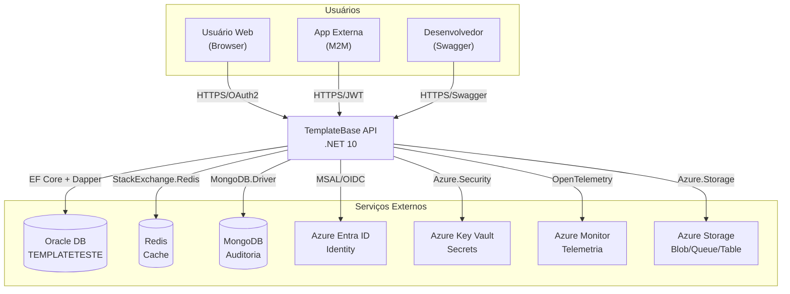

### Decisões Arquiteturais

| Decisão | Escolha | Justificativa |
|---------|---------|---------------|
| Arquitetura | Clean Architecture | Separação de responsabilidades, testabilidade, independência de frameworks |
| Padrão de aplicação | CQRS/Mediator + Service Layer | Separação clara entre leitura e escrita, lógica de negócio reutilizável nos Services |
| ORM | EF Core + Dapper | EF Core para CRUD/transações, Dapper para queries de alta performance |
| Banco relacional | Oracle | Padrão corporativo FUNCEF |
| Autenticação | Azure Entra ID + JWT | SSO corporativo, tokens stateless |
| Cache | Redis | Distribuído, alta performance, suporte a pub/sub |
| Auditoria | Oracle Lakehouse (`LOG_AUDIT`) | Persistência centralizada e governada das trilhas de auditoria |
| Secrets | Azure Key Vault | Segurança centralizada, rotação automática |
| Telemetria | OpenTelemetry + Azure Monitor | Padrão aberto, connection string via Key Vault |

### Estrutura do Projeto

| Projeto | Descrição |
|---------|-----------|
| **TemplateBase.Domain** | Entidades ricas: Cliente, Ordem + StatusOrdem (máquina de estados) |
| **TemplateBase.Application** | Abstractions, Commands, Queries, Handlers, Services, Validators, DTOs, Documents + DI (`DependencyInjection` + `Stores/`) |
| **TemplateBase.Infrastructure** | DbContexts (Oracle e SQL Server), repositórios do banco secundário, seeders, mapeamento Bson, Configuration + DI (`DependencyInjection` + 10 módulos em `Stores/`) |
| **TemplateBase.API** | `Program.cs`, `DependencyInjection`, `ApiPipeline`, Controllers, HealthChecks, Middleware, Diagnostics + `Stores/` |
| **TemplateBase.Tests** | Testes unitários (Domain, Validators, Handlers, Services, DTOs, Infrastructure, API) |

---

<a id="2-clean-architecture"></a>
## 2. Clean Architecture

O projeto segue o padrão **Clean Architecture** (Robert C. Martin), onde as dependências apontam para o centro (domínio). Nenhuma camada interna conhece as camadas externas.

### Diagrama de Dependências entre Camadas

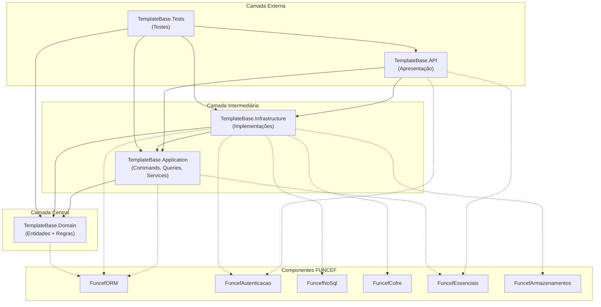

### Regras de Dependência

| Camada | Pode depender de | NÃO pode depender de |
|--------|-------------------|----------------------|
| **Domain** | Nenhuma camada do projeto (apenas FuncefORM para atributos) | Application, Infrastructure, API |
| **Application** | Domain | Infrastructure, API |
| **Infrastructure** | Domain, Application (para registrar implementações) | API |
| **API** | Application, Infrastructure (para DI setup) | - |

### Benefícios

1. **Testabilidade**: Handlers e Services testados isoladamente sem banco de dados ou HTTP
2. **Independência de framework**: Trocar de EF Core para outro ORM afetaria apenas Infrastructure
3. **Independência de banco**: A camada Domain não conhece Oracle, Redis ou MongoDB
4. **Evolução independente**: Novas features são adicionadas criando novos Commands/Queries e Services

---

<a id="3-cqrsmediator"></a>
## 3. CQRS/Mediator

O TemplateBase implementa CQRS onde **Commands** modificam estado e **Queries** apenas leem dados. O **IMediator** (FuncefEssenciais) despacha mensagens para os Handlers correspondentes, passando pelo pipeline de validação automático.

### Convenções de Nomenclatura

| Elemento | Padrão | Exemplo |
|----------|--------|---------|
| Command | `{Ação}{Entidade}Command` | `CreateClienteCommand`, `UpdateOrdemStatusCommand` |
| Command Handler | `{Ação}{Entidade}Handler` | `CreateClienteHandler`, `DeleteOrdemHandler` |
| Command Validator | `{Ação}{Entidade}Validator` | `CreateClienteValidator`, `UpdateOrdemValidator` |
| Query | `Get{Entidade}{Detalhe}Query` | `GetClienteByIdQuery`, `GetOrdemPagedQuery` |
| Query Handler | `Get{Entidade}{Detalhe}Handler` | `GetClienteByIdHandler`, `GetOrdensByClienteHandler` |
| Estrutura Commands | `Commands/{Entidade}/{Ação}/` | `Commands/Cliente/Create/`, `Commands/Ordem/UpdateStatus/` |
| Estrutura Queries | `Queries/{Entidade}/{Detalhe}/` | `Queries/Cliente/GetById/`, `Queries/Ordem/GetPaged/` |

### Diagrama de Fluxo CQRS/Mediator

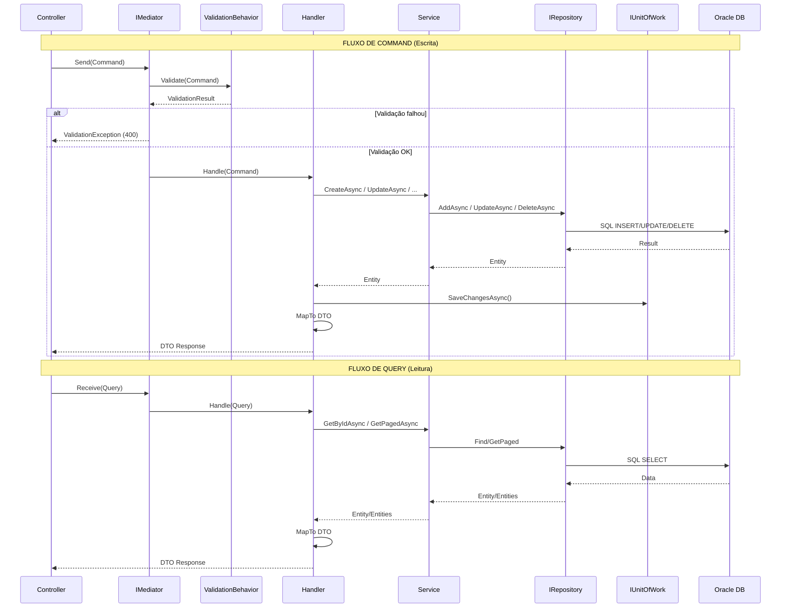

### Estrutura de um Command

```
Commands/
└── Cliente/
    └── Create/
        ├── CreateClienteCommand.cs      ← Define campos de entrada (ICommand<TResponse>)
        ├── CreateClienteValidator.cs     ← Regras de validação (AbstractValidator<Command>)
        └── CreateClienteHandler.cs      ← Orquestração (ICommandHandler<Command, Response>)
```

### Estrutura de uma Query

```
Queries/
└── Cliente/
    └── GetById/
        ├── GetClienteByIdQuery.cs       ← Define parâmetros (IQuery<TResponse>)
        └── GetClienteByIdHandler.cs     ← Consulta (IQueryHandler<Query, Response>)
```

> Queries não possuem Validators — a validação é feita no Handler quando necessário.

### Interfaces Base (FuncefEssenciais)

```csharp
// Commands
public interface ICommand<TResult> { }
public interface ICommand { }
public interface ICommandHandler<TCommand, TResponse> where TCommand : ICommand<TResponse>
{
    Task<TResponse> Handle(TCommand command, CancellationToken cancellationToken);
}

// Queries
public interface IQuery<TResponse> { }
public interface IQueryHandler<TQuery, TResponse> where TQuery : IQuery<TResponse>
{
    Task<TResponse> Handle(TQuery query, CancellationToken cancellationToken);
}

// Mediator
public interface IMediator
{
    Task<TResponse> Send<TResponse>(ICommand<TResponse> command, CancellationToken ct = default);
    Task Send(ICommand command, CancellationToken ct = default);
    Task<TResponse> Receive<TResponse>(IQuery<TResponse> query, CancellationToken ct = default);
}
```

### Inventário de Commands, Queries e Handlers

<details>
<summary>Clique para expandir — Tabela completa</summary>

| Entidade | Tipo | Message | Handler | Descrição |
|----------|------|---------|---------|-----------|
| Cliente | Command | `CreateClienteCommand` | `CreateClienteHandler` | Cria cliente |
| Cliente | Command | `UpdateClienteCommand` | `UpdateClienteHandler` | Atualiza cliente |
| Cliente | Command | `DeleteClienteCommand` | `DeleteClienteHandler` | Remove cliente |
| Cliente | Command | `CreateClienteComOrdemEfCommand` | `CreateClienteComOrdemEfHandler` | Cria cliente + ordem (EF Core) |
| Cliente | Command | `CreateClienteComOrdemDapperCommand` | `CreateClienteComOrdemDapperHandler` | Cria cliente + ordem (Dapper) |
| Cliente | Query | `GetClienteByIdQuery` | `GetClienteByIdHandler` | Busca por ID |
| Cliente | Query | `GetClientePagedQuery` | `GetClientePagedHandler` | Lista paginada |
| Ordem | Command | `CreateOrdemCommand` | `CreateOrdemHandler` | Cria ordem |
| Ordem | Command | `UpdateOrdemCommand` | `UpdateOrdemHandler` | Atualiza ordem |
| Ordem | Command | `UpdateOrdemStatusCommand` | `UpdateOrdemStatusHandler` | Atualiza status |
| Ordem | Command | `DeleteOrdemCommand` | `DeleteOrdemHandler` | Remove ordem |
| Ordem | Query | `GetOrdemByIdQuery` | `GetOrdemByIdHandler` | Busca por ID |
| Ordem | Query | `GetOrdemPagedQuery` | `GetOrdemPagedHandler` | Lista paginada |
| Ordem | Query | `GetOrdensByClienteQuery` | `GetOrdensByClienteHandler` | Ordens por cliente |

</details>

---

<a id="4-service-layer"></a>
## 4. Service Layer

A Service Layer encapsula a **lógica de negócio** e o **acesso a dados** via `IRepository<T>`. Os Handlers delegam ao Service e controlam a persistência via `IUnitOfWork`.

### Diagrama de Responsabilidades

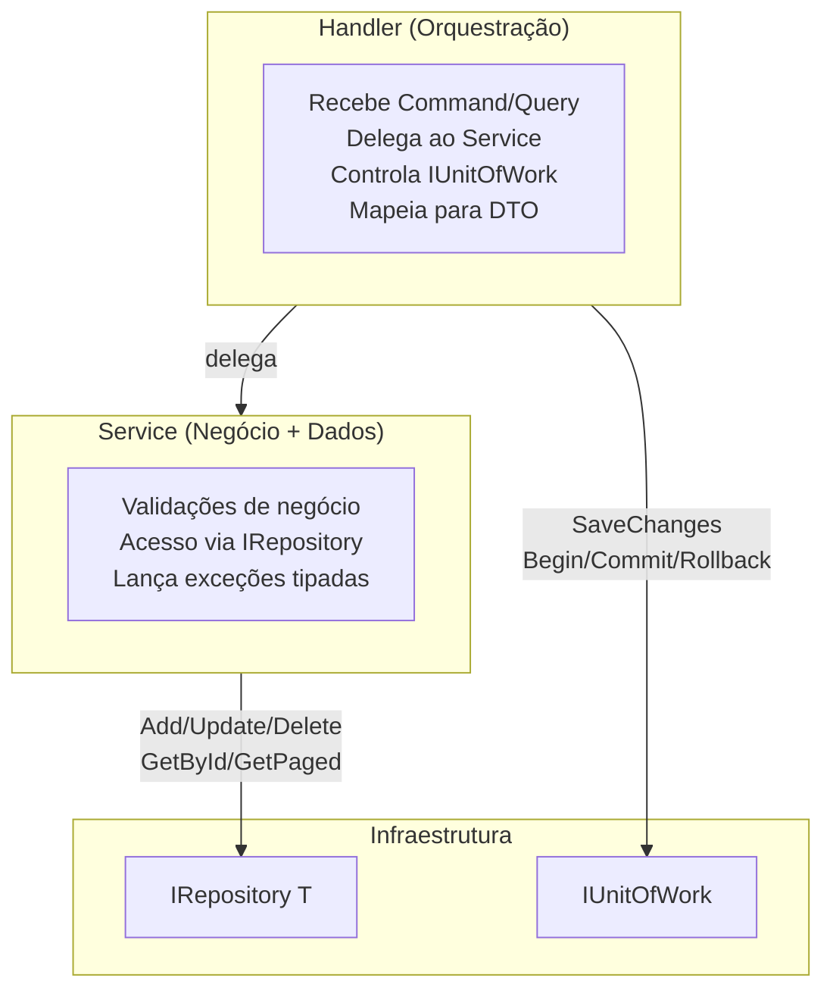

### Controle de transação

| Cenário | Quem controla | Exemplo |
|---------|:-------------:|---------|
| CRUD simples | Handler chama `SaveChangesAsync()` | `CreateClienteHandler` |
| Transação multi-entidade (EF) | Handler usa `Begin/Commit/Rollback` | `CreateClienteComOrdemEfHandler` |
| Transação Dapper (SQL) | Handler usa `Begin/Commit/Rollback` | `CreateClienteComOrdemDapperHandler` |
| Leitura (Query) | Sem transação | `GetClienteByIdHandler` |

### Services do projeto

| Interface | Implementação | Responsabilidade |
|-----------|---------------|-----------------|
| `IClienteService` | `ClienteService` | CRUD de clientes, validação de email único, Dapper |
| `IOrdemService` | `OrdemService` | CRUD de ordens, validação de status, Dapper |

---

<a id="5-camada-de-domínio-domain"></a>
## 5. Camada de Domínio (Domain)

A camada mais interna contém as **entidades de negócio**. Não possui dependência de frameworks de infraestrutura, exceto atributos do FuncefORM para mapeamento e auditoria.

### Estrutura

| Arquivo | Descrição |
|---------|-----------|
| `Entities/BaseEntity.cs` | Classe base abstrata com Id (Guid, [Key], [Column("ID")], [DatabaseGenerated(None)]) |
| `Entities/Cliente.cs` | [Table("CLIENTE", Schema = "TEMPLATETESTE")], [Auditable("Cliente")] |
| `Entities/Ordem.cs` | [Table("ORDEM", Schema = "TEMPLATETESTE")], [Auditable("Ordem")] |

### Diagrama de Entidades

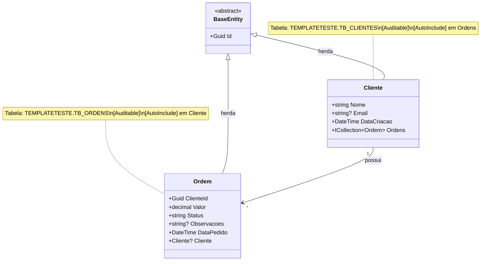

### Mapeamento Oracle

| Entidade | Schema | Tabela | PK (Oracle) |
|----------|--------|--------|-------------|
| `BaseEntity` | - | - | `ID` (RAW 16 / GUID) |
| `Cliente` | `TEMPLATETESTE` | `CLIENTE` | `ID` |
| `Ordem` | `TEMPLATETESTE` | `ORDEM` | `ID` |

### Índices (AppDbContext.OnModelCreating)

| Entidade | Coluna | Tipo | Observação |
|----------|--------|------|------------|
| `Cliente` | `EMAIL` | Unique (filtrado) | `WHERE EMAIL IS NOT NULL` |
| `Ordem` | `CLIENTE_ID` | Non-unique | FK para Cliente |
| `Ordem` | `STATUS` | Non-unique | Filtros por status |
| `Ordem` | `DATA_PEDIDO` | Non-unique | Filtros por data |

### Comportamentos do Domínio

- **Delete Behavior**: `Restrict` — não permite deletar um cliente que possui ordens
- **Status padrão da Ordem**: `"Pendente"` (definido no construtor)
- **DataCriacao/DataPedido**: `DateTime.UtcNow` como valor padrão

---

<a id="6-camada-de-aplicação-application"></a>
## 6. Camada de Aplicação (Application)

Contém a **lógica de aplicação** (Handlers), **lógica de negócio** (Services), **validações**, **DTOs** e **exceções**. Orquestra o fluxo de dados entre a API e o Domínio.

### Estrutura

| Categoria | Organização |
|----------|-------------|
| DI | `DependencyInjection.cs` (orquestrador) + `Stores/` (módulos de registro) |
| Abstractions | `Abstractions/Configuration/` (seções e predicados), `Abstractions/Persistence/` (contratos do banco secundário) |
| Services | `IClienteService`, `ClienteService`, `IOrdemService`, `OrdemService`, `IOrdemHistoricoService` (contrato; implementação na Infrastructure) |
| Documents | `Documents/OrdemHistoricoDocumento.cs` (POCO sem atributos do driver) |
| Exceptions | `ConflictException.cs` |
| DTOs | `DTOs/{Entidade}Dto/{Request\|Response\|Resume}/` |
| Commands | `Commands/{Entidade}/{Ação}/` (Command, Validator, Handler) |
| Queries | `Queries/{Entidade}/{Detalhe}/` (Query, Handler) |

> **Regra de alocação de Services.** Service cujo único vínculo externo são abstrações declaradas na Application (ou contratos de repositório) fica **aqui** — caso de `ClienteService` e `OrdemService` (e de qualquer service sobre `ISqlServerRepository<T>`). Service que depende de um cliente de infraestrutura concreto fica na **Infrastructure** — caso de `OrdemHistoricoService`, que usa o `IDocumentStore<T>` do FUNCEF.NoSql. Por isso esta camada **não** referencia `FUNCEF.NoSql`.

### DTOs

```
DTOs/
├── ClienteDto/
│   ├── Request/   (ClienteRequest, ClienteComOrdemRequest)
│   ├── Response/  (ClienteResponse, ClienteComOrdemResponse)
│   └── Resume/    (ClienteResume)
└── OrdemDto/
    ├── Request/   (CreateOrdemRequest, UpdateOrdemRequest, UpdateOrdemStatusRequest)
    ├── Response/  (OrdemResponse)
    └── Resume/    (OrdemResume)
```

### Diagrama de Componentes

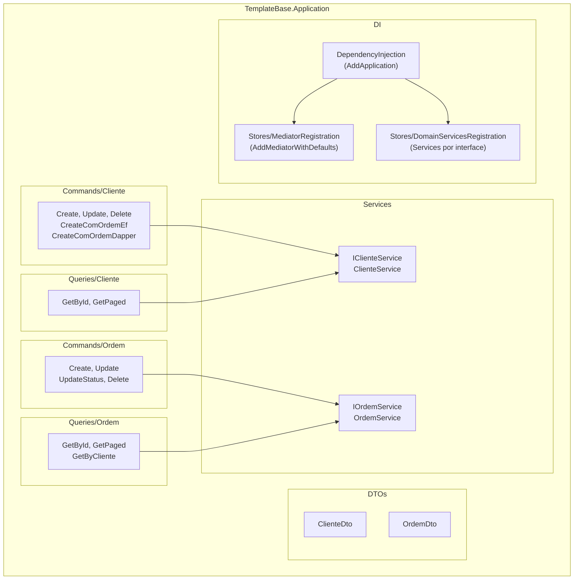

### Validação (FluentValidation)

Cada Command possui um Validator correspondente que é executado **automaticamente** pelo `ValidationBehavior` no pipeline do Mediator. Se a validação falhar, o request é rejeitado com HTTP 400 antes de chegar ao Handler.

> Validators validam o **Command** (não o DTO Request). Queries não possuem Validators.

### Mapeamento de DTOs ([MapFrom] e [NestedMap])

Os DTOs utilizam atributos `[MapFrom]` e `[NestedMap]` do FuncefORM para mapeamento automático via `MapTo<TEntity, TDto>()`:

```csharp
public class ClienteResponse
{
    [MapFrom("Id")]       public Guid Id { get; set; }
    [MapFrom("Nome")]     public string Nome { get; set; } = string.Empty;
    [MapFrom("Email")]    public string? Email { get; set; }
    [MapFrom("DataCriacao")] public DateTime DataCriacao { get; set; }
    [NestedMap("Ordens")] public List<OrdemResume>? Ordens { get; set; }
}
```

### Estratégia de Exceções

| Exceção | HTTP | Uso |
|---------|:----:|-----|
| `NotFoundException` | 404 | `NotFoundException.ForResource("Cliente", id)` |
| `BusinessException` | 422 | `new BusinessException("mensagem", "ERROR_CODE")` |
| `ConflictException` | 409 | `new ConflictException("recurso", "detalhe")` |
| `ValidationException` | 400 | Automático via pipeline do Mediator |

---

<a id="7-camada-de-infraestrutura-infrastructure"></a>
## 7. Camada de Infraestrutura (Infrastructure)

Implementa as **preocupações técnicas**: acesso a dados, cache, auditoria, autenticação, storage e telemetria.

### Estrutura

| Arquivo | Descrição |
|---------|-----------|
| `DependencyInjection.cs` | Orquestrador de DI — define a ordem dos 11 passos de registro (ver §10) |
| `Stores/*.cs` | Um módulo de registro por preocupação (Secrets, Telemetry, Oracle, SqlServer, Cache, Documents, Audit, Authentication, FileStorage, Mapping) |
| `Configuration/VaultBootstrap.cs` | Fonte única da leitura de segredos em tempo de registro |
| `Configuration/KeyVaultConfigurationExtensions.cs` | Injeta no `IConfiguration` os segredos que componentes leem direto dele |
| `Configuration/ConfigurationValidationExtensions.cs` | Validação de configuração no startup (fail-fast em produção) |
| `Persistence/Context/AppDbContext.cs` | DbContext do Oracle (principal), herdando `BaseDbContext` |
| `Persistence/Context/SqlServerDbContext.cs` | DbContext do SQL Server (secundário) |
| `Persistence/SqlServer/SqlServerRepository.cs` | Repositório do banco secundário |
| `Persistence/SqlServer/SqlServerUnitOfWork.cs` | Unidade de trabalho do banco secundário |
| `Persistence/Documents/OrdemHistoricoDocumentoMapping.cs` | Mapeamento Bson via `BsonClassMap` (mantém o POCO da Application livre do driver) |
| `Persistence/Seeders/ClienteSeeder.cs` | Seeder de clientes (Oracle, apenas em dev) |
| `Persistence/Seeders/OrdemSeeder.cs` | Seeder de ordens (Oracle, apenas em dev) |
| `Services/OrdemHistoricoService.cs` | Histórico em MongoDB via `IDocumentStore<T>` |

### AppDbContext

`AppDbContext` herda de `BaseDbContext` (FuncefORM), que fornece:

- Interceptor de auditoria (`AuditSaveChangesInterceptor`)
- Interceptor de telemetria
- Integração com pool de conexões
- Suporte a transações (EF Core e Dapper)

### Seeders

Seeders herdam de `EntitySeederBase<T>` e são executados automaticamente em desenvolvimento. A propriedade `Order` controla a sequência de execução para respeitar integridade referencial.

| Seeder | Order | Dados |
|--------|-------|-------|
| `ClienteSeeder` | 1 | 2 clientes (IDs fixos) |
| `OrdemSeeder` | 2 | 3 ordens (referenciando clientes do seeder 1) |

---

<a id="8-camada-de-apresentação-api"></a>
## 8. Camada de Apresentação (API)

Ponto de entrada HTTP. Contém controllers e configuração de startup.

### Estrutura

| Arquivo | Descrição |
|---------|-----------|
| `Program.cs` | ~20 linhas: resolve segredos, registra, constrói, diagnostica, monta o pipeline |
| `DependencyInjection.cs` | `AddApiServices()` — ponto de composição das três camadas |
| `ApiPipeline.cs` | `UseApiPipeline()` — ordem dos middlewares e mapeamento de endpoints |
| `Stores/PresentationRegistration.cs` | Controllers, JSON, FluentValidation, Swagger, sessão OAuth, HttpClient |
| `Stores/SecurityRegistration.cs` | CORS e rate limiting |
| `Stores/HealthCheckRegistration.cs` | Health checks e as tags `live`/`ready` que definem os probes |
| `HealthChecks/DependencyHealthChecks.cs` | Checks de Redis, MongoDB e SQL Server |
| `Diagnostics/StartupDiagnostics.cs` | Verificação não-fatal de conectividade (Dev/Homologation) |
| `Controllers/ClientesController.cs` | 7 endpoints (GetAll, Get, Create, CreateComOrdem, CreateComOrdemDapper, Update, Delete) |
| `Controllers/OrdensController.cs` | 7 endpoints (GetAll, Get, GetByCliente, Create, Update, UpdateStatus, Delete) |

> **Registro × pipeline são arquivos separados de propósito.** `DependencyInjection` responde "o que existe no container" e `ApiPipeline` responde "em que ordem a requisição atravessa" — perguntas independentes, com regras de ordenação distintas (no registro a ordem quase nunca importa; no pipeline é semântica).

> Os endpoints de health são mapeados em `ApiPipeline` via `MapHealthChecks()`/`MapGet()`, sem controller dedicado.

### Controllers com IMediator

Todos os controllers herdam de `BaseController` (FuncefEssenciais) e recebem `IMediator`:

```csharp
public class ClientesController : BaseController
{
    private readonly IMediator _mediator;

    public ClientesController(ITelemetry telemetry, IMediator mediator) : base(telemetry)
    {
        _mediator = mediator;
    }

    // Commands → _mediator.Send()
    // Queries  → _mediator.Receive()
}
```

### Métodos de resposta do BaseController

| Método | Descrição | HTTP Status |
|--------|-----------|:-----------:|
| `ApiOk(data)` | Retorna dados | 200 |
| `ApiCreated(data)` | Retorna dados criados | 201 |
| `ApiNoContent()` | Sem corpo | 204 |

---

<a id="9-pipeline-http-middleware"></a>
## 9. Pipeline HTTP (Middleware)

O pipeline de middleware do ASP.NET Core é configurado em `Program.cs`. A **ordem é crítica** para o funcionamento correto.

### Diagrama Sequencial do Pipeline

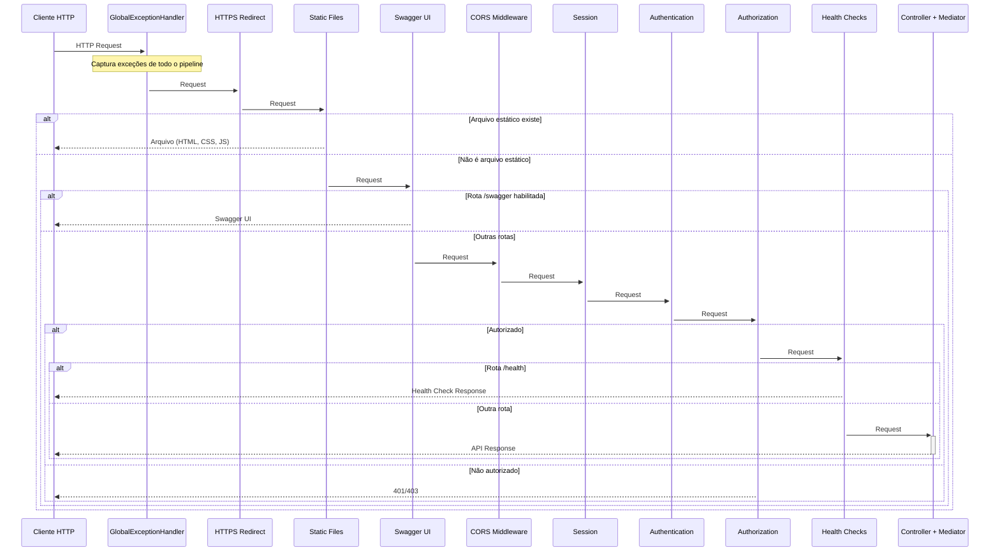

### Ordem dos Middlewares

| # | Middleware | Responsabilidade |
|---|-----------|------------------|
| 1 | `UseGlobalExceptionHandler()` | Captura exceções e retorna ProblemDetails, mapeia ConflictException → 409 |
| 2 | `UseHttpsRedirection()` | Redireciona HTTP para HTTPS |
| 3 | `UseDefaultFiles()` + `UseStaticFiles()` | Serve arquivos de wwwroot/ |
| 4 | `UseSwaggerDocumentation()` | Swagger UI (condicional) |
| 5 | `UseCors()` | Valida origens cross-origin |
| 6 | `UseSession()` | Gerencia sessão (state OAuth) |
| 7 | `UseAuthentication()` | Valida tokens JWT |
| 8 | `UseAuthorization()` | Verifica atributos de autorização |
| 9 | `MapHealthChecks()` | Endpoints de monitoramento (/health, /health/live, /health/ready) |
| 10 | `MapGet("/health/version")` | Informações de versão |
| 11 | `MapControllers()` | Roteamento para controllers |

---

<a id="10-dependency-injection"></a>
## 10. Dependency Injection

### Padrão: orquestrador + módulos de registro

Cada camada expõe **um** `DependencyInjection.cs` (orquestrador) que não registra nada por conta própria — apenas define a ordem em que os módulos de `Stores/` entram no container. Cada módulo de `Stores/` cobre **uma** preocupação e é responsável pela própria condição de habilitação.

```
src/TemplateBase.Application/
├── DependencyInjection.cs            ← AddApplication(configuration)
└── Stores/
    ├── MediatorRegistration.cs       Mediator, handlers, validators, behaviors (por convenção)
    └── DomainServicesRegistration.cs Services de negócio (registro manual por interface)

src/TemplateBase.Infrastructure/
├── DependencyInjection.cs            ← AddInfrastructure() / AddInfrastructureDevelopment()
└── Stores/
    ├── SecretsRegistration.cs        Azure Key Vault (FUNCEF.Cofre)
    ├── TelemetryRegistration.cs      OpenTelemetry + Azure Monitor
    ├── OracleRegistration.cs         Banco PRINCIPAL: AppDbContext, IRepository<T>, IUnitOfWork
    ├── SqlServerRegistration.cs      Banco SECUNDÁRIO: contexto, repositório e UoW próprios
    ├── CacheRegistration.cs          Redis (ICacheStore)
    ├── DocumentsRegistration.cs      MongoDB (IDocumentStore<T>) + IOrdemHistoricoService
    ├── AuditRegistration.cs          Auditoria de entidades e de acesso (Oracle Lakehouse)
    ├── AuthenticationRegistration.cs Entra ID, refresh tokens, cliente do PDP
    ├── FileStorageRegistration.cs    Azure Storage (Blob, Queue, Table)
    └── MappingRegistration.cs        Object mapper ([MapFrom]/[NestedMap])

src/TemplateBase.API/
├── DependencyInjection.cs            ← AddApiServices() — compõe as três camadas
├── ApiPipeline.cs                    ← UseApiPipeline() — middlewares e endpoints
└── Stores/
    ├── PresentationRegistration.cs   Controllers, JSON, FluentValidation, Swagger, sessão OAuth
    ├── SecurityRegistration.cs       CORS e rate limiting
    └── HealthCheckRegistration.cs    Health checks e as tags live/ready
```

### Registro na Application

`AddApplication(configuration)` delega para dois módulos:

| Módulo | Responsabilidade |
|--------|------------------|
| `MediatorRegistration` | `AddMediatorWithDefaults` — Scrutor escaneia o assembly e registra `ICommandHandler<,>`, `IQueryHandler<,>`, `AbstractValidator<>`, `IPipelineBehavior<,>` e o `IMediator`. **Nenhum handler é registrado manualmente.** |
| `DomainServicesRegistration` | Services de negócio, registro manual por interface — a lista legível das capacidades da aplicação. |

Recebe `IConfiguration` para permitir services **condicionais**: um service sobre o banco secundário só deve ser registrado quando a seção `SqlServer` existe (`ConfigurationSections.IsSqlServerEnabled`). O registro condicional é load-bearing — os handlers declaram esses services como dependência **opcional** (`= null`) e respondem com `BusinessException` de configuração quando ausentes; registrá-los sem a infraestrutura trocaria essa mensagem por um erro de resolução de DI.

> `IOrdemHistoricoService` é a exceção: a implementação depende do `IDocumentStore<T>` (FUNCEF.NoSql) e por isso vive na Infrastructure, que também o registra (`DocumentsRegistration`). A regra é **o registro acompanha a implementação** — a Application não pode referenciar a Infrastructure sem inverter a regra de dependência.

### Fonte única das condições

`ConfigurationSections` (em `Application/Abstractions/Configuration`) centraliza os nomes das seções e os predicados de habilitação. A mesma condição é avaliada em camadas diferentes: a seção `SqlServer` decide na Infrastructure se o contexto é registrado **e** na API se o health check `sqlserver` entra em `/health/ready`. Com strings literais repetidas, renomear a seção em um só lugar deixaria o recurso meio-registrado — serviço no ar sem probe, ou o inverso.

### Ordem de registro na Infrastructure

A ordem é **semântica**: vários módulos consomem, em tempo de registro, serviços registrados por módulos anteriores.

| # | Módulo | Por que a posição importa |
|---|--------|---------------------------|
| 1 | **Secrets** (Key Vault) | Origem das connection strings e chaves de quase todos os seguintes. Depois, os outros caem em fallback silencioso. |
| 2 | **Telemetry** | Registra `ITelemetry`, consumido pelos módulos seguintes. |
| 3 | **Oracle** | `AppDbContext`, `IRepository<T>`, `IUnitOfWork`, health check `ready`. |
| 4 | **SqlServer** | Contexto, repositório e UoW do banco secundário (opcional). |
| 5 | **Cache** (Redis) | **Obrigatoriamente antes de Authentication:** com `Auth:RefreshToken:StorageType = Redis`, o store de refresh tokens reaproveita o `ICacheStore` daqui. Invertido, cai em memória **sem erro** — e os tokens deixam de ser compartilhados entre réplicas. |
| 6 | **Documents** (MongoDB) | Document store + `IOrdemHistoricoService` (opcional). |
| 7 | **EntityAuditing** | Interceptor de `SaveChanges`; exige o `AppDbContext` do passo 3. |
| 8 | **Authentication** | Entra ID, refresh tokens, cliente do PDP; exige o cache do passo 5. |
| 9 | **AccessAuditing** | Complementa a autenticação do passo 8 — precisa vir depois dela. |
| 10 | **FileStorage** | Azure Storage; resolve a URI da conta via Key Vault (opcional). |
| 11 | **Mapping** | Object mapper; sem dependência de ordem, fecha a cadeia. |

Módulos opcionais (4, 5, 6, 10) são **no-op** quando a seção correspondente não existe.

### Composição no Program.cs

O `Program.cs` tem ~20 linhas: resolve segredos, registra, constrói, diagnostica e monta o pipeline.

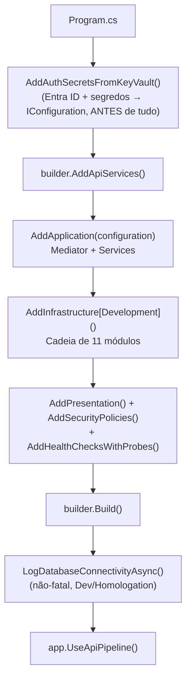

`AddAuthSecretsFromKeyVault()` precede todo registro: alguns componentes leem segredos **direto do `IConfiguration`/`IOptions`**, ignorando a resolução feita pela lib a partir da referência ao cofre. Ver §12 para o caso da auditoria.

**Forma canônica das referências a segredo.** Todo o ecossistema usa um único formato, o `SecretRef` de `FUNCEF.Abstractions` — uma subseção `<Coisa>FromKeyVault` com `Enabled` + `SecretName`:

```jsonc
"ConnectionStringFromKeyVault": { "Enabled": true, "SecretName": "nome-do-segredo-no-cofre" }
```

É fixa a **chave** do `appsettings.json`, nunca o **nome do segredo** — o nome pertence ao cofre de cada sistema, e nenhum componente FUNCEF o assume por convenção. As quatro sintaxes anteriores (`*KeyName`, `SecretName` cru, `UseKeyVaultForX` + `XSecretName`, e o `KeyVaultReference` do FUNCEF.NoSql) foram **removidas** dos componentes, sem alias nem período de convivência: uma chave antiga remanescente não quebra o build nem o startup — ela é simplesmente ignorada, e o segredo nunca é resolvido. O teste `ConfiguracaoEntraIdTests.Config_NaoDeveUsarSintaxeAntigaDeReferenciaASegredo` existe para pegar exatamente isso. Mapa completo em `FUNCEF.Abstractions/docs/CONFIGURACAO-FUNCEF.md`.

Pedir o cofre sem informar o segredo (`Enabled: true` sem `SecretName`) é **erro de configuração** e derruba o startup — inclusive para chaves opcionais, porque degradar ali esconderia um erro de digitação.

O mesmo mecanismo resolve os **identificadores do Entra ID** (`TenantId`/`ClientId`/`Audience`), que por isso não ficam versionados no `appsettings` — só as referências `*FromKeyVault`. Eles são marcados como obrigatórios: se não resolverem, o startup falha nomeando a chave e o segredo esperado. Sem esse fail-fast a API subiria com `Authority` sem tenant e responderia 401 em tudo, com o health check do Entra e o self-test M2M silenciosamente desligados (ambos leem `Auth:EntraId:TenantId` do `IConfiguration`). `Scope` e `Auth:M2M:AllowedTenantIds`, quando vazios, são derivados do ClientId/TenantId resolvidos.

### Resolução de segredos em tempo de registro

`VaultBootstrap` (em `Infrastructure/Configuration`) é a fonte única disso. Cria um container **mínimo e isolado** com `IVaultService` + `ITelemetry`, descartado após uso — evita `BuildServiceProvider()` no container principal.

- **Sem circuit breaker**, deliberadamente: faz apenas leituras pontuais no startup, e o breaker (a) loga toda `NotFoundException` como ERRO — ruído para segredos opcionais — e (b) conta o `NotFound` como falha, podendo **abrir** e bloquear a leitura dos segredos seguintes, que existem.
- **Nunca lança**: falha por segredo devolve `null`, para que a ausência de um não aborte a leitura dos outros.
- O `IVaultService` **de runtime** (com cache e breaker) é o de `SecretsRegistration`. A connection string do SQL Server usa esse caminho de runtime, resolvido na criação do contexto — não o de bootstrap.

---

<a id="11-sistema-de-autenticação"></a>
## 11. Sistema de Autenticação

### Fluxo OAuth2 + PKCE (Login Interativo)

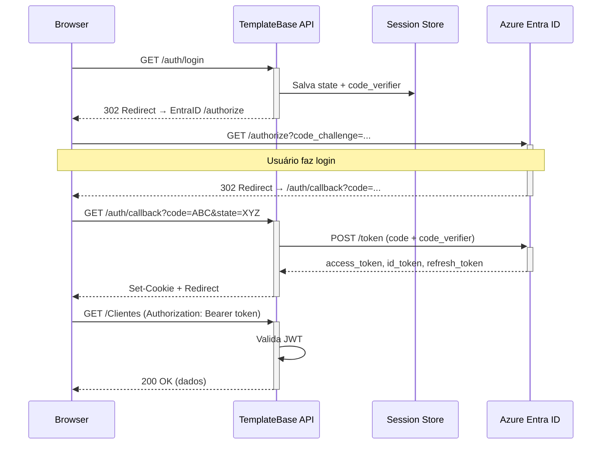

### Fluxo M2M (Machine-to-Machine)

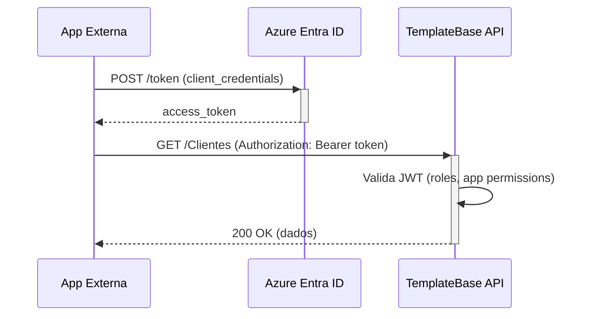

### Proteção de Endpoints

Os controllers `ClientesController` e `OrdensController` utilizam `[FuncefAuthorize]` em todos os endpoints. Os endpoints de health são públicos.

---

<a id="12-sistema-de-auditoria"></a>
## 12. Sistema de Auditoria

### 12.1 Auditoria de Entidades (FuncefORM.Audit)

Audita automaticamente operações de **INSERT, UPDATE e DELETE** em entidades marcadas com `[Auditable]`.

```mermaid
sequenceDiagram
    participant H as Handler
    participant U as IUnitOfWork
    participant EF as EF Core (SaveChanges)
    participant Int as AuditSaveChangesInterceptor
    participant BG as AuditBackgroundService
    participant Mongo as MongoDB (audit_logs)

    H->>U: SaveChangesAsync()
    U->>EF: SaveChangesAsync()
    EF->>+Int: SavingChangesAsync()
    Note over Int: Detecta entidades [Auditable]\nCaptura: old values, new values
    Int-->>-EF: Continue
    EF->>-H: Result

    Int->>+BG: Enqueue(AuditEntry)
    BG->>Mongo: InsertOne(AuditEntryDocument)
```

### 12.2 Auditoria de Acesso (FuncefAutenticacao.AccessAudit)

Registra tentativas de **login e acesso** a endpoints protegidos.

A persistência é configurada na seção `Auth:Audit` do appsettings.

| Destino | Configuração | Uso |
|---------|--------------|-----|
| Oracle Lakehouse | `ConnectionStringFromKeyVault: { Enabled: true, SecretName: "api-oracle-audit" }` | Produção / Homologação |
| Telemetria (fallback) | `Enabled: true` sem connection string Oracle | Desenvolvimento |

---

<a id="13-persistência-de-dados"></a>
## 13. Persistência de Dados

### Onde cada dado mora — matriz de decisão

| Base | Papel | Obrigatória? | Seção |
|------|-------|--------------|-------|
| **Oracle** | **Registro do domínio.** Entidades de negócio, transações, trilha de auditoria. Conformidade com o PadraoBD FUNCEF. **Destino padrão de qualquer entidade nova.** | Sim | `FuncefORM` |
| **SQL Server** | **Interoperabilidade.** Dados que *não pertencem* ao Oracle: integração com sistemas que já publicam em SQL Server, bases legadas de terceiros, espelhos. Exceção justificada, não alternativa livre. | Não | `SqlServer` |
| **MongoDB** | **Documentos.** Append-only, sem esquema rígido, fora de transação relacional (ex.: histórico de eventos). | Não | `NoSql:MongoDocuments` |
| **Redis** | **Cache distribuído** e backing store de refresh tokens. Sem ele, os tokens não são compartilhados entre réplicas. | Não (recomendada em produção) | `NoSql:RedisCache` |
| **Azure Storage** | Arquivos (Blob), filas (Queue) e dados tabulares auxiliares (Table). | Não | `Storage` |

**Na dúvida, Oracle.** Uma entidade só vai para o SQL Server se a origem do dado for externa ao domínio desta API.

### Diagrama de Bancos de Dados

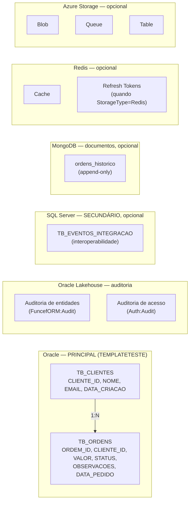

> **Nota de versão:** até a v3 dos componentes, as duas auditorias persistiam no MongoDB. A partir da v4 ambas gravam no **Oracle Lakehouse** (segredo `api-oracle-audit`) — o MongoDB deixou de ser requisito de auditoria e é hoje exclusivamente um document store de aplicação.

### Oracle — banco principal

| Tabela | Schema | Acesso |
|--------|--------|--------|
| `TB_CLIENTES` | `TEMPLATETESTE` | EF Core + Dapper |
| `TB_ORDENS` | `TEMPLATETESTE` | EF Core + Dapper |

**Acesso via:**
- **EF Core** (`IRepository<T>` + `IUnitOfWork`): CRUD padrão, transações, change tracking, auto-includes
- **Dapper**: queries de alta performance, operações em lote

DDL em `scripts/banco-dados/` (schema, tabelas, índices). Em desenvolvimento, `AddFuncefORMDevelopment` aplica migrations e seeders automaticamente.

### SQL Server — banco secundário

| Tabela | Acesso |
|--------|--------|
| `TB_EVENTOS_INTEGRACAO` | EF Core via `ISqlServerRepository<T>` + `ISqlServerUnitOfWork` |

**Por que um registro local e não `AddFuncefORMDbContext`:** na linha 3.x do FUNCEF.ORM existe um único `ORMOptions`/`ProviderType` por aplicação, e o provedor principal desta API é Oracle. `SqlServerRegistration` replica o padrão da lib (segredo no Key Vault com fallback direto, timeout, retry) para o segundo contexto.

**Consequência:** `IRepository<T>` e `IUnitOfWork` (FUNCEF.ORM) ficam ligados ao `AppDbContext` e **não alcançam** o SQL Server. Daí o par simétrico `ISqlServerRepository<T>`/`ISqlServerUnitOfWork` (contratos na Application, implementações em `Infrastructure/Persistence/SqlServer`), para que o padrão de acesso seja o mesmo nas duas bases — nenhum service manipula `DbContext` diretamente.

#### Paridade entre os dois provedores

| Capacidade | Oracle | SQL Server |
|-----------|--------|------------|
| Contexto | `AppDbContext` | `SqlServerDbContext` |
| Registro | `AddFuncefORM` + `AddFuncefORMDbContext` (lib) | `SqlServerRegistration` (local) |
| Repositório | `IRepository<T>` | `ISqlServerRepository<T>` |
| Unidade de trabalho | `IUnitOfWork` | `ISqlServerUnitOfWork` |
| Dapper | Sim | Não |
| Auditoria automática | Sim (`[Auditable]`) | Não |
| Health check (tag `ready`) | `funcef-orm` | `sqlserver` |
| Migrations | Auto em dev + `scripts/banco-dados/` | `scripts/banco-dados/sqlserver/` |
| Connection string | `FuncefORM:Connection:ConnectionStringFromKeyVault` | `SqlServer:ConnectionStringFromKeyVault` |

#### Não há transação distribuída

`IUnitOfWork` (Oracle) e `ISqlServerUnitOfWork` são **recursos transacionais independentes**: um commit não participa do outro, e o rollback de um não desfaz o outro.

Operação que precise alterar as duas bases de forma consistente exige **consistência eventual**:

1. Grave no Oracle dentro do `IUnitOfWork`, incluindo um registro de intenção (*outbox*) na mesma transação.
2. Publique no SQL Server em um passo separado, idempotente.
3. Reprocesse o que ficou pendente.

Não assuma atomicidade entre as duas bases — o commit do Oracle pode ter sucesso e o do SQL Server falhar em seguida.

---

<a id="14-resiliência-e-tolerância-a-falhas"></a>
## 14. Resiliência e Tolerância a Falhas

### Padrões Implementados

| Componente | Threshold | Timeout | Recovery |
|-----------|-----------|---------|----------|
| Oracle (FuncefORM) | 5 falhas | 30s | Half-open após timeout |
| Redis (FuncefNoSql) | Configurável | Configurável | Half-open |
| MongoDB (FuncefNoSql) | Configurável | Configurável | Half-open |
| Key Vault (FuncefCofre) | Configurável | Configurável | Half-open + cache |

### Health Checks

| Endpoint | Descrição |
|----------|-----------|
| `/health` | Status completo (JSON detalhado) |
| `/health/live` | Liveness probe |
| `/health/ready` | Readiness probe |
| `/health/version` | Informações de versão |

---

<a id="15-stack-de-componentes-funcef"></a>
## 15. Stack de Componentes FUNCEF

### Diagrama de Dependências

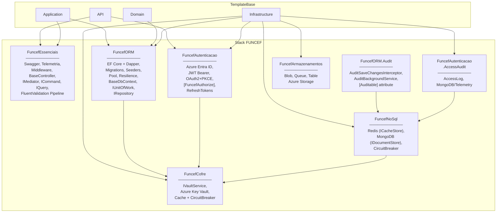

### Resumo dos Componentes

| Componente | Função Principal |
|-----------|-----------------|
| **FuncefEssenciais** | HTTP utils, telemetria, Swagger, middleware, IMediator, ICommand, IQuery, FluentValidation pipeline |
| **FuncefORM** | Acesso a dados (EF Core + Dapper), IRepository, IUnitOfWork |
| **FuncefORM.Audit** | Auditoria de entidades |
| **FuncefAutenticacao** | Autenticação e autorização |
| **FuncefNoSql** | Redis (cache) + MongoDB opcional (`AddMongoDocuments<T>`) |
| **FuncefCofre** | Azure Key Vault |
| **FuncefArmazenamentos** | Azure Storage |

---

<div align="center"><br/><strong>Arquitetura — TemplateBase</strong><br/>Clean Architecture + CQRS/Mediator + Service Layer · .NET 10 · Oracle · Azure<br/><br/>© FUNCEF 2025–2026</div>
