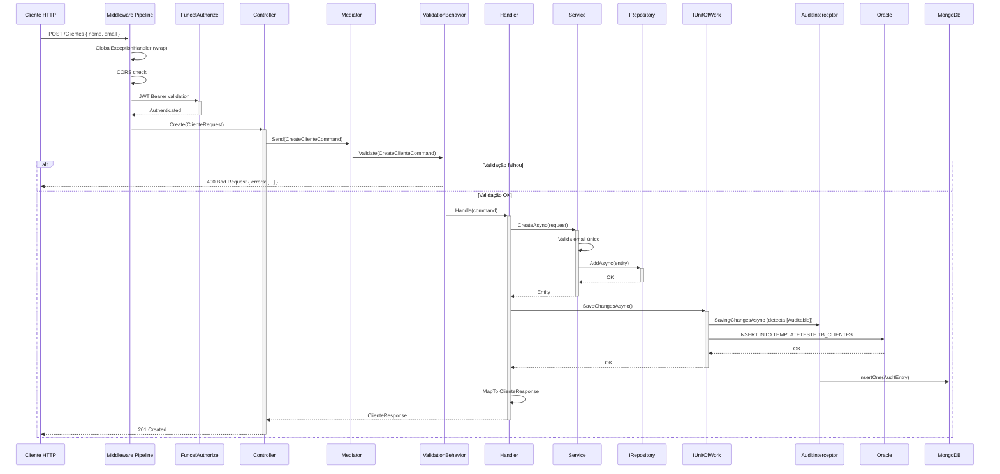

<h1 align="center">Guia de Desenvolvimento</h1>
<p align="center"><strong>TemplateBase — Guia completo para criar novas features e entender convenções</strong></p>
<p align="center">
  
  
  
  
  
</p>

> Guia completo para desenvolvedores que precisam criar novas features, entender convenções e utilizar os recursos do template.

> [!IMPORTANT]
> **Stack FUNCEF linha 3.0** (`[3.0.0,4.0.0)`): autenticação via `FuncefAutenticacao` (ex-`FuncefSeguranca`);
> auditoria no **Oracle Lakehouse** (não MongoDB); paginação e `ITelemetry` em `FUNCEF.Abstractions`;
> refresh tokens usam `Auth:RefreshToken:StorageType` (`InMemory`/`Redis`); versões centralizadas em
> `Directory.Packages.props` (Central Package Management).

---

## Sumário

| | Seção | Descrição |
|:---:|-------|-----------|
| 1 | [Pré-requisitos](#1-pré-requisitos) | Ferramentas e extensões |
| 2 | [Configuração do Ambiente](#2-configuração-do-ambiente) | Clone, configuração e execução |
| 3 | [Criação de Entidade](#3-criação-de-entidade) | Passo a passo para novas entidades |
| 4 | [Criação de CRUD](#4-criação-de-crud) | Services, Commands, Queries, Handlers e Controllers |
| 5 | [Fluxo de Requisição](#5-fluxo-de-requisição) | Diagrama e resumo do pipeline |
| 6 | [Validação](#6-validação) | FluentValidation no pipeline do Mediator |
| 7 | [Mapeamento de DTOs](#7-mapeamento-de-dtos) | MapFrom, NestedMap e propriedades calculadas |
| 8 | [Transações](#8-transações) | EF Core e Dapper |
| 9 | [Auditoria](#9-auditoria) | Habilitando e configurando auditoria |
| 10 | [Autenticação e Autorização](#10-autenticação-e-autorização) | FuncefAuthorize e fluxos OAuth |
| 11 | [Convenções de Código](#11-convenções-de-código) | Nomenclatura e estrutura |
| 12 | [Testes](#12-testes) | MSTest, NSubstitute e exemplos |
| 13 | [Troubleshooting](#13-troubleshooting) | Problemas comuns e soluções |

---

<a id="1-pré-requisitos"></a>
## 1. Pré-requisitos

| Ferramenta | Versão | Finalidade |
|-----------|--------|-----------|
| .NET SDK | 10.0+ | Build e execução |
| Visual Studio 2022+ ou VS Code | Última | IDE |
| Docker Desktop | Última | Serviços locais (Redis, MongoDB) |
| Git | 2.x+ | Controle de versão |
| Azure CLI (opcional) | Última | Gerenciar Key Vault |

### Extensões VS Code Recomendadas

- C# Dev Kit (Microsoft)
- .NET Extension Pack
- Docker
- REST Client
- Mermaid Preview

---

<a id="2-configuração-do-ambiente"></a>
## 2. Configuração do Ambiente

### 2.1 Clone e Restauração

```bash
git clone <url-do-repositorio>
cd TemplateBase
dotnet restore
```

### 2.2 Configuração do appsettings

O arquivo já vem com valores de exemplo. O `KeyVault:Url` do `appsettings.json` é um **placeholder** e derruba o startup de propósito — sobrescreva aqui com o cofre de DEV do seu sistema. Preencha as configurações do Azure Entra ID:

```json
{
  "KeyVault": {
    "Url": "https://kv-<sistema>-<env>-001.vault.azure.net/"
  },
  "Auth": {
    "EntraId": {
      "TenantId": "<seu-tenant-id>",
      "ClientId": "<seu-client-id>",
      "ClientSecret": "<seu-client-secret>",
      "Audience": "api://<seu-client-id>",
      "RedirectUri": "https://localhost:56055/auth/callback"
    }
  }
}
```

### 2.3 Executar a API

```bash
dotnet run --project src/TemplateBase.API
```

A API será acessível em: `https://localhost:56055`

---

<a id="3-criação-de-entidade"></a>
## 3. Criação de Entidade

### Passo a Passo

Vamos criar uma entidade `Produto` como exemplo completo.

<details>
<summary><strong>Passo 1: Criar a entidade no Domain</strong></summary>

Crie o arquivo `src/TemplateBase.Domain/Entities/Produto.cs`:

```csharp
using System.ComponentModel.DataAnnotations;
using System.ComponentModel.DataAnnotations.Schema;
using FuncefORM.Audit.Attributes;

namespace TemplateBase.Domain.Entities;

[Table("PRODUTO", Schema = "TEMPLATETESTE")]
[Auditable("Produto")]
public class Produto : BaseEntity
{
    [Required]
    [Column("NOME", TypeName = "NVARCHAR2(200)")]
    [MaxLength(200)]
    public string Nome { get; set; } = string.Empty;

    [Column("DESCRICAO", TypeName = "NVARCHAR2(1000)")]
    [MaxLength(1000)]
    public string? Descricao { get; set; }

    [Required]
    [Column("PRECO", TypeName = "NUMBER(10,2)")]
    [Range(0.01, 99999999.99)]
    public decimal Preco { get; set; }

    [Required]
    [Column("ATIVO")]
    public bool Ativo { get; set; } = true;

    [Required]
    [Column("DATA_CRIACAO", TypeName = "TIMESTAMP(7)")]
    public DateTime DataCriacao { get; set; } = DateTime.UtcNow;
}
```

**Pontos importantes:**
- Herda de `BaseEntity` (fornece o `Id` como `Guid` com `[DatabaseGenerated(None)]`)
- `[Table("PRODUTO", Schema = "TEMPLATETESTE")]` — mapeia para a tabela Oracle
- `[Auditable("Produto")]` — habilita auditoria automática de INSERT/UPDATE/DELETE
- `[AutoInclude]` — usar em propriedades de navegação para carregamento automático

</details>

<details>
<summary><strong>Passo 2: Registrar no AppDbContext</strong></summary>

Edite `src/TemplateBase.Infrastructure/Persistence/Context/AppDbContext.cs`:

```csharp
public DbSet<Produto> Produtos { get; set; } = null!;
```

E adicione a configuração no `OnModelCreating`:

```csharp
modelBuilder.Entity<Produto>(entity =>
{
    entity.Property(e => e.Id).ValueGeneratedNever();
    entity.HasIndex(e => e.Nome);
    entity.HasIndex(e => e.Ativo);
});
```

</details>

<details>
<summary><strong>Passo 3: Criar Seeder (Opcional - para desenvolvimento)</strong></summary>

Crie `src/TemplateBase.Infrastructure/Persistence/Seeders/ProdutoSeeder.cs`:

```csharp
using FuncefORM.Contracts;
using TemplateBase.Domain.Entities;

namespace TemplateBase.Infrastructure.Persistence.Seeders;

public class ProdutoSeeder : EntitySeederBase<Produto>
{
    public override int Order => 3;

    public override IEnumerable<Produto> GetSeedData()
    {
        yield return new Produto
        {
            Id = Guid.Parse("66666666-6666-6666-6666-666666666666"),
            Nome = "Produto Exemplo",
            Descricao = "Descrição do produto de exemplo",
            Preco = 99.99m,
            Ativo = true,
            DataCriacao = DateTime.UtcNow
        };
    }
}
```

</details>

<details>
<summary><strong>Passo 4: Criar Migration</strong></summary>

```bash
dotnet ef migrations add AddProduto \
  --project src/TemplateBase.Infrastructure \
  --startup-project src/TemplateBase.API

dotnet ef database update \
  --project src/TemplateBase.Infrastructure \
  --startup-project src/TemplateBase.API
```

</details>

---

<a id="4-criação-de-crud"></a>
## 4. Criação de CRUD

Continuando com o exemplo do `Produto`, vamos criar todo o CRUD seguindo o padrão CQRS/Mediator com Service Layer.

### Estrutura de Pastas

```
Application/
├── Commands/
│   └── Produto/
│       ├── Create/
│       │   ├── CreateProdutoCommand.cs
│       │   ├── CreateProdutoValidator.cs
│       │   └── CreateProdutoHandler.cs
│       ├── Update/
│       ├── Delete/
├── Queries/
│   └── Produto/
│       ├── GetById/
│       │   ├── GetProdutoByIdQuery.cs
│       │   └── GetProdutoByIdHandler.cs
│       └── GetPaged/
├── Services/
│   ├── IProdutoService.cs
│   └── ProdutoService.cs
├── DTOs/
│   └── ProdutoDto/
│       ├── Request/   (ProdutoRequest.cs)
│       ├── Response/  (ProdutoResponse.cs)
│       └── Resume/    (ProdutoResume.cs)
├── Stores/
│   ├── MediatorRegistration.cs
│   └── DomainServicesRegistration.cs   ← registrar o ProdutoService aqui
└── DependencyInjection.cs
```

<details>
<summary><strong>Passo 1: Criar os DTOs</strong></summary>

**`DTOs/ProdutoDto/Request/ProdutoRequest.cs`:**

```csharp
namespace TemplateBase.Application.DTOs.ProdutoDto.Request;

public class ProdutoRequest
{
    public string Nome { get; set; } = string.Empty;
    public string? Descricao { get; set; }
    public decimal Preco { get; set; }
    public bool Ativo { get; set; } = true;
}
```

**`DTOs/ProdutoDto/Response/ProdutoResponse.cs`:**

```csharp
using FuncefORM.Mapping.Attributes;

namespace TemplateBase.Application.DTOs.ProdutoDto.Response;

public class ProdutoResponse
{
    [MapFrom("Id")]       public Guid Id { get; set; }
    [MapFrom("Nome")]     public string Nome { get; set; } = string.Empty;
    [MapFrom("Descricao")] public string? Descricao { get; set; }
    [MapFrom("Preco")]    public decimal Preco { get; set; }
    [MapFrom("Ativo")]    public bool Ativo { get; set; }
    [MapFrom("DataCriacao")] public DateTime DataCriacao { get; set; }
}
```

**`DTOs/ProdutoDto/Resume/ProdutoResume.cs`:**

```csharp
using FuncefORM.Mapping.Attributes;

namespace TemplateBase.Application.DTOs.ProdutoDto.Resume;

public class ProdutoResume
{
    [MapFrom("Id")]    public Guid Id { get; set; }
    [MapFrom("Nome")]  public string Nome { get; set; } = string.Empty;
    [MapFrom("Preco")] public decimal Preco { get; set; }
    [MapFrom("Ativo")] public bool Ativo { get; set; }

    public string PrecoFormatado => Preco.ToString("C",
        System.Globalization.CultureInfo.GetCultureInfo("pt-BR"));
}
```

</details>

<details>
<summary><strong>Passo 2: Criar o Service</strong></summary>

**`Services/IProdutoService.cs`:**

```csharp
using TemplateBase.Application.DTOs.ProdutoDto.Request;
using TemplateBase.Domain.Entities;

namespace TemplateBase.Application.Services;

public interface IProdutoService
{
    Task<Produto> CreateAsync(ProdutoRequest request, CancellationToken ct = default);
    Task<Produto> UpdateAsync(Guid id, ProdutoRequest request, CancellationToken ct = default);
    Task ValidateAndDeleteAsync(Guid id, CancellationToken ct = default);
    Task<Produto?> GetByIdAsync(Guid id, CancellationToken ct = default);
}
```

**`Services/ProdutoService.cs`:**

```csharp
using FuncefEssenciais.Exceptions;
using FuncefORM.Contracts;
using TemplateBase.Application.DTOs.ProdutoDto.Request;
using TemplateBase.Domain.Entities;

namespace TemplateBase.Application.Services;

public class ProdutoService : IProdutoService
{
    private readonly IRepository<Produto> _repository;

    public ProdutoService(IRepository<Produto> repository)
    {
        _repository = repository;
    }

    public virtual async Task<Produto> CreateAsync(ProdutoRequest request, CancellationToken ct = default)
    {
        var entity = new Produto
        {
            Id = Guid.NewGuid(),
            Nome = request.Nome,
            Descricao = request.Descricao,
            Preco = request.Preco,
            Ativo = request.Ativo,
            DataCriacao = DateTime.UtcNow
        };

        await _repository.AddAsync(entity, ct);
        return entity;
    }

    public virtual async Task<Produto> UpdateAsync(Guid id, ProdutoRequest request, CancellationToken ct = default)
    {
        var produto = await _repository.GetByIdAsync(id, cancellationToken: ct)
            ?? throw NotFoundException.ForResource("Produto", id);

        produto.Nome = request.Nome;
        produto.Descricao = request.Descricao;
        produto.Preco = request.Preco;
        produto.Ativo = request.Ativo;

        await _repository.UpdateAsync(produto, ct);
        return produto;
    }

    public virtual async Task ValidateAndDeleteAsync(Guid id, CancellationToken ct = default)
    {
        var produto = await _repository.GetByIdAsync(id, cancellationToken: ct)
            ?? throw NotFoundException.ForResource("Produto", id);

        await _repository.DeleteAsync(produto, ct);
    }

    public virtual Task<Produto?> GetByIdAsync(Guid id, CancellationToken ct = default)
        => _repository.GetByIdAsync(id, cancellationToken: ct);
}
```

> **Services** encapsulam lógica de negócio e acesso a dados via `IRepository<T>`. Usam `virtual` nos métodos para facilitar mocking em testes.

</details>

<details>
<summary><strong>Passo 3: Criar o Command + Validator + Handler</strong></summary>

**`Commands/Produto/Create/CreateProdutoCommand.cs`:**

```csharp
using FuncefEssenciais.Application.Commands;
using TemplateBase.Application.DTOs.ProdutoDto.Request;
using TemplateBase.Application.DTOs.ProdutoDto.Response;

namespace TemplateBase.Application.Commands.Produto.Create;

public class CreateProdutoCommand : ICommand<ProdutoResponse>
{
    public ProdutoRequest Request { get; set; } = new();
}
```

**`Commands/Produto/Create/CreateProdutoValidator.cs`:**

```csharp
using FluentValidation;
using FuncefEssenciais.Core.Validation.FluentValidation;

namespace TemplateBase.Application.Commands.Produto.Create;

public class CreateProdutoValidator : AbstractValidator<CreateProdutoCommand>
{
    public CreateProdutoValidator()
    {
        this.RuleForRequiredText(x => x.Request.Nome, "nome", 200);
        this.RuleForOptionalText(x => x.Request.Descricao, "descrição", 1000);
        this.RuleForPositiveDecimal(x => x.Request.Preco);
    }
}
```

**`Commands/Produto/Create/CreateProdutoHandler.cs`:**

```csharp
using FuncefEssenciais.Application.Commands;
using FuncefORM.Contracts;
using FuncefORM.Mapping.Extensions;
using TemplateBase.Application.DTOs.ProdutoDto.Response;
using TemplateBase.Application.Services;

namespace TemplateBase.Application.Commands.Produto.Create;

public class CreateProdutoHandler : ICommandHandler<CreateProdutoCommand, ProdutoResponse>
{
    private readonly IProdutoService _service;
    private readonly IUnitOfWork _unitOfWork;

    public CreateProdutoHandler(IProdutoService service, IUnitOfWork unitOfWork)
    {
        _service = service;
        _unitOfWork = unitOfWork;
    }

    public async Task<ProdutoResponse> Handle(CreateProdutoCommand command, CancellationToken cancellationToken)
    {
        var produto = await _service.CreateAsync(command.Request, cancellationToken);
        await _unitOfWork.SaveChangesAsync(cancellationToken);
        return produto.MapTo<Domain.Entities.Produto, ProdutoResponse>();
    }
}
```

> **Handler** recebe o Command, delega ao Service e persiste via `IUnitOfWork.SaveChangesAsync()`.

</details>

<details>
<summary><strong>Passo 4: Criar a Query + Handler</strong></summary>

**`Queries/Produto/GetById/GetProdutoByIdQuery.cs`:**

```csharp
using FuncefEssenciais.Application.Queries;
using TemplateBase.Application.DTOs.ProdutoDto.Response;

namespace TemplateBase.Application.Queries.Produto.GetById;

public class GetProdutoByIdQuery : IQuery<ProdutoResponse>
{
    public Guid Id { get; set; }
}
```

**`Queries/Produto/GetById/GetProdutoByIdHandler.cs`:**

```csharp
using FuncefEssenciais.Application.Queries;
using FuncefEssenciais.Exceptions;
using FuncefORM.Mapping.Extensions;
using TemplateBase.Application.DTOs.ProdutoDto.Response;
using TemplateBase.Application.Services;

namespace TemplateBase.Application.Queries.Produto.GetById;

public class GetProdutoByIdHandler : IQueryHandler<GetProdutoByIdQuery, ProdutoResponse>
{
    private readonly IProdutoService _service;

    public GetProdutoByIdHandler(IProdutoService service) => _service = service;

    public async Task<ProdutoResponse> Handle(GetProdutoByIdQuery query, CancellationToken cancellationToken)
    {
        var produto = await _service.GetByIdAsync(query.Id, cancellationToken)
            ?? throw NotFoundException.ForResource("Produto", query.Id);

        return produto.MapTo<Domain.Entities.Produto, ProdutoResponse>();
    }
}
```

</details>

<details>
<summary><strong>Passo 5: Registrar Service no DI</strong></summary>

Edite `src/TemplateBase.Application/Stores/DomainServicesRegistration.cs`:

```csharp
internal static IServiceCollection AddDomainServices(
    this IServiceCollection services,
    IConfiguration configuration)
{
    services.AddScoped<IClienteService, ClienteService>();
    services.AddScoped<IOrdemService, OrdemService>();
    services.AddScoped<IProdutoService, ProdutoService>();  // novo

    return services;
}
```

> Handlers e Validators são registrados **automaticamente** pelo `AddMediatorWithDefaults()` (em `Stores/MediatorRegistration.cs`). Apenas o **Service** precisa de registro manual.
>
> Se o Service depender de infraestrutura **opcional** (SQL Server, MongoDB, Redis), condicione o registro com `ConfigurationSections.Is*Enabled(configuration)` e declare a dependência como opcional no handler (`IProdutoService? service = null`) — o padrão está documentado em `DomainServicesRegistration` e `SqlServerRegistration`.

</details>

<details>
<summary><strong>Passo 6: Criar o Controller</strong></summary>

**`src/TemplateBase.API/Controllers/ProdutosController.cs`:**

```csharp
using FuncefEssenciais.Application;
using FuncefEssenciais.Http.Controllers;
using FuncefEssenciais.Infrastructure.Telemetry.Contracts;
using FuncefAutenticacao.Authorization;
using Microsoft.AspNetCore.Mvc;
using TemplateBase.Application.Commands.Produto.Create;
using TemplateBase.Application.DTOs.ProdutoDto.Request;
using TemplateBase.Application.DTOs.ProdutoDto.Response;
using TemplateBase.Application.Queries.Produto.GetById;

namespace TemplateBase.API.Controllers;

[Route("[controller]")]
[ApiController]
public class ProdutosController : BaseController
{
    private readonly IMediator _mediator;

    public ProdutosController(ITelemetry telemetry, IMediator mediator) : base(telemetry)
    {
        _mediator = mediator;
    }

    [HttpPost]
    [FuncefAuthorize]
    [ProducesResponseType(typeof(ProdutoResponse), StatusCodes.Status201Created)]
    [ProducesResponseType(StatusCodes.Status400BadRequest)]
    public async Task<IActionResult> Create(
        [FromBody] ProdutoRequest request,
        CancellationToken cancellationToken = default)
    {
        var result = await _mediator.Send(
            new CreateProdutoCommand { Request = request },
            cancellationToken);

        return ApiCreated(result);
    }

    [HttpGet("{id:guid}")]
    [FuncefAuthorize]
    [ProducesResponseType(typeof(ProdutoResponse), StatusCodes.Status200OK)]
    [ProducesResponseType(StatusCodes.Status404NotFound)]
    public async Task<IActionResult> Get(
        Guid id,
        CancellationToken cancellationToken = default)
    {
        var result = await _mediator.Receive(
            new GetProdutoByIdQuery { Id = id },
            cancellationToken);

        return ApiOk(result);
    }
}
```

</details>

### Checklist para Novo CRUD

- [ ] Entidade no Domain com `[Auditable]`, `[Table]`, `[Column]`
- [ ] DbSet no `AppDbContext` + configuração no `OnModelCreating`
- [ ] Seeder (opcional, para desenvolvimento)
- [ ] Migration
- [ ] DTOs Request/Response/Resume com `[MapFrom("Property")]`
- [ ] Service (Interface + Implementação) com lógica de negócio via `IRepository<T>`
- [ ] Commands em `Commands/{Entidade}/{Ação}/` (Command `ICommand<T>`, Validator `AbstractValidator<Command>`, Handler `ICommandHandler<,>`)
- [ ] Queries em `Queries/{Entidade}/{Detalhe}/` (Query `IQuery<T>`, Handler `IQueryHandler<,>`)
- [ ] Registro do Service em `Application/Stores/DomainServicesRegistration.cs` (Handlers e Validators são automáticos via `AddMediatorWithDefaults`)
- [ ] Controller com `IMediator`, `[FuncefAuthorize]` e herança de `BaseController`
- [ ] Testes unitários (Validators, Handlers, Services, Controllers)

---

<a id="5-fluxo-de-requisição"></a>
## 5. Fluxo de Requisição

### Diagrama Sequencial



### Resumo do Fluxo

1. **Request HTTP** chega ao servidor Kestrel
2. **Middleware Pipeline** processa: Exception Handler → HTTPS → CORS → Session → Auth
3. **Controller** recebe o request autenticado, cria o Command e envia ao **IMediator**
4. **ValidationBehavior** valida o Command automaticamente via FluentValidation
5. **Handler** orquestra o fluxo: delega ao Service, persiste via UnitOfWork
6. **Service** executa lógica de negócio e acessa dados via IRepository
7. **AuditInterceptor** captura mudanças em entidades `[Auditable]`
8. **Response** retorna ao cliente como DTO

---

<a id="6-validação"></a>
## 6. Validação

### Registro Automático via AddMediatorWithDefaults

Os Validators são registrados automaticamente pelo `AddMediatorWithDefaults()` (Scrutor scan). O `ValidationBehavior` no pipeline do Mediator executa a validação antes do Handler.

> Não é necessário registrar cada Validator manualmente no DI.

### Validators validam Commands (não DTOs)

```csharp
// CORRETO — Validator valida o Command
public class CreateClienteValidator : AbstractValidator<CreateClienteCommand>
{
    public CreateClienteValidator()
    {
        this.RuleForRequiredText(x => x.Request.Nome, "nome", 100);
        this.RuleForOptionalEmail(x => x.Request.Email, maxLength: 150);
    }
}
```

### Queries não possuem Validators

Apenas Commands possuem Validators no pipeline. Para Queries, validações são feitas no Handler quando necessário.

### Métodos de Conveniência (FuncefEssenciais)

| Método | Uso |
|--------|-----|
| `RuleForRequiredText(x => x.Nome, "nome", 100)` | Texto obrigatório com tamanho máximo |
| `RuleForOptionalText(x => x.Descricao, "descrição", 500)` | Texto opcional com tamanho máximo |
| `RuleForOptionalEmail(x => x.Email, maxLength: 150)` | Email opcional, formato válido |
| `RuleForRequiredId(x => x.Id, "id")` | GUID obrigatório (não Guid.Empty) |
| `RuleForPositiveDecimal(x => x.Valor)` | Decimal maior que zero |
| `RuleForRequiredAllowedValues(x => x.Status, StatusValidos, "status")` | Valor em lista permitida |
| `RuleForPagination(x => x.Pagina, x => x.TamanhoPagina)` | Página e tamanho de página válidos |
| `RuleForSortField(x => x.OrdenarPor, allowedFields)` | Campo de ordenação permitido |
| `RuleForSortDirection(x => x.DirecaoOrdenacao)` | Direção asc/desc válida |

<details>
<summary><strong>Exemplo: Validator com Status Permitidos</strong></summary>

```csharp
public class UpdateOrdemValidator : AbstractValidator<UpdateOrdemCommand>
{
    private static readonly string[] StatusValidos =
        ["Pendente", "Processando", "Enviado", "Concluido", "Cancelado"];

    public UpdateOrdemValidator()
    {
        this.RuleForRequiredId(x => x.Id, "id");
        this.RuleForPositiveDecimal(x => x.Request.Valor);
        this.RuleForRequiredAllowedValues(x => x.Request.Status, StatusValidos, "Status");
        this.RuleForOptionalText(x => x.Request.Observacoes, "observações", 500);
    }
}
```

</details>

---

<a id="7-mapeamento-de-dtos"></a>
## 7. Mapeamento de DTOs

### Atributos de Mapeamento (FuncefORM)

| Atributo | Uso | Exemplo |
|----------|-----|---------|
| `[MapFrom("Prop")]` | Mapeia propriedade simples | `[MapFrom("Nome")] public string Nome` |
| `[MapFrom("Nav.Prop")]` | Mapeia propriedade de navegação | `[MapFrom("Cliente.Nome")] public string? NomeCliente` |
| `[NestedMap("Nav")]` | Mapeia objeto de navegação completo | `[NestedMap("Ordens")] public List<OrdemResume>? Ordens` |

> Use `[MapFrom("Property")]` em **cada propriedade** do DTO. Não use `[MapFrom(typeof(Entity))]` na classe.

### Uso no Handler

```csharp
using FuncefORM.Mapping.Extensions;

var dto = entity.MapTo<Domain.Entities.Cliente, ClienteResponse>();
var dtos = entities.MapToList<Domain.Entities.Cliente, ClienteResume>();
```

> Use `Domain.Entities.{Entidade}` (fully qualified) para evitar colisão de namespace com a pasta `Commands/{Entidade}/` ou `Queries/{Entidade}/`.

### Propriedades Calculadas

Propriedades sem `[MapFrom]` não são mapeadas automaticamente e podem ser calculadas:

```csharp
public class OrdemResume
{
    [MapFrom("DataPedido")] public DateTime DataPedido { get; set; }
    [MapFrom("Valor")]      public decimal Valor { get; set; }

    public string DataPedidoFormatada => DataPedido.ToString("dd/MM/yyyy");
    public string ValorFormatado => Valor.ToString("C",
        System.Globalization.CultureInfo.GetCultureInfo("pt-BR"));
}
```

---

<a id="8-transações"></a>
## 8. Transações

O TemplateBase demonstra transações com EF Core e Dapper. O padrão é: **Handlers controlam transação, Services acessam repositórios**.

### 8.1 CRUD simples (Handler + SaveChanges)

Para operações simples, o Handler delega ao Service e chama `SaveChangesAsync()`:

```csharp
public async Task<ClienteResponse> Handle(CreateClienteCommand command, CancellationToken ct)
{
    var cliente = await _service.CreateAsync(command.Request, ct);
    await _unitOfWork.SaveChangesAsync(ct);
    return cliente.MapTo<Domain.Entities.Cliente, ClienteResponse>();
}
```

### 8.2 Transação explícita com EF Core (Begin/Commit/Rollback)

Para operações que envolvem múltiplos Services:

```csharp
public async Task<ClienteComOrdemResponse> Handle(
    CreateClienteComOrdemEfCommand command, CancellationToken ct)
{
    await _unitOfWork.BeginAsync(ct);

    try
    {
        var cliente = await _clienteService.CreateAsync(clienteRequest, ct);
        await _unitOfWork.SaveChangesAsync(ct);

        var ordem = await _ordemService.CreateAsync(ordemRequest, ct);
        await _unitOfWork.SaveChangesAsync(ct);

        await _unitOfWork.CommitAsync(ct);
        return new ClienteComOrdemResponse { /* ... */ };
    }
    catch
    {
        await _unitOfWork.RollbackAsync(ct);
        throw;
    }
}
```

### 8.3 Transação com Dapper (SQL Direto)

Os Services expõem métodos Dapper. O Handler controla a transação da mesma forma:

```csharp
public async Task<ClienteComOrdemResponse> Handle(
    CreateClienteComOrdemDapperCommand command, CancellationToken ct)
{
    await _unitOfWork.BeginAsync(ct);

    try
    {
        await _clienteService.CreateWithDapperAsync(command.Request, clienteId, dataAtual, ct);
        await _ordemService.CreateWithDapperAsync(clienteId, ordemId, valor, obs, dataAtual, ct);

        await _unitOfWork.CommitAsync(ct);
        return new ClienteComOrdemResponse { /* ... */ };
    }
    catch
    {
        await _unitOfWork.RollbackAsync(ct);
        throw;
    }
}
```

### Quando Usar Cada Abordagem?

| Cenário | Recomendação | Motivo |
|---------|-------------|--------|
| CRUD simples | EF Core (SaveChanges) | Produtividade, change tracking, auditoria automática |
| Inserção em lote | Dapper | Performance superior |
| Queries complexas | Dapper | Controle total sobre o SQL |
| Transação multi-entidade | EF Core ou Dapper | Ambos suportam Begin/Commit/Rollback |
| Auditoria necessária | EF Core | O interceptor só funciona com EF Core |

---

<a id="9-auditoria"></a>
## 9. Auditoria

### Habilitando Auditoria em uma Entidade

Adicione o atributo `[Auditable]` na classe:

```csharp
[Auditable("Cliente")]
public class Cliente : BaseEntity { }
```

### O Que é Capturado Automaticamente

Quando `SaveChangesAsync()` é chamado no EF Core:

| Evento | Dados Capturados |
|--------|-----------------|
| INSERT | NewValues, UserId, UserName, IP, Timestamp |
| UPDATE | OldValues, NewValues, Changes (diff), UserId, UserName, IP |
| DELETE | OldValues, UserId, UserName, IP |

### Configuração (appsettings.json)

A partir da v4, a auditoria de entidades persiste no **Oracle Lakehouse** (`LOG_AUDIT.Registro_LOG`).

```json
{
  "FuncefORM": {
    "Audit": {
      "Enabled": true,
      "ConnectionStringFromKeyVault": {
        "Enabled": true,
        "SecretName": "api-oracle-audit"
      },
      "ApplicationName": "TemplateBase.API",
      "IncludeOldValues": true,
      "IncludeNewValues": true,
      "IncludeChanges": true,
      "QueueCapacity": 50000,
      "MaxSaveRetries": 3
    }
  }
}
```

---

<a id="10-autenticação-e-autorização"></a>
## 10. Autenticação e Autorização

### Protegendo um Endpoint

Use `[FuncefAuthorize]` (não `[Authorize]`):

```csharp
[HttpGet]
[FuncefAuthorize]
public async Task<IActionResult> GetAll() { }

[HttpGet("public")]
[AllowAnonymous]
public IActionResult GetPublicData() { }
```

### Fluxos Suportados

- **OAuth2 + PKCE** — login interativo para frontends
- **Client Credentials** — comunicação máquina-a-máquina (M2M)

---

<a id="11-convenções-de-código"></a>
## 11. Convenções de Código

### Nomenclatura

| Item | Convenção | Exemplo |
|------|-----------|---------|
| Commands | `{Ação}{Entidade}Command` | `CreateClienteCommand`, `DeleteOrdemCommand` |
| Queries | `Get{Entidade}{Detalhe}Query` | `GetClienteByIdQuery`, `GetOrdemPagedQuery` |
| Command Handlers | `{Ação}{Entidade}Handler` | `CreateClienteHandler`, `UpdateOrdemStatusHandler` |
| Query Handlers | `Get{Entidade}{Detalhe}Handler` | `GetClienteByIdHandler`, `GetOrdensByClienteHandler` |
| Validators | `{Ação}{Entidade}Validator` | `CreateClienteValidator`, `UpdateOrdemValidator` |
| Services | `I{Entidade}Service` / `{Entidade}Service` | `IClienteService` / `ClienteService` |
| DTOs Request | `{Entidade}Request`, `{Ação}{Entidade}Request` | `ClienteRequest`, `CreateOrdemRequest` |
| DTOs Response | `{Entidade}Response` | `ClienteResponse`, `OrdemResponse` |
| DTOs Resume | `{Entidade}Resume` | `ClienteResume`, `OrdemResume` |
| Controllers | `{Entidade}sController` | `ClientesController`, `OrdensController` |

### Estrutura de Pastas

```
Application/
├── Commands/
│   ├── Cliente/
│   │   ├── Create/          (Command, Validator, Handler)
│   │   ├── Update/
│   │   ├── Delete/
│   │   ├── CreateComOrdemEf/
│   │   └── CreateComOrdemDapper/
│   └── Ordem/
│       ├── Create/, Update/, UpdateStatus/, Delete/
├── Queries/
│   ├── Cliente/
│   │   ├── GetById/         (Query, Handler)
│   │   └── GetPaged/
│   └── Ordem/
│       ├── GetById/, GetPaged/, GetByCliente/
├── Abstractions/
│   ├── Configuration/       (ConfigurationSections.cs)
│   └── Persistence/         (ISqlServerRepository.cs, ISqlServerUnitOfWork.cs)
├── Services/
│   ├── IClienteService.cs, ClienteService.cs
│   ├── IOrdemService.cs, OrdemService.cs
│   └── IOrdemHistoricoService.cs   (implementação na Infrastructure)
├── Documents/
│   └── OrdemHistoricoDocumento.cs  (POCO, sem atributos do driver Mongo)
├── DTOs/
│   ├── ClienteDto/          (Request/, Response/, Resume/)
│   └── OrdemDto/            (Request/, Response/, Resume/)
├── Stores/
│   ├── MediatorRegistration.cs
│   └── DomainServicesRegistration.cs
└── DependencyInjection.cs
```

### Build Settings

| Configuração | Valor | Efeito |
|-------------|-------|--------|
| `TreatWarningsAsErrors` | `true` | Warnings tratados como erros |
| `Nullable` | `enable` | Nullable reference types |
| `GenerateDocumentationFile` | `true` | XML docs no build |

---

<a id="12-testes"></a>
## 12. Testes

### Framework e Configuração

| Item | Valor |
|------|-------|
| Framework | MSTest |
| Mocking | NSubstitute |
| Validação | FluentValidation.TestHelper |
| Paralelismo | `ExecutionScope.MethodLevel` |

### Estrutura de Testes

```
tests/TemplateBase.Tests/
├── TestAssemblySetup.cs
├── Application/
│   ├── Validators/       (testes de Validators)
│   ├── Handlers/         (testes de Handlers com NSubstitute)
│   └── DTOs/             (testes de DTOs)
├── Domain/               (testes de entidades)
├── API/Controllers/      (testes de controllers)
└── Infrastructure/       (Database, Redis, MongoDB, Seeders)
```

<details>
<summary><strong>Exemplo: Teste de Validator</strong></summary>

```csharp
using FluentValidation.TestHelper;
using TemplateBase.Application.Commands.Cliente.Create;
using TemplateBase.Application.DTOs.ClienteDto.Request;

[TestClass]
public class CreateClienteValidatorTests
{
    private CreateClienteValidator _validator = null!;

    [TestInitialize]
    public void Setup() => _validator = new CreateClienteValidator();

    [TestMethod]
    public void DevePassar_ComDadosValidos()
    {
        var command = new CreateClienteCommand
        {
            Request = new ClienteRequest { Nome = "João Silva", Email = "joao@email.com" }
        };
        var result = _validator.TestValidate(command);
        result.ShouldNotHaveAnyValidationErrors();
    }

    [TestMethod]
    public void DeveFalhar_SemNome()
    {
        var command = new CreateClienteCommand
        {
            Request = new ClienteRequest { Nome = string.Empty }
        };
        var result = _validator.TestValidate(command);
        result.ShouldHaveValidationErrorFor(x => x.Request.Nome);
    }
}
```

</details>

<details>
<summary><strong>Exemplo: Teste de Handler (com NSubstitute)</strong></summary>

```csharp
using NSubstitute;

[TestClass]
public class CreateClienteHandlerTests
{
    private IClienteService _service = null!;
    private IUnitOfWork _unitOfWork = null!;
    private CreateClienteHandler _handler = null!;

    [TestInitialize]
    public void Setup()
    {
        _service = Substitute.For<IClienteService>();
        _unitOfWork = Substitute.For<IUnitOfWork>();
        _handler = new CreateClienteHandler(_service, _unitOfWork);
    }

    [TestMethod]
    public async Task Handle_ComDadosValidos_DeveCriarCliente()
    {
        var cliente = new Cliente { Id = 1001L, Nome = "João" };
        _service.CreateAsync(Arg.Any<ClienteRequest>(), Arg.Any<CancellationToken>())
            .Returns(cliente);

        var command = new CreateClienteCommand
        {
            Request = new ClienteRequest { Nome = "João", Email = "joao@email.com" }
        };

        var result = await _handler.Handle(command, CancellationToken.None);

        Assert.IsNotNull(result);
        await _service.Received(1).CreateAsync(Arg.Any<ClienteRequest>(), Arg.Any<CancellationToken>());
        await _unitOfWork.Received(1).SaveChangesAsync(Arg.Any<CancellationToken>());
    }
}
```

</details>

### Executando Testes

```bash
dotnet test

dotnet test --filter "FullyQualifiedName~CreateClienteValidatorTests"
dotnet test --logger "console;verbosity=detailed"
```

---

<a id="13-troubleshooting"></a>
## 13. Troubleshooting

### Problemas Comuns

| Problema | Causa | Solução |
|----------|-------|---------|
| `RedisConnectionException` | Redis não acessível | Usar `Auth:RefreshToken:StorageType = "InMemory"` em desenvolvimento |
| Auditoria não é gravada | Connection string Oracle ausente | Conferir `FuncefORM:Audit:ConnectionStringFromKeyVault` (`Enabled` + `SecretName: "api-oracle-audit"`) e o segredo no Key Vault |
| CORS error no browser | Origem não permitida | Adicionar origem em `Cors:OriginsPermitidas` (e `Cors:Politica`) |
| 401 Unauthorized | Token inválido/expirado | Verificar `Auth:EntraId` no appsettings |
| `AADSTS7000218` / HTTP 401 no `/auth/callback` (`token_exchange_failed`) | O `FuncefAuthController` lê `Auth:EntraId:ClientSecret` direto do `IConfiguration`; se vazio, não envia `client_secret` | Só se aplica a `CredentialType: "ClientSecret"` — habilite `Auth:EntraId:ClientSecretFromKeyVault` (`Enabled` + `SecretName`), que o `AddAuthSecretsFromKeyVault()` do `Program.cs` injeta na config. Validar em `GET /auth/m2m/config` → `hasClientSecret: true`. Após mudar config/segredo, reiniciar a app por completo (Hot Reload não re-executa o startup) |
| `AADSTS700222` em Development | `CredentialType: "ManagedIdentity"` depende de Workload Identity Federation e só funciona rodando **no** Azure; na estação o `DefaultAzureCredential` devolve token de **usuário**, que o Entra rejeita como assertion federada | É o motivo de existir a `DeveloperUserCredential`, registrada só em `AddInfrastructureDevelopment`. Confirme que está rodando em `Development` e que `AZURE_TOKEN_CREDENTIALS=AzureCliCredential` está no `launchSettings.json` (senão o token sai da conta do Visual Studio, e o `oid` do 403 no cofre não bate com o do `az login`) |
| `Chave de assinatura do refresh token não configurada` após login OK | `RefreshTokenService` lê `Auth:RefreshToken:SigningKey` via `IOptions` bindado do config; a referência ao cofre só popula cópia local | Mesmo `AddAuthSecretsFromKeyVault()` injeta `Auth:RefreshToken:SigningKey` (≥ 32 chars) do Key Vault a partir de `Auth:RefreshToken:SigningKeyFromKeyVault`. Conferir que o segredo `glb-auth-refresh-jwt` existe no cofre |
| Startup falha com `'X:Enabled' é true, mas 'X:SecretName' não foi informado` | Referência ao cofre incompleta | Mensagem canônica do `SecretRef`: preencha o `SecretName` (ou desligue o `Enabled` e use o valor direto em dev). Vale até para segredos opcionais — falhar alto aqui evita mascarar erro de digitação |
| `AADSTS501051` (M2M) | App sem App Role atribuída para a própria API | Criar App Role (member type *Applications*) em **App roles**, conceder em **API permissions → My APIs**, e dar **Grant admin consent** |
| Falha no M2M só percebida em runtime | Sem validação no startup | Habilitar `Auth:M2M:ValidateOnStartup: true` — loga o `AADSTS...` no startup |
| Login interativo conclui mas dashboard fica "Não autenticado" (401 em `/auth/user/me`) | Com `Scope` de Graph (`User.Read`), o access_token tem audience do Microsoft Graph; `/auth/user/me` só aceita `api://{clientId}`/`{clientId}` | Usar no `Auth:EntraId:Scope` um scope **exposto pela própria API e com admin consent** (ex.: `api://{clientId}/user_impersonation`). NÃO desligar `ValidateAudience` |
| `AADSTS65005` (scope inexistente) no login | `Auth:EntraId:Scope` referencia um scope que não está em **Expose an API** | Usar um scope existente (`user_impersonation`) ou criar o scope no Entra |
| `AADSTS65001` (consent required) no login | O scope existe mas não tem consentimento | Usar um scope já consentido, ou **Grant admin consent** no app (Enterprise app → Permissions) |
| `TreatWarningsAsErrors` falha | Warning de nullable | Resolver warnings (`string?` onde necessário) |
| Handler não encontrado | Assembly não escaneado | Verificar `AddMediatorWithDefaults(assembly)` com o assembly correto |
| Colisão de namespace `Cliente` | `Commands.Cliente` vs `Domain.Entities.Cliente` | Usar `Domain.Entities.Cliente` (fully qualified) no MapTo |

### Application Insights

A connection string é resolvida via Key Vault. Configure a referência canônica no appsettings:

```json
"ApplicationInsights": {
  "ConnectionStringFromKeyVault": { "Enabled": true, "SecretName": "glb-appinsights-key" }
}
```

Sem segredo resolvido, a telemetria cai para console (`AddConsoleTelemetry`) — que é o comportamento desejado em `Development`, onde a referência vem com `Enabled: false`.

---

<div align="center"><br/><strong>Guia de Desenvolvimento — TemplateBase</strong><br/>.NET 10 · Clean Architecture · CQRS/Mediator · Service Layer<br/><br/>© FUNCEF 2025–2026</div>
