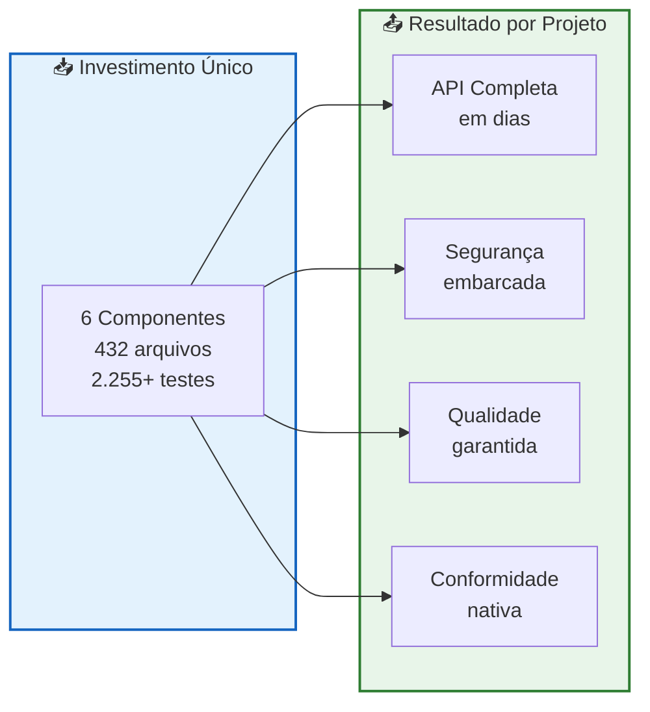
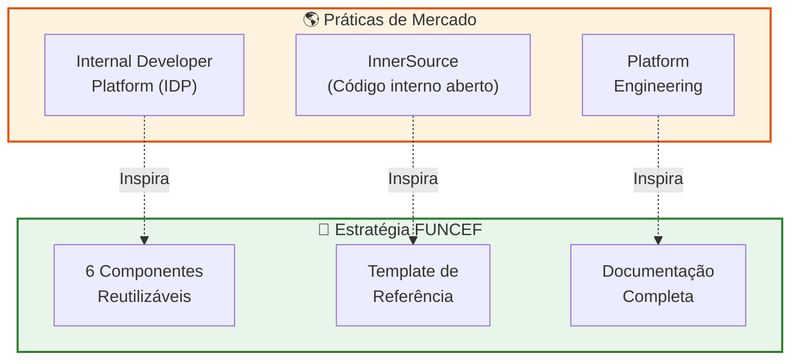
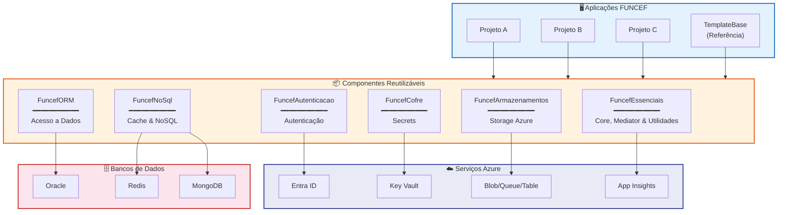
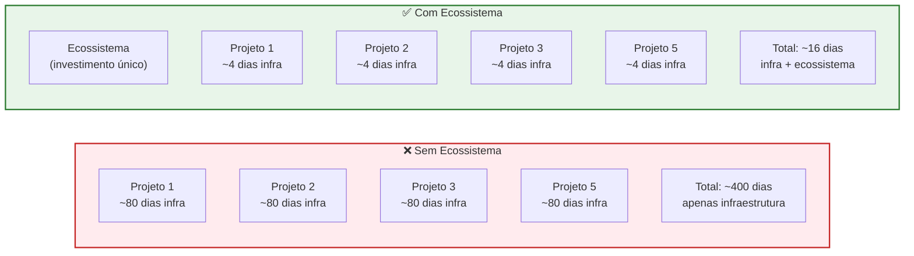
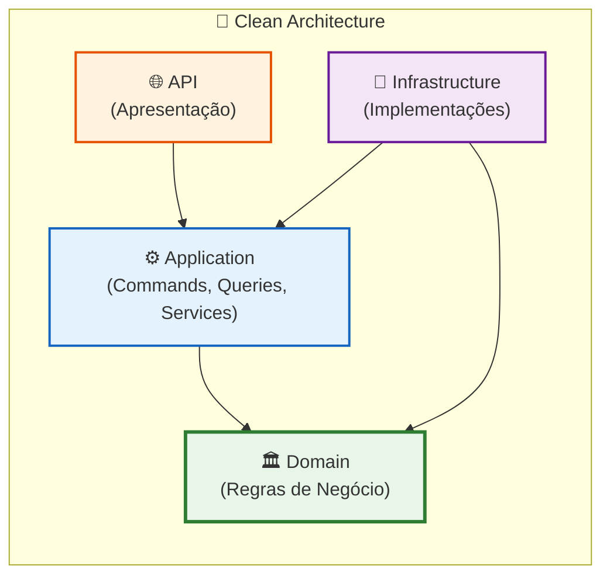
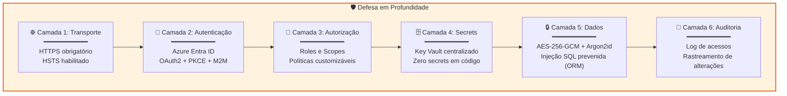
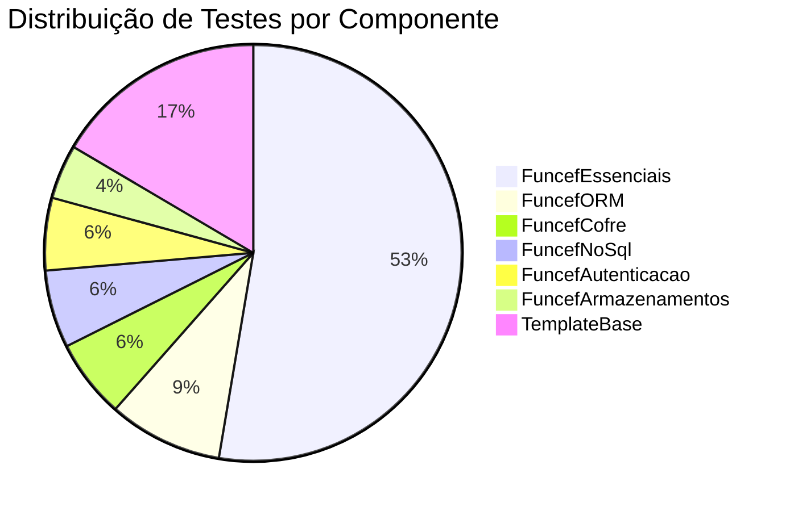
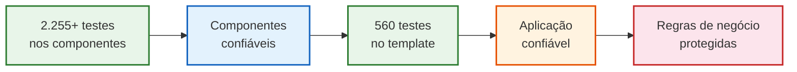
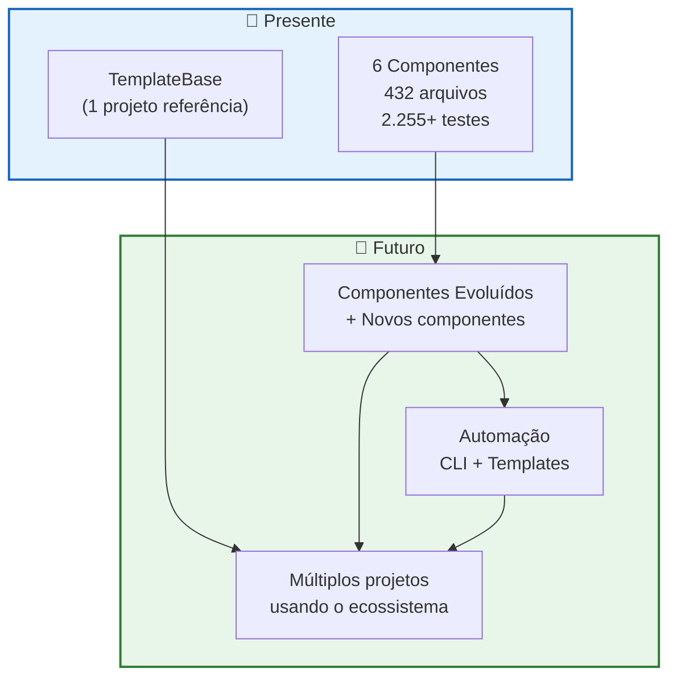

<h1 align="center">
   
  📊 Relatório Gerencial
   
</h1>

  <strong>Ecossistema de Componentes FUNCEF — Ganhos Estratégicos, Vantagens Competitivas e Retorno sobre Investimento</strong>

  
  
  
  

  
  
  
  
  

---

## 📑 Sumário

| | Seção | Descrição |
|:---:|-------|-----------|
| 📋 | [1. Resumo Executivo](#1-resumo-executivo) | Visão consolidada para tomada de decisão |
| 🎯 | [2. Contexto Estratégico](#2-contexto-estratégico) | Cenário atual e motivações |
| 🧩 | [3. O Ecossistema de Componentes](#3-o-ecossistema-de-componentes) | Inventário e mapa do que foi construído |
| 💰 | [4. Análise de Retorno sobre Investimento](#4-análise-de-retorno-sobre-investimento) | Métricas de economia e ganhos quantificáveis |
| 🏗️ | [5. Por que esta Arquitetura é a Melhor Estratégia](#5-por-que-esta-arquitetura-é-a-melhor-estratégia) | Justificativas técnicas e de negócio |
| 🔐 | [6. Segurança e Conformidade](#6-segurança-e-conformidade) | Segurança embarcada e governança |
| ⚡ | [7. Ganhos de Produtividade](#7-ganhos-de-produtividade) | Impacto direto na velocidade de entrega |
| 📊 | [8. Indicadores de Qualidade](#8-indicadores-de-qualidade) | Métricas de cobertura e confiabilidade |
| 🔄 | [9. Comparativo: Com vs. Sem o Ecossistema](#9-comparativo-com-vs-sem-o-ecossistema) | Cenários lado a lado |
| 🛡️ | [10. Mitigação de Riscos](#10-mitigação-de-riscos) | Riscos eliminados pela abordagem |
| 🚀 | [11. Visão de Futuro e Escalabilidade](#11-visão-de-futuro-e-escalabilidade) | Evolução e roadmap do ecossistema |
| ✅ | [12. Conclusão e Recomendações](#12-conclusão-e-recomendações) | Próximos passos e direcionamento |

---

## 📋 1. Resumo Executivo

> **A FUNCEF construiu um ecossistema de 6 bibliotecas de componentes reutilizáveis que, combinados com um template de referência e uma arquitetura padronizada, permitem que novos projetos de API sejam iniciados em dias — não em meses — com segurança, qualidade e conformidade já embarcadas desde o primeiro commit.**

### Números-chave do ecossistema

| Indicador | Valor | Significado |
|:----------|:-----:|:------------|
| **Bibliotecas de componentes** | **6** | Infraestrutura completa reutilizável |
| **Arquivos de código fonte** | **432** | Código maduro, testado e pronto para uso |
| **Testes automatizados (componentes)** | **2.255+** | Qualidade garantida na base |
| **Testes automatizados (template)** | **446** | Exemplo completo com cobertura ampla |
| **Testes totais do ecossistema** | **2.700+** | Confiabilidade comprovada |
| **Linhas de código reutilizáveis** | **~20.000+** | Investimento acumulado em ativos de software |
| **Redução estimada de tempo por projeto** | **60-75%** | Semanas em vez de meses para o primeiro MVP |

---

## 🎯 2. Contexto Estratégico

### O desafio que enfrentávamos

> Cada novo projeto de API na FUNCEF exigia que equipes de desenvolvimento construíssem, do zero, toda a infraestrutura técnica: autenticação, acesso a banco de dados, cache, armazenamento, segurança de secrets, auditoria e telemetria. Isso gerava **código duplicado**, **inconsistências de segurança**, **padrões divergentes** entre equipes e **prazos elevados** para entrega.

### A estratégia adotada

A FUNCEF optou por uma abordagem de **plataforma interna de desenvolvimento** (_Internal Developer Platform_), onde:

| Pilar | Descrição |
|:------|:----------|
| **Componentização** | Funcionalidades transversais encapsuladas em bibliotecas NuGet reutilizáveis |
| **Padronização** | Arquitetura de referência (Clean Architecture + CQRS/Mediator + Service Layer) documentada e exemplificada |
| **Template de Referência** | Projeto funcional completo que serve como ponto de partida |
| **Automação** | Configurações complexas reduzidas a chamadas simples de extensão |
| **Governança** | Segurança, auditoria e conformidade aplicadas de forma declarativa |

### Alinhamento com boas práticas de mercado

> 💡 **Empresas como Google, Netflix, Spotify e Nubank** adotam abordagens similares de plataformas internas com componentes reutilizáveis. A FUNCEF segue esta tendência com uma implementação adaptada à sua realidade e ao ecossistema Microsoft/Azure.

---

## 🧩 3. O Ecossistema de Componentes

### Visão geral do ecossistema

### Inventário detalhado dos componentes

<strong>📦 FuncefEssenciais — Core, Mediator e Utilidades</strong>

 

> O **alicerce do ecossistema**. Fornece funcionalidades transversais utilizadas por todos os outros componentes e projetos.

| Métrica | Valor |
|:--------|:-----:|
| Arquivos de código | **175** |
| Testes automatizados | **1.422** |

**O que fornece:**

| Módulo | Capacidades |
|:-------|:------------|
| **Validação brasileira** | CPF, CNPJ, e-mail, telefone com formatação automática |
| **Segurança** | Criptografia AES, hashing Argon2id, JWT, rotação de chaves |
| **Telemetria** | OpenTelemetry + Azure Monitor integrados |
| **Cache** | Abstração de cache com invalidação inteligente |
| **HTTP** | HttpClient resiliente com retry e circuit breaker |
| **CQRS/Mediator** | IMediator, ICommand, IQuery, ICommandHandler, IQueryHandler, pipeline de validação |
| **Controllers base** | Controllers padronizados com tratamento de erros (ApiOk, ApiCreated, ApiNoContent) |
| **Middleware** | GlobalExceptionHandler, logging, tratamento de exceções, performance |
| **Manipulação** | CSV, imagens e arquivos com APIs simplificadas |
| **Paginação** | Paginação consistente e padronizada (PaginatedResult, PagedRequest) |

<strong>🗄️ FuncefORM — Acesso a Dados Híbrido</strong>

 

> Combina a **produtividade do EF Core** com a **performance do Dapper** em um único componente, com abstração completa de Repository e Unit of Work.

| Métrica | Valor |
|:--------|:-----:|
| Arquivos de código | **90** |
| Testes automatizados | **239+** |

**O que fornece:**

| Módulo | Capacidades |
|:-------|:------------|
| **Repository** | `IRepository<T>` genérico com CRUD, filtros e paginação |
| **Unit of Work** | Transações atômicas com `IUnitOfWork` |
| **Dapper** | Consultas SQL de alta performance quando necessário |
| **Bulk Operations** | Inserção e atualização em massa otimizadas |
| **Migrations** | Gerenciamento de migração de esquema |
| **Seeding** | Population inicial de dados automatizada |
| **Mapeamento** | Conversão entidade-DTO com atributos `[MapFrom]` e `[NestedMap]` |
| **Auditoria** | Rastreamento automático de alterações com `[Auditable]` |
| **Specifications** | Padrão Specification para queries complexas reutilizáveis |

<strong>🔐 FuncefAutenticacao — Autenticação e Autorização</strong>

 

> Implementação **completa e pronta** de autenticação com Azure Entra ID. Fornece **24 endpoints de autenticação** prontos para uso, sem necessidade de código adicional.

| Métrica | Valor |
|:--------|:-----:|
| Arquivos de código | **64** |
| Testes automatizados | **152** |
| Endpoints prontos | **24** |

**O que fornece:**

| Módulo | Capacidades |
|:-------|:------------|
| **OAuth2 + PKCE** | Fluxo interativo seguro para aplicações web |
| **Client Credentials** | Autenticação máquina-a-máquina (M2M) |
| **Refresh Tokens** | Armazenamento em InMemory ou Redis |
| **Controllers** | `FuncefAuthController` (7), `FuncefUserInfoController` (14), `FuncefM2MController` (3) |
| **Swagger** | Configuração automática de Bearer JWT |
| **Auditoria** | Log de acessos e tentativas de autenticação |
| **Autorização** | Handler customizável de autorização por roles/scopes |

<strong>📡 FuncefNoSql — Cache e Armazenamento NoSQL</strong>

 

> Abstração unificada para **Redis** (cache/key-value) e **MongoDB** (documentos/auditoria) com resiliência integrada.

| Métrica | Valor |
|:--------|:-----:|
| Arquivos de código | **31** |
| Testes automatizados | **163** |

**O que fornece:**

| Módulo | Capacidades |
|:-------|:------------|
| **Cache** | `ICacheStore` com TTL, invalidação e políticas configuráveis |
| **Key-Value** | `IKeyValueStore` para dados temporários |
| **Documentos** | `IDocumentStore<T>` para persistência NoSQL |
| **Transações** | Operações transacionais em MongoDB |
| **Resiliência** | Circuit breaker e retry automáticos |
| **Health Checks** | Monitoramento de saúde das conexões |

<strong>🔑 FuncefCofre — Gestão de Secrets</strong>

 

> Integração segura com **Azure Key Vault** para gestão centralizada de secrets, chaves e certificados, com cache e resiliência.

| Métrica | Valor |
|:--------|:-----:|
| Arquivos de código | **28** |
| Testes automatizados | **165** |

**O que fornece:**

| Módulo | Capacidades |
|:-------|:------------|
| **Secrets** | Leitura e escrita segura de segredos |
| **Chaves** | Gestão de chaves criptográficas |
| **Certificados** | Gestão de certificados digitais |
| **Cache** | Cache local de secrets para performance |
| **Circuit Breaker** | Proteção contra falhas do Key Vault |
| **Rate Limiting** | Controle de taxa de requisições |
| **Auditoria** | Log de acessos a secrets |
| **Métricas** | Monitoramento de uso e performance |

<strong>📁 FuncefArmazenamentos — Armazenamento Azure</strong>

 

> Abstração completa de todos os serviços de armazenamento do Azure: **Blob, Queue, Table, File Share e Data Lake Gen2**.

| Métrica | Valor |
|:--------|:-----:|
| Arquivos de código | **44** |
| Testes automatizados | **114** |

**O que fornece:**

| Módulo | Capacidades |
|:-------|:------------|
| **Blob Storage** | Upload, download, SAS tokens (User Delegation) |
| **Queue Storage** | Enfileiramento e processamento de mensagens |
| **Table Storage** | Armazenamento key-value escalável |
| **File Share** | Compartilhamento de arquivos SMB |
| **Data Lake Gen2** | Big data e analytics |
| **Resiliência** | Circuit breaker e retry por serviço |
| **Métricas** | Monitoramento e auditoria |
| **Validação** | Validação de arquivos, tipos e tamanhos |

### Consolidação do ecossistema

| Componente | Arquivos | Testes | Propósito Principal |
|:-----------|:--------:|:------:|:--------------------|
| FuncefEssenciais | 175 | 1.422 | Core, IMediator, CQRS, validações, segurança, telemetria |
| FuncefORM | 90 | 239+ | Acesso a dados (EF Core + Dapper) |
| FuncefAutenticacao | 64 | 152 | Autenticação Azure Entra ID |
| FuncefNoSql | 31 | 163 | Redis e MongoDB |
| FuncefCofre | 28 | 165 | Azure Key Vault |
| FuncefArmazenamentos | 44 | 114 | Azure Storage completo |
| **Total** | **432** | **2.255+** | **Ecossistema completo** |

---

## 💰 4. Análise de Retorno sobre Investimento

### O custo de não ter componentes reutilizáveis

> Sem o ecossistema, **cada novo projeto** precisaria implementar, do zero, toda a infraestrutura técnica. A tabela abaixo estima o esforço necessário por funcionalidade.

| Funcionalidade | Esforço sem componentes | Com componentes | Economia |
|:---------------|:-----------------------:|:---------------:|:--------:|
| Autenticação OAuth2 + Entra ID | 15–20 dias | **1 linha de configuração** | ~95% |
| Acesso a dados (Repository + UoW) | 10–15 dias | **1 linha de configuração** | ~95% |
| Cache distribuído (Redis) | 5–8 dias | **1 linha de configuração** | ~95% |
| Auditoria automática | 8–12 dias | **1 atributo `[Auditable]`** | ~98% |
| Gestão de secrets (Key Vault) | 5–8 dias | **1 linha de configuração** | ~95% |
| Armazenamento Azure (Blob/Queue) | 8–12 dias | **1 linha de configuração** | ~95% |
| Validações brasileiras (CPF/CNPJ) | 3–5 dias | **Já incluso** | 100% |
| Telemetria (OpenTelemetry) | 5–8 dias | **1 linha de configuração** | ~95% |
| Health Checks | 3–5 dias | **Já incluso** | 100% |
| Tratamento global de erros | 3–5 dias | **Já incluso** | 100% |
| **Total por projeto** | **65–98 dias** | **~3–5 dias** | **~95%** |

### Projeção de economia em escala

| Cenário (5 projetos) | Dias de infra | Custo relativo | Economia |
|:----------------------|:-------------:|:--------------:|:--------:|
| **Sem ecossistema** | ~400 dias | 100% | — |
| **Com ecossistema** | ~20 dias | ~5% | **~380 dias** |

> 💡 **A cada novo projeto**, a economia acumulada cresce. O investimento na construção do ecossistema se paga já no **segundo projeto** e gera retorno crescente a cada projeto adicional.

### Economia em manutenção

| Aspecto | Sem ecossistema | Com ecossistema |
|:--------|:---------------:|:---------------:|
| Correção de bug de segurança | Corrigir em **N projetos** separadamente | Corrigir **1 vez** no componente |
| Atualização de dependência | **N atualizações** independentes | **1 atualização** propagada via NuGet |
| Nova feature transversal | Implementar em **N projetos** | Implementar **1 vez**, disponível para todos |
| Treinamento de novo dev | Aprender **N padrões** diferentes | Aprender **1 padrão** consistente |

---

## 🏗️ 5. Por que esta Arquitetura é a Melhor Estratégia

### Clean Architecture — Independência e longevidade

> A **Clean Architecture** garante que as regras de negócio da FUNCEF sejam independentes de frameworks, bancos de dados e interfaces externas. Isso protege o investimento em código contra obsolescência tecnológica.

| Benefício | Impacto para a FUNCEF |
|:----------|:----------------------|
| **Independência do banco** | Se amanhã for necessário migrar do Oracle para outro banco, apenas a camada de Infrastructure muda |
| **Testabilidade** | Regras de negócio testadas isoladamente, sem dependência de banco ou rede |
| **Manutenibilidade** | Alterações em uma camada não propagam efeitos colaterais para outras |
| **Onboarding rápido** | Desenvolvedores novos entendem a estrutura em horas, não semanas |
| **Evolução controlada** | Troca de componentes técnicos sem reescrever lógica de negócio |

### CQRS — Separação de leitura e escrita

| Vantagem | Detalhamento |
|:---------|:-------------|
| **Performance** | Queries otimizadas com Dapper (leitura) enquanto Commands usam EF Core (escrita) |
| **Escalabilidade** | Leituras e escritas podem ser escaladas independentemente |
| **Clareza** | Cada operação tem um Handler dedicado via IMediator — rastreabilidade total |
| **Validação** | Cada Command tem seu Validator no pipeline do Mediator — nenhum dado inválido chega ao Handler |
| **Auditoria** | Cada operação de escrita é rastreável individualmente |

### Por que .NET 10 e C# 13

| Fator | Justificativa |
|:------|:-------------|
| **Performance** | .NET 10 é um dos runtimes mais performáticos do mercado (benchmarks TechEmpower) |
| **Suporte corporativo** | Suporte da Microsoft até 2028+ (LTS) com SLA enterprise |
| **Ecossistema Azure** | Integração nativa com Azure Entra ID, Key Vault, Storage, Monitor |
| **Maturidade** | Plataforma com 20+ anos de evolução e comunidade massiva |
| **Segurança** | Patches de segurança contínuos e CVE tracking ativo |
| **Custo-benefício** | Open-source, sem custos de licenciamento para o runtime |

### Comparativo com alternativas de mercado

| Critério | Ecossistema FUNCEF | Framework genérico | Desenvolvimento ad-hoc |
|:---------|:------------------:|:------------------:|:----------------------:|
| Tempo para MVP | ✅ **Dias** | ⚠️ Semanas | ❌ Meses |
| Segurança Entra ID | ✅ Embarcada | ⚠️ Configuração manual | ❌ Implementação do zero |
| Padrões FUNCEF | ✅ Nativos | ❌ Ausentes | ❌ Ausentes |
| Testes prontos | ✅ 2.815+ | ⚠️ Parciais | ❌ Nenhum |
| Custo de manutenção | ✅ Centralizado | ⚠️ Distribuído | ❌ Exponencial |
| Consistência entre projetos | ✅ Garantida | ⚠️ Variável | ❌ Inexistente |
| Curva de aprendizado | ✅ Documentação completa | ⚠️ Documentação externa | ❌ Tribal knowledge |
| Integração Azure | ✅ Nativa | ⚠️ Manual | ❌ Caso a caso |

---

## 🔐 6. Segurança e Conformidade

> A segurança não é uma feature opcional — é **embarcada por padrão** em todos os componentes. Um desenvolvedor que usa o ecossistema FUNCEF obtém conformidade de segurança **sem esforço adicional**.

### Camadas de segurança do ecossistema

### Mapeamento de controles de segurança

| Controle de Segurança | Componente Responsável | Status |
|:----------------------|:-----------------------|:------:|
| Autenticação corporativa (Entra ID) | FuncefAutenticacao | ✅ Embarcado |
| Autenticação M2M (Client Credentials) | FuncefAutenticacao | ✅ Embarcado |
| Refresh Tokens seguros | FuncefAutenticacao | ✅ Embarcado |
| Secrets fora do código-fonte | FuncefCofre | ✅ Embarcado |
| Criptografia AES-256-GCM | FuncefEssenciais | ✅ Embarcado |
| Hashing Argon2id (senhas) | FuncefEssenciais | ✅ Embarcado |
| JWT com rotação de chaves | FuncefEssenciais | ✅ Embarcado |
| Prevenção de SQL Injection | FuncefORM (EF Core) | ✅ Embarcado |
| Auditoria de alterações em dados | FuncefORM | ✅ Embarcado |
| Auditoria de acessos | FuncefAutenticacao | ✅ Embarcado |
| Circuit Breaker (proteção contra falhas) | Todos os componentes | ✅ Embarcado |
| SAS Tokens (User Delegation) | FuncefArmazenamentos | ✅ Embarcado |
| Validação de entrada (CPF/CNPJ/etc) | FuncefEssenciais | ✅ Embarcado |
| Health Checks para monitoramento | Todos os componentes | ✅ Embarcado |

> 🔒 **Resultado:** projetos que nascem no ecossistema FUNCEF atendem a **14 controles de segurança automaticamente**, sem necessidade de implementação adicional pelo desenvolvedor.

---

## ⚡ 7. Ganhos de Produtividade

### O poder da configuração declarativa

O TemplateBase demonstra como **todo o ecossistema** é ativado com chamadas simples no `Program.cs`. Abaixo, a comparação entre o que o desenvolvedor escreve e o que ele obtém:

| O que o dev escreve | O que ele obtém | Linhas economizadas |
|:--------------------|:----------------|:-------------------:|
| `builder.AddFuncefORM<AppDbContext>(...)` | Repository, UoW, Dapper, Migrations, Audit, Bulk Ops, Seeding | **~2.000+** |
| `builder.AddFuncefAutenticacao(...)` | 24 endpoints de auth, OAuth2, JWT, M2M, Refresh Tokens, Swagger | **~3.000+** |
| `builder.AddFuncefNoSql(...)` | Redis cache, MongoDB docs, Circuit Breaker, Health Checks | **~1.500+** |
| `builder.AddFuncefCofre(...)` | Key Vault integrado, cache de secrets, rate limiting, métricas | **~1.500+** |
| `builder.AddFuncefArmazenamentos(...)` | Blob, Queue, Table, File Share, Data Lake, SAS, métricas | **~2.000+** |
| `builder.AddFuncefEssenciais(...)` | Validações, Telemetria, Middleware, HTTP Client, Paginação | **~4.000+** |
| **Total: ~6 linhas** | **Ecossistema completo** | **~14.000+** |

### Exemplo real: TemplateBase

> O TemplateBase prova o conceito na prática. Com apenas **4.147 linhas de código de aplicação**, ele entrega uma API completa com 43 endpoints, autenticação, auditoria, cache, validação e telemetria — porque **~14.000+ linhas estão nos componentes reutilizáveis**.

| Métrica do TemplateBase | Valor |
|:------------------------|:-----:|
| Linhas de código (aplicação) | **4.147** |
| Linhas de código (testes) | **8.100** |
| Endpoints totais | **43** (19 app + 24 auth) |
| Classes públicas | **63** |
| Handlers (CQRS/Mediator) | **14** (9 Command + 5 Query) |
| Validators | **9** |
| DTOs | **10** |
| Pacotes NuGet (total) | **12** |
| Pacotes FUNCEF utilizados | **3** (ORM, Armazenamentos, Segurança) |
| Testes automatizados | **560** |
| Arquivos de teste | **24** |
| Ratio testes/código | **1,95x** (quase 2 linhas de teste para cada linha de código) |

---

## 📊 8. Indicadores de Qualidade

### Cobertura de testes do ecossistema

### Cobertura de testes do TemplateBase (por camada)

> [!IMPORTANT]
> A cobertura ainda **não é medida automaticamente** (o pipeline de CI com gate de cobertura
> está no roadmap). A tabela abaixo reflete a **presença de testes por camada** na suíte atual
> (410 casos), não percentual de linhas exercitadas.

| Camada | Situação | Nível |
|:-------|:---------:|:-----:|
| Domain (Entidades) | Cliente, Ordem e StatusOrdem testados (propriedades + comportamento) | 🟢 |
| Application — Validators | 8 de 9 validators testados | 🟡 |
| Application — Handlers | Fluxos Cliente/Ordem testados | 🟡 |
| Application — DTOs | Cliente/Ordem testados | 🟢 |
| API — Controllers | 2 de 2 controllers testados | 🟢 |
| Infrastructure | DbContext, Seeders e configs testados | 🟡 |
| DI Registration | Presença de tipos verificada | 🟡 |

### Indicadores de qualidade do código

| Indicador | Valor | Avaliação |
|:----------|:-----:|:---------:|
| Testes automatizados (TemplateBase) | **446 casos** | 🟢 |
| Build com TreatWarningsAsErrors | ✅ (projetos de produto) | 🟢 |
| Documentação técnica completa | 4 documentos detalhados | 🟢 Excelente |
| Arquitetura documentada | Diagramas C4 e Mermaid | 🟢 Excelente |
| Padrões de código | Clean Architecture + CQRS | 🟢 Excelente |

---

## 🔄 9. Comparativo: Com vs. Sem o Ecossistema

### Ciclo de vida de um novo projeto

| Fase | ❌ Sem Ecossistema | ✅ Com Ecossistema |
|:-----|:-------------------|:-------------------|
| **Setup inicial** | 2–3 dias configurando projeto, estrutura de pastas, dependências | **~30 min** — clonar template e renomear |
| **Autenticação** | 15–20 dias implementando OAuth2, Entra ID, JWT, M2M | **~1 hora** — configurar `appsettings.json` |
| **Acesso a dados** | 10–15 dias criando Repository, UoW, DbContext | **~2 horas** — criar entidades e configurar ORM |
| **Cache** | 5–8 dias integrando Redis, definindo políticas | **~30 min** — configurar connection string |
| **Secrets** | 5–8 dias integrando Key Vault com retry e cache | **~30 min** — configurar vault URI |
| **Auditoria** | 8–12 dias criando sistema de logs de alterações | **Automático** — adicionar `[Auditable]` |
| **Telemetria** | 5–8 dias configurando OpenTelemetry + Azure Monitor | **~15 min** — connection string via Key Vault |
| **Validação** | 3–5 dias criando validadores globais | **Automático** — criar validators com FluentValidation |
| **Health Checks** | 3–5 dias implementando health checks para todos os serviços | **Automático** — já incluso nos componentes |
| **Testes** | 20–30 dias escrevendo testes de infraestrutura | **~1 dia** — foco apenas nos testes de negócio |
| **Documentação** | 5–10 dias documentando APIs e arquitetura | **Já pronto** — template com docs completos |
| **TOTAL** | **~80–130 dias** | **~3–5 dias** |

### Impacto financeiro (estimativa)

> Considerando um custo médio de desenvolvimento de R$ 800/dia por desenvolvedor:

| Cenário | Dias | Custo estimado por projeto |
|:--------|:----:|:--------------------------:|
| Sem ecossistema | ~100 dias | **R$ 80.000** |
| Com ecossistema | ~4 dias | **R$ 3.200** |
| **Economia por projeto** | **~96 dias** | **R$ 76.800** |

| Escala | Economia acumulada |
|:-------|:------------------:|
| 3 projetos | **R$ 230.400** |
| 5 projetos | **R$ 384.000** |
| 10 projetos | **R$ 768.000** |

---

## 🛡️ 10. Mitigação de Riscos

### Riscos eliminados pelo ecossistema

| Risco | Sem Ecossistema | Com Ecossistema | Mitigação |
|:------|:---------------:|:---------------:|:----------|
| **Vulnerabilidade de segurança** | 🔴 Alto | 🟢 Baixo | Segurança embarcada, atualização centralizada |
| **Inconsistência entre projetos** | 🔴 Alto | 🟢 Eliminado | Mesmos componentes, mesmos padrões |
| **Dependência de pessoa-chave** | 🔴 Alto | 🟢 Baixo | Documentação + padrões conhecidos |
| **Dívida técnica acumulada** | 🔴 Alto | 🟢 Baixo | Arquitetura limpa desde o início |
| **Falha em integração Azure** | 🟡 Médio | 🟢 Baixo | Componentes testados e resilientes |
| **Perda de conhecimento (turnover)** | 🔴 Alto | 🟢 Baixo | Template documentado como referência |
| **Atraso em entregas** | 🔴 Alto | 🟢 Baixo | Infraestrutura pronta, foco no negócio |
| **Bugs em infraestrutura** | 🟡 Médio | 🟢 Baixo | 2.255+ testes nos componentes |
| **Não-conformidade regulatória** | 🟡 Médio | 🟢 Baixo | Auditoria e rastreabilidade nativas |

### Cadeia de confiança

---

## 🚀 11. Visão de Futuro e Escalabilidade

### O ecossistema como plataforma de crescimento

> O investimento em componentes reutilizáveis cria um **efeito multiplicador**: cada melhoria em um componente beneficia automaticamente todos os projetos que o utilizam.

### Oportunidades de expansão

| Oportunidade | Descrição | Benefício Esperado |
|:-------------|:----------|:-------------------|
| **Template de Frontend** | Criar template Angular/React com componentes FUNCEF de UI | Padronização full-stack |
| **CLI de scaffolding** | Ferramenta `dotnet new funcef-api` para gerar projetos | Provisionamento em segundos |
| **Gateway API** | Componente de API Gateway com rate limiting e routing | Governança de APIs centralizada |
| **Mensageria** | Componente para Azure Service Bus / Event Grid | Arquitetura orientada a eventos |
| **Observabilidade** | Dashboard centralizado de health e telemetria | Visão operacional unificada |
| **CI/CD Templates** | Pipelines padronizados de build, test e deploy | DevOps consistente |

### Escalabilidade da arquitetura

| Dimensão | Capacidade Atual | Expansibilidade |
|:---------|:----------------|:----------------|
| **Horizontal** | Single instance | ✅ Stateless — escalável com load balancer |
| **Banco de dados** | Oracle single | ✅ Read replicas via Dapper queries |
| **Cache** | Redis standalone | ✅ Redis Cluster sem mudança de código |
| **Autenticação** | Azure Entra ID | ✅ Multi-tenant pronto |
| **Storage** | Azure Storage | ✅ Geo-replicação nativa |
| **Telemetria** | App Insights | ✅ OpenTelemetry — troca de backend sem mudança |

---

## ✅ 12. Conclusão e Recomendações

### Síntese dos ganhos

| Dimensão | Ganho |
|:---------|:------|
| ⏱️ **Tempo** | Redução de **~95%** no tempo de setup de novos projetos |
| 💰 **Custo** | Economia estimada de **~R$ 76.800** por projeto |
| 🔐 **Segurança** | **14 controles** de segurança embarcados automaticamente |
| 📊 **Qualidade** | **2.815+** testes garantindo confiabilidade |
| 🔄 **Consistência** | Padrão único entre todos os projetos da FUNCEF |
| 📚 **Conhecimento** | Documentação completa eliminando dependência de pessoas |
| 🛡️ **Risco** | Redução significativa em **9 categorias** de risco |
| 🚀 **Agilidade** | Foco do desenvolvedor em **regras de negócio**, não em infraestrutura |

### Recomendações estratégicas

> 1. **Adotar o ecossistema como padrão institucional** para todos os novos projetos de API back-end na FUNCEF
>
> 2. **Investir na evolução contínua dos componentes**, incorporando feedback dos projetos que os utilizam
>
> 3. **Expandir o ecossistema** para cobrir frontend, CI/CD e mensageria, ampliando o efeito multiplicador
>
> 4. **Capacitar as equipes** no uso do template e dos componentes, maximizando a adoção e o retorno
>
> 5. **Medir e comunicar** os ganhos reais à medida que novos projetos forem entregues com o ecossistema

---

   
  <strong>Ecossistema de Componentes FUNCEF</strong> 
  <em>Construído uma vez. Reutilizado sempre. Melhorado continuamente.</em>
    
  
  
  
    
  Relatório elaborado pela equipe de Arquitetura e Desenvolvimento — FUNCEF 
  Fevereiro de 2026

