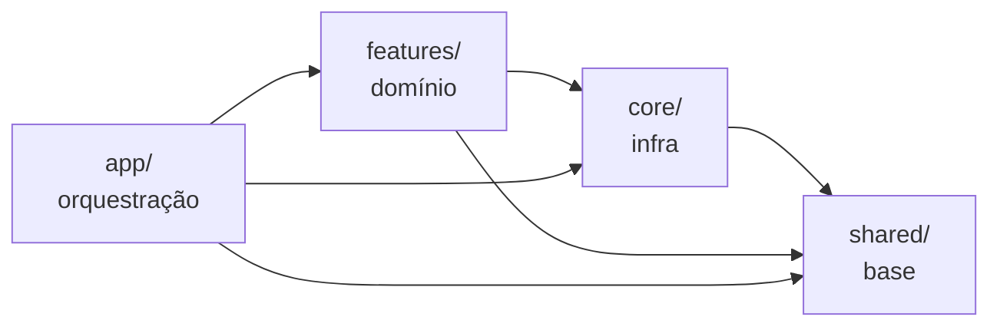

# Arquitetura — Web Template FUNCEF

Template base para novos sistemas web FUNCEF. Next.js 16 (App Router), React 19,
TypeScript e TanStack Query — **consumindo `@funcef-componentes/auth`** (auth,
HTTP, shell e proxy vêm da lib; nada de cópia local). Organizado por domínio de
negócio em **quatro camadas** com boundaries enforçados por lint.

> Este documento é a visão humana da arquitetura. As convenções operacionais
> (para devs e agentes) vivem em [`.claude/rules/`](./.claude/rules/) — 10
> rules; em conflito, as rules vencem.

---

## Visão geral

O template entrega, prontos para uso:

- **Auth pela lib** — `createFuncefAuth` (Entra ID), `createSessionProxy`
  (guard de sessão no `src/proxy.ts`), `AppShell` (chrome completo: menu,
  breadcrumb, busca Ctrl/⌘+K, seletor de sistemas, guards de sessão embutidos).
- **Data-fetching normalizado** — instância `api` (`@/core/api`, `createApi` da
  lib) apontando para o **BFF same-origin** (`/api/bff`, `createBffHandler`): o
  Bearer é resolvido no servidor e nunca chega ao browser; envelope FUNCEF
  normalizado, erro carimbado (retry/toast) e `401 → teardown`; React Query com
  QueryClient SSR-safe.
- **Dois cenários de consumo** — base = Full BA (Entra ID); a conversão para
  Consumidor TKF2 é feita pela CLI (`funcef scenario apply consumidor-tkf2`).
- **Exemplo mínimo `features/tasks`** — 1 query + 1 mutation, servido pelo mock
  de dev (`pnpm mock`, json-server na porta 3001) sem backend real.
- **Telemetria opt-in** — via `@funcef-componentes/observability` no projeto
  (App Insights + OTel); o template base não embute telemetria.
- **Segurança** — CSP por ambiente + headers (`next.config.ts`).
- **CI/CD** — `ci.yml` (verify: typecheck+lint+format+test+build) + 3 pipelines
  de deploy funcef-devops gateadas por `DEPLOY_ENABLED`; Dockerfile multi-stage
  node-slim.
- **Instrumentação de IA** — `CLAUDE.md` (entry point do agente) +
  `.claude/rules/` + skill `/new-feature`.

---

## Os dois cenários de consumo

| Aspecto     | Cenário 2 — Full BA (base, default) | Cenário 1 — Consumidor TKF2 (overlay) |
| ----------- | ----------------------------------- | ------------------------------------- |
| Login       | Entra ID local (`/api/auth`)        | porta de entrada (`web-autenticacao`) |
| better-auth | sim                                 | não (removido no overlay)             |
| Sessão      | cookie better-auth                  | cookie `TKF2`                         |
| `proxy.ts`  | sign-in local                       | `signInPath` absoluto da porta        |

A base **é** o Full BA — clona e roda. Para criar um projeto novo ou converter
para Consumidor TKF2, use a CLI funcef (`pnpm dlx @funcef-componentes/cli new`
/ `... scenario apply consumidor-tkf2`) — o overlay e as verificações de
cenário vivem na CLI, não neste repo.

---

## Arquitetura em 4 camadas



| Camada      | Papel                                             | Pode importar de             |
| ----------- | ------------------------------------------------- | ---------------------------- |
| `app/`      | Rotas e orquestração — decide **o que** mostrar   | `features`, `core`, `shared` |
| `features/` | Domínio de negócio — decide **como** funciona     | `core`, `shared`             |
| `core/`     | Infra e concerns transversais (api, auth, config) | `shared`                     |
| `shared/`   | Base genérica — UI, utils, tipos, env             | nada acima dela              |

Fora das camadas: os arquivos de raiz de `src/` (`proxy.ts`,
`instrumentation.ts`, tratados como `app`). Estado global (zustand) **não é
camada** — adicione sob demanda.

**Enforçamento:** `eslint-plugin-boundaries` falha o lint para qualquer import
proibido — inclusive arquivos na raiz das camadas e arquivos não classificados
(`boundaries/no-unknown-files`). Não suprima o erro — corrija o boundary.

### Golden rule — onde o código vai?

```
Específico de uma rota/URL?              → app/<rota>/
Específico de um domínio de negócio?     → features/<domínio>/
Infra cross-cutting ou identidade?       → core/   (api, auth, config)
Reutilizável entre features (genérico)?  → shared/
Estado global de cliente?                → zustand sob demanda (não é camada)
Telemetria?                              → @funcef-componentes/observability (opt-in)
```

---

## Fluxo de dados

```mermaid
sequenceDiagram
  participant C as Component
  participant H as Hook (React Query)
  participant A as api (@/core/api — createApi da lib)
  participant BE as Backend

  C->>H: useAllTasks()
  H->>A: api.get<Task[]>(endpoint)
  A->>BE: HTTP GET /api/bff/* (BFF anexa o Bearer no servidor)
  BE-->>A: { resultado: [...], mensagem, qtdRegistros }
  A-->>H: ApiResponse<Task[]> (envelope normalizado; erro carimbado)
  H-->>C: { tasks, isTasksLoading, error }
  Note over H,C: cache React Query (stale 3 min, gc 6 min)
```

- **Não existe camada `service.ts`** — o hook é a facade de dados e chama a
  instância `api` diretamente.
- A normalização do envelope FUNCEF e o carimbo de erro (`retryable`,
  mensagem de toast) acontecem **dentro da lib** (`createApi`) — nunca
  re-implementados por feature.
- Erros retryáveis (5xx/rede) têm retry seletivo (máx. 2); mutations nunca
  reprocessam; toasts automáticos via handlers globais do QueryClient.

---

## Contrato de uma feature

```
features/<domínio>/
├── api/
│   ├── endpoints.ts   # builders puros — retornam URLs/configs, sem HTTP
│   ├── client.ts      # chamadas tipadas via api<T> de @/core/api
│   └── index.ts
├── hooks/             # React Query (useQuery / useMutation)
├── components/        # UI do domínio (apresentação)
├── types.ts           # DTOs e tipos do domínio
├── validators.ts      # Zod schemas (somente quando há formulários)
└── index.ts           # barrel público da feature
```

Fluxo interno: `components → hooks → api/{endpoints,client} → types/validators`.

Exemplo vivo: **`src/features/tasks`** (1 `useQuery` + 1 `useMutation` com
`meta: { globalErrorToast: true }`, teste MSW, rota `/tasks`).

| Hook            | Tipo          | Convenção                                   |
| --------------- | ------------- | ------------------------------------------- |
| `useAllTasks`   | `useQuery`    | query: `useAll<Entity>` / `use<Entity>ById` |
| `useCreateTask` | `useMutation` | mutation: `use<Action><Entity>`             |

Query keys sempre pela factory central `queryKeys`
(`src/shared/lib/query-keys.ts`): `queryKeys.tasks.all` / `.list()` /
`.detail(id)` — nunca arrays inline.

---

## Convenções obrigatórias

- **Idioma** — código em INGLÊS (identificadores, arquivos, rotas); PORTUGUÊS
  só em strings de UI e docs de produto; shapes de backend intocados.
- **Imports** — sempre `@/` (absolutos); kebab-case nos arquivos, PascalCase
  nos exports; barrels `index.ts`.
- **lib v2** (`@funcef-componentes/react`) — `render` prop (não `asChild`),
  `data-state`, `LoadingFuncef`.
- **Env** — leia apenas de `src/shared/config/{env,env-client}.ts`
  (Zod-validado); exceção única: `process.env.NODE_ENV`.
- **Testes** — Vitest + MSW (`src/__tests__/msw/`); nunca Jest, nunca rede
  real. Testes entram no typecheck (`tsconfig.test.json`) e no lint.
- **Mock de dev** — json-server (`pnpm mock`, `mocks/db.json`), processo
  separado na porta 3001; sem service worker.

---

## Como usar

### Criar uma nova feature

Use a skill `/new-feature` no Claude Code (scaffolding guiado pelo contrato) ou
siga manualmente o contrato acima espelhando `src/features/tasks`.

### Remover o exemplo `tasks` num projeto novo

1. Apague `src/features/tasks/` e a rota `src/app/(authenticated)/tasks/`.
2. Remova a entrada do menu em `src/core/config/menu.config.ts`.
3. Remova o grupo `tasks` de `src/shared/lib/query-keys.ts` e os handlers de
   exemplo em `src/__tests__/msw/handlers.ts` e `mocks/db.json`.

### Adicionar capacidades opcionais

Consulte os guias do design system no Storybook (Formulários, Tabelas, PDF) e o
pacote `@funcef-componentes/observability` para telemetria.

---

## Documentação

| Documento                            | Conteúdo                                            |
| ------------------------------------ | --------------------------------------------------- |
| [`README.md`](./README.md)           | O que você recebe, quick start, comandos            |
| [`CLAUDE.md`](./CLAUDE.md)           | Entry point para o agente: stack, comandos, gotchas |
| [`.claude/rules/`](./.claude/rules/) | 10 rules de arquitetura, convenções e workflow      |
