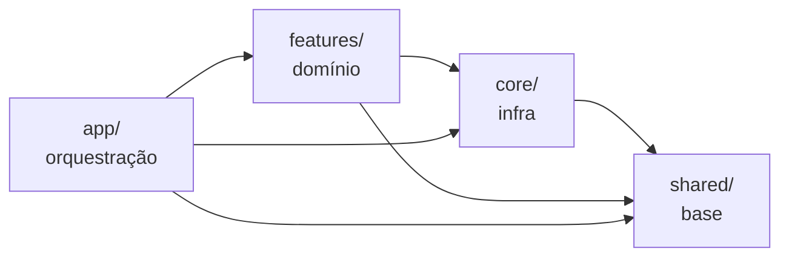

# Web Template FUNCEF

Base oficial para novos sistemas web FUNCEF. Next.js 16 (App Router), React 19,
TypeScript, TanStack Query — consumindo `@funcef-componentes/auth` (auth, HTTP,
shell, proxy). O template já vem no **Cenário 2 (Full BA / Entra ID)**; para
criar um projeto novo ou converter para o **Cenário 1 (Consumidor TKF2)**, use
a CLI: `pnpm dlx @funcef-componentes/cli new` / `... scenario apply`.

---

## O que você recebe

- **Auth pela lib** — `@funcef-componentes/auth` (^3.1.0): `createFuncefAuth`
  (Entra ID), `createApi` (HTTP com envelope FUNCEF + erro carimbado +
  401→teardown), `createSessionProxy` e `AppShell` — chrome completo com menu
  agrupado (`MenuGroup[]` + ícones), busca Ctrl/⌘+K, breadcrumb derivado,
  seletor de sistemas, troca de tema no menu do usuário e **guards de sessão
  embutidos** (basta injetar `logout`). Nada de cópia local.
- **Data-fetching normalizado** — a instância `api` (`@/core/api`) + React Query;
  toast/retry por erro carimbado; QueryClient SSR-safe.
- **Exemplo mínimo `features/tasks`** — 1 query + 1 mutation, servido de ponta a
  ponta por um **mock de dev (`json-server` na porta 3001)** sem backend real
  (`pnpm mock`); testes usam MSW.
- **Telemetria opt-in** — adote `@funcef-componentes/observability` no projeto
  quando precisar (App Insights + OTel; o README do pacote traz o wiring).
- **Instrumentação de IA** — `CLAUDE.md` + `.claude/rules/` (convenções para devs e IA).
- **Segurança / CI-CD** — CSP e headers configurados; Dockerfile multi-stage;
  pipelines gateadas por `DEPLOY_ENABLED`.

### Camadas



> Quatro camadas. Estado global (zustand) não faz parte do base — adicione
> zustand sob demanda; telemetria é opt-in via
> `@funcef-componentes/observability`.

---

## Quick Start

### Pré-requisitos

- Node.js 22+
- pnpm (via Corepack — `corepack enable pnpm`)

### Instalação

```bash
# 1. Clone o repositório
git clone <url-do-repositorio>
cd web-template

# 2. Para novos projetos, prefira a CLI (baixa a última release, renomeia e configura):
#    pnpm dlx @funcef-componentes/cli new

# 3. Instale as dependências
pnpm install

# 4. Configure as variáveis de ambiente
cp .env.example .env.local
# Edite .env.local com as URLs das APIs e credenciais de autenticação

# 5. Inicie o servidor de desenvolvimento
pnpm dev
```

Acesse: `http://localhost:3000`

### Mock de desenvolvimento (sem backend)

Para exercitar o exemplo `features/tasks` sem um backend real, rode o mock em
paralelo — `json-server` numa porta própria (3001, para não colidir com o Next):

```bash
pnpm mock        # json-server mocks/db.json --port 3001
```

Aponte `API_URL=http://localhost:3001` no `.env.local` (o
`.env.example` já vem assim). É um processo separado — **sem service worker**,
sem interferir na navegação do Next. Os dados ficam em `mocks/db.json`.

> Fronteira: o mock cobre a **API de negócio**, não o auth (login Entra exige
> tenant real). Nos **testes**, o mock é o MSW
> (`src/__tests__/msw/handlers.ts` + `server.ts`), não o json-server.

---

## Comandos

| Comando              | O que faz                                 |
| -------------------- | ----------------------------------------- |
| `pnpm dev`           | Inicia o servidor de desenvolvimento      |
| `pnpm build`         | Build de produção                         |
| `pnpm start`         | Serve o build de produção                 |
| `pnpm mock`          | Mock de dev (json-server na porta 3001)   |
| `pnpm lint`          | ESLint (inclui boundaries entre camadas)  |
| `pnpm lint:fix`      | ESLint com correção automática            |
| `pnpm typecheck`     | TypeScript sem emitir arquivos            |
| `pnpm test`          | Vitest em modo watch                      |
| `pnpm test:run`      | Vitest execução única (equivalente ao CI) |
| `pnpm test:coverage` | Vitest com relatório de cobertura         |
| `pnpm format`        | Prettier — formata todos os arquivos      |
| `pnpm format:check`  | Prettier — verifica sem modificar         |

**Antes de marcar trabalho como concluído**, rode os três comandos de verificação:

```bash
pnpm typecheck && pnpm lint && pnpm test:run
```

---

## Novo projeto a partir do template

```bash
pnpm dlx @funcef-componentes/cli new
```

A CLI `funcef` baixa a última release do template, pergunta nome e cenário,
renomeia o projeto (package.json, CHANGELOG, docs), remove o andaime e gera o
`.env.local` guiado. Para converter um checkout existente:
`pnpm dlx @funcef-componentes/cli scenario apply consumidor-tkf2`.

---

## Documentação

| Documento                              | Conteúdo                                                                                  |
| -------------------------------------- | ----------------------------------------------------------------------------------------- |
| [`ARCHITECTURE.md`](./ARCHITECTURE.md) | Visão humana da arquitetura v3 — 4 camadas, cenários, fluxo de dados, contrato de feature |
| [`CLAUDE.md`](./CLAUDE.md)             | Entry point para o agente: stack, comandos, gotchas                                       |
| [`.claude/rules/`](./.claude/rules/)   | 10 rules de arquitetura, convenções e workflow (para devs e IA)                           |
