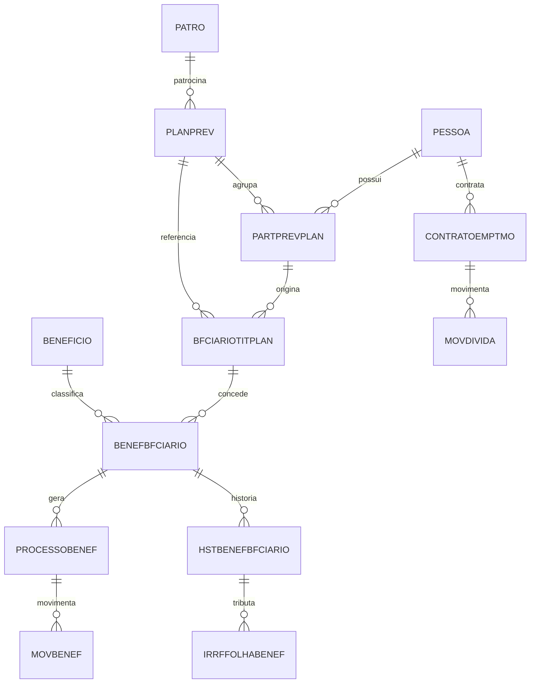

# Modelo de Dados — Sistema Planus (Oracle)

O banco de dados do sistema é **Oracle**, com o schema principal `CM` e um schema de
auditoria/trilha `LOGPLANUS`. A lógica de negócio é fortemente apoiada em **PL/SQL**
(procedures, packages e triggers), com uso de sintaxe clássica Oracle (`VARCHAR2`, outer join `(+)`).

> **Importante:** os scripts DDL presentes neste repositório (`SCRIPT/**`, `__SCRIPTS__/**`) são
> **incrementais e por chamado** (padrões `SIG*`, `SOL*`, `WO*`). Portanto, o modelo completo
> (centenas de tabelas) reside no banco de produção; abaixo estão documentadas as entidades
> **confirmadas por evidência** neste repositório (código Delphi e/ou scripts SQL).

---

## Entidades Núcleo da Previdência

### Pessoa

**Tabela:** `PESSOA` / `PESSOAFISICA`

**Finalidade:** cadastro central de pessoas (participantes, dependentes, beneficiários, responsáveis).

**Campos (parciais, confirmados por uso):**

| Campo | Tipo | Obrigatório | Descrição |
|---|---|---|---|
| `IDPESSOA` | NUMBER | Sim | Identificador da pessoa (PK) |
| `IDENDRESIDENCIAL` | NUMBER | Não | Endereço residencial (FK `ENDPESS`) |
| `IDENDCORRESP` | NUMBER | Não | Endereço de correspondência (FK `ENDPESS`) |

**Relacionamentos:** `PESSOA` → `ENDPESS` via `IDENDERECO`; `ENDPESS` → `CIDADES` → `ESTADO` → `PAIS`.

Confiança: Alta (uso extensivo — ~9.000 referências; joins em `SP_FB_GERALISTAPREVIA`).

---

### Plano Previdenciário

**Tabela:** `PLANPREV`

**Finalidade:** define os planos de previdência complementar administrados pela entidade.

| Campo | Tipo | Obrigatório | Descrição |
|---|---|---|---|
| `IDPLANOPREV` | NUMBER | Sim | Identificador do plano (PK) |

**Relacionamentos:** referenciada por `PARTPREVPLAN`, `BENEFPLANPREV`, `BFCIARIOTITPLAN`, `HSTBENEFBFCIARIO`.

Confiança: Alta.

---

### Patrocinadora

**Tabela:** `PATRO`

**Finalidade:** patrocinadoras/mantenedoras dos planos.

Confiança: Alta (~4.500 referências no código).

---

### Participante × Plano

**Tabela:** `PARTPREVPLAN`

**Finalidade:** vínculo do participante a um plano previdenciário (proposta, elegibilidade).

**Relacionamentos:** `PARTPREVPLAN` → `PLANPREV` via `IDPLANOPREV`; → `PESSOA` via `IDPESSOA`.

Confiança: Alta.

---

### Beneficiário / Benefício

**Tabelas:** `BENEFBFCIARIO`, `BFCIARIOTITPLAN`, `BENEFICIO`, `BENEFPLANPREV`, `BENEFPLANPATRO`,
`BENEFPLANOPART`.

**Finalidade:** beneficiários dos benefícios, vínculo titular/plano, definição de benefícios e
parametrização por plano/patrocinadora.

**Campos relevantes (confirmados por `SP_FB_GERALISTAPREVIA`):**

| Campo | Tabela | Descrição |
|---|---|---|
| `IDBENEFICIO` | `BENEFICIO` | Identificador do benefício |
| `NUMEROPROCESSO` | `BENEFBFCIARIO` | Processo do benefício |
| `IDTITULAR` | `BFCIARIOTITPLAN` | Titular do plano |
| `SEQPROPOSTA` | `BFCIARIOTITPLAN` | Sequência da proposta |
| `FLGACEITAZERO` | `BENEFPLANPREV` | Permite valor previsto zero |
| `FLGREFERENCIA` / `FLGPAGAINSS` | `BENEFPLANPREV` | Regras de referência/pagamento INSS |

Confiança: Alta.

---

### Processo e Movimento de Benefício

**Tabelas:** `PROCESSOBENEF`, `MOVBENEF`, `HSTBENEFBFCIARIO`.

**Finalidade:** processo de benefício, movimentos e histórico mensal de pagamento.

**Campos relevantes de `HSTBENEFBFCIARIO`:**

| Campo | Tipo | Descrição |
|---|---|---|
| `MESREFERENCIA` | VARCHAR2 | Mês de referência |
| `MES` | VARCHAR2 | Mês de competência |
| `FLGENVIADO` | NUMBER | Indica registro já enviado/processado |
| `DTEFETPGTO` | DATE | Data efetiva de pagamento |
| `VLBENEFPGTO` | NUMBER | Valor do benefício pago |
| `VALORPREV` | NUMBER | Valor previsto |
| `IDLOTE` | NUMBER | Lote de processamento (FK `CTRLINTERFACE`) |

Confiança: Alta (procedure `SP_FB_GERALISTAPREVIA`).

---

## Empréstimos

**Tabelas:** `CONTRATOEMPTMO`, `CONTRATOEMPTMOMSG`, `MOVDIVIDA`, `TIPOMOVDIVIDA`,
`HISTMOVEMPTMO`, `PARAMEMPTMO`, `CLASSETAXADEP`.

**Finalidade:** contratos de empréstimo, mensagens do contrato, movimentação de dívida, histórico
de movimento e parâmetros de empréstimo.

| Tabela | Finalidade | Origem |
|---|---|---|
| `CONTRATOEMPTMO` | Contrato de empréstimo | `__SCRIPTS__/**` + ~600 referências no código |
| `MOVDIVIDA` / `TIPOMOVDIVIDA` | Movimento e tipos de dívida | `WO7474_8288/*` |
| `HISTMOVEMPTMO` | Histórico de movimento (segregado) | `SP_TRAT_PARCELAS_EM_ATRASO` (v1.09) |
| `PARAMEMPTMO` | Parâmetros de empréstimo | `WO7986/*` |

Confiança: Alta.

---

## Contratos

**Tabelas:** `CONTRATOCONTR`, `CONTRATOORIG`, `CONTRATO_AREATECNICA`.

**Campos relevantes de `CONTRATOCONTR`:** `IDCONTRATO`, `NOMECONTRATO`, `IDPESSOA`, `TIPOCONTRATO`,
`DATAASSINATURA`, `VALORBASECONTRATO`, `DATAPREVENCERRA`, `DATAEFETENCERRA`, `MOTIVOENCERRA`.

Confiança: Alta (DDL + trigger `TUDLOGALT_CONTRATOCONTR` em `WO13506/*`).

---

## IRRF / Tributos

**Tabelas:** `IRRFFOLHABENEF`, `IRRF_REDUCAO`, `COMPENSAIRRF`.

**Finalidade:** IRRF sobre a folha de benefícios, reduções de base e compensações.

Confiança: Alta (DDL `SOL198886_18334/*`, `SIG41089`).

---

## Orçamento

**Tabelas:** `PADRAORATEIOFLUXO`, `GRUPORATEIOFLUXO`.

**Finalidade:** padrões e grupos de rateio de fluxo orçamentário.

Confiança: Alta (DDL `WO13599/*`).

---

## ETL / Integrações

**Tabelas:** `PARAM_ETL_ARQUIVO`, `PARAM_ETL_ARQUIVODET`, `PARAMETLCONEXAO`, `ETL_FOLHA_PREVIA`,
`DEPARAEXTERNO`.

**Finalidade:** parametrização de ETL (arquivos, conexões, de-para externo) e prévia de folha via ETL.

Confiança: Alta (DDL `SOL244125/*`, `SIG36752/*`).

---

## Motor de Relatórios (ReportBuilder)

**Tabelas:** `RB_TABLE`, `RB_FIELD`, `RB_FOLDER`, `RB_ITEM`, `RB_JOIN`.

**Finalidade:** metadados do gerador de relatórios (ReportBuilder) usados pelo módulo de
inteligência de negócio.

Confiança: Alta.

---

## Auditoria / Trilha (LOGPLANUS)

**Schema:** `LOGPLANUS`

**Tabelas (padrão `LOG_PLANUS_*`):** `LOG_PLANUS_CONTRATOCONTR`, `LOG_PLANUS_MOVDIVIDA`,
`LOG_PLANUS_FAIXA`, `LOG_PLANUS_PERCFAIXA`, `LOG_PLANUS_IRRF_REDUCAO`,
`LOG_PLANUS_HSTARQUIVOALTBENEF`, `LOG_PLANUS_DEPARAEXTERNO`, entre outras.

**Mecanismo:** triggers `TUDLOGALT_*` no schema `CM` gravam o estado anterior dos registros
alterados nas tabelas de log do schema `LOGPLANUS` (trilha de auditoria de alterações).

Confiança: Alta.

---

## Diagrama Entidade-Relacionamento (núcleo previdenciário)

> **Confiança: Média** para a cardinalidade exata do diagrama — as chaves e relacionamentos são
> inferidos dos joins da procedure `SP_FB_GERALISTAPREVIA` e do uso no código; a modelagem
> definitiva depende do dicionário de dados do banco de produção.
