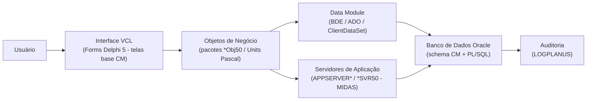

# Sistema Planus — Visão Geral para User Stories

Versão: 2026-08-19
Tecnologia: Delphi 5
Objetivo: Fonte única da verdade para criação de User Stories,
análise funcional e entendimento técnico do sistema.

---

## 🧭 Identificação do Sistema

O repositório contém a suíte corporativa **Planus** (identificada nas tabelas de auditoria
`LOGPLANUS.*` e nos diretórios `HELP_PLANUS`), um conjunto integrado de aplicações
desenvolvidas em **Delphi 5 / Object Pascal** pelo fabricante **CM** (prefixo presente em
praticamente todos os pacotes de framework e de negócio, ex.: `CMGlobalObj50`, `CMForms50`).

O domínio funcional predominante é a **gestão de Entidades Fechadas de Previdência Complementar
(fundos de pensão / fundações)** e a administração corporativa associada (contabilidade,
financeiro, investimentos, imobiliário, empréstimos, recursos humanos, jurídico e suprimentos).

> **Confiança: Alta** — o nome "Planus", o fabricante "CM" e o domínio previdenciário são
> evidenciados diretamente por nomes de pacotes, títulos de aplicação (`Application.Title`),
> tabelas Oracle (`PLANPREV`, `PARTPREVPLAN`, `BENEFBFCIARIO`, `PROCESSOBENEF`) e procedures
> PL/SQL do banco.

---

## 📊 Estatísticas da Plataforma

### Tecnologia

- Linguagem: Object Pascal (Delphi 5)
- IDE: Borland Delphi 5
- Interface: VCL (Visual Component Library) com componentes visuais de terceiros
  (InfoPower/Woll2Woll `ww*`, Toolbar97/TB97, Developer Express, ReportBuilder)
- Acesso a Dados: **BDE** (`DBTables`, `TwwTable`, `TwwQuery`, `TQuery`, `TDatabase`) como padrão
  histórico predominante; **ADO** (`TADOQuery`, `TADOConnection`) e **arquitetura multicamada
  MIDAS/DataSnap** (`TClientDataSet` + servidores de aplicação `APPSERVER*`/`*SVR50`) nas
  aplicações mais recentes com sufixo `MT` (Multi-Tier).
- Banco de Dados: **Oracle** (schema `CM`), com esquema de auditoria/trilha `LOGPLANUS` e
  farto uso de PL/SQL (procedures, packages, triggers, sintaxe de outer join `(+)`, `VARCHAR2`).

> **Confiança: Alta** para BDE/ADO/MIDAS e Oracle (evidência direta em `.dfm`, `.pas` e `.sql`).

### Métricas (identificadas na análise, excluindo componentes de terceiros)

- Quantidade de módulos funcionais identificados: **20**
- Quantidade de aplicações executáveis (`Application.Title`): **~45**
- Quantidade de projetos (`.dpr`, incluindo servidores/DLLs/versões antigas): **103**
- Quantidade de pacotes (`.dpk` — framework + negócio): **108**
- Quantidade de Units Pascal (`.pas`): **~11.215**
- Quantidade de Forms (`.dfm`): **~6.995**
- Quantidade de Data Modules identificados (`.pas` com `TDataModule`): **~192**
- Quantidade de tabelas no banco: **centenas** (schema Oracle `CM`; scripts DDL neste repositório
  são incrementais/por chamado — ver `docs/database-model.md`)
- Quantidade de regras de negócio catalogadas nesta documentação: **ver `docs/business-rules-catalog.md`**

> **Confiança: Média** para contagens exatas — os números refletem os arquivos presentes no
> repositório; parte da lógica reside no banco Oracle (PL/SQL) que só é entregue por scripts
> incrementais.

---

## 🏗️ Arquitetura de Alto Nível

### Camadas (evidenciadas pelos 3 project groups `*.bpg`)

O sistema é organizado em três camadas de compilação:

1. **Framework / Padrão** (`1-BPL.Padrao.bpg`) — pacotes base reutilizáveis:
   `CMResource50`, `CmSql50`, `CMAdd50`, `CMCompo50`, `CMOld50`, `CmParser50`, `CMBussines50`,
   `CMCrypto`, `CMForms50`, `CMRad50`, `CMPrincipal50`, `CMExperts`, `CmRelatsOld50`.
   Contêm as **telas base** (`FCadastro`, `FCadMestreDet`, `FCadastroPai`, `FCMPrincipal`),
   componentes, parser, criptografia e o motor de relatórios.

2. **Objetos de Negócio** (`2-BPL.Negocio.bpg`) — pacotes de regras por domínio:
   `CmGlobalObj50`, `CMContabObj50`, `CMCfinanObj50`, `CMPlaneOrcObj50`, `CMCapCarObj50`,
   `CMIntBancoMT50`, `CMCAFObj50`, `CMIRRFobj50`, `cmLivroObj50`, `CMImobiliarioObj50`,
   `CMIndicadoresObj50`, `CmRHObj50`, `CMFolhaObjMT`, `CMAutoAtendimentoObj50` e outros.

3. **Aplicações** (`3-Sistemas.bpg`) — os executáveis finais consumidos pelo usuário
   (ex.: `BeneficioPrev.exe`, `CadastroPrev.exe`, `Folha.exe`, `Contab.exe`, `CFINAN.exe`).

### Stack Tecnológica

- Frontend/Interface: VCL Forms (Delphi 5), padrão MDI, com telas base reutilizáveis do framework CM.
- Lógica de Negócio: Object Pascal — Units, Forms e pacotes `*Obj50` (objetos de negócio) + regras em PL/SQL.
- Acesso a Dados: BDE / ADO / MIDAS (`TClientDataSet` + servidores de aplicação).
- Banco de Dados: Oracle (schema `CM`), auditoria em `LOGPLANUS`.

### Padrões Arquiteturais Identificados

- **Telas base reutilizáveis (herança de Form)**: quase todos os cadastros herdam de
  `TfrmCadastro` / `TfrmCadastroPai` / `TfrmCadMestreDetalhe`, que já implementam as ações
  padrão **Inserir, Alterar, Procurar, Apagar, Confirmar, Cancelar** e o componente
  `CmEventosCadastro`. **Confiança: Alta** (`CM/Forms/Source/FCadastro.pas`).
- **Padrão Mestre-Detalhe**: `FCadMestreDet` e diretório `MTSMESTREDETALHE`. **Confiança: Alta**.
- **Separação Form / Data Module**: cada aplicação instancia Data Modules dedicados
  (ex.: `dtmAPrev`, `dtmRelatBeneficios`) via `Application.CreateForm`. **Confiança: Alta**
  (`BENEFICIOPREV/Fontes/BeneficioPrev.dpr`).
- **Arquitetura multicamada (MIDAS/MTS)**: aplicações `*MT` e servidores `APPSERVER*` / `*SVR50`
  usando `TClientDataSet`. **Confiança: Alta**.
- **Controle de autorização/telas**: `FTelaAut` (`frmTelaAutorizacao`), `DAutorizacao`,
  `uAutorizacao`. **Confiança: Alta**.
- **Regras de negócio no banco (PL/SQL)**: procedures/packages/triggers Oracle no schema `CM`.
  **Confiança: Alta**.
- **Motor de regras configurável**: aplicações `Regra` e `ExecutaRegra` + pacotes `CMRegra50`.
  **Confiança: Média**.

---

## 📚 Catálogo de Módulos

⚠️ O bloco abaixo é obrigatório. Não remover. Não alterar os marcadores.

<!-- MODULE_LIST_START -->
**Modules:** cadastro-previdenciario, beneficios-previdenciarios, contribuicao-previdenciaria, folha-beneficios, atendimento-previdenciario, emprestimos-financiamento, investimentos, gestao-imobiliaria, contabilidade, financeiro-tesouraria, planejamento-orcamento, impostos-tributos, ativo-fixo-patrimonio, contratos-projetos, almoxarifado-compras, recursos-humanos, juridico, inteligencia-negocio, plataforma-cm, administracao-assistencial
<!-- MODULE_LIST_END -->

---

### Cadastro Previdenciário

**ID:** cadastro-previdenciario

**Propósito:** Cadastro de participantes, dependentes, planos previdenciários, patrocinadoras e a
parametrização do regime de previdência complementar.

**Responsabilidades:**
- Manutenção de pessoas (física/jurídica), dependentes e beneficiários.
- Cadastro e parametrização de planos previdenciários (`PLANPREV`) e patrocinadoras (`PATRO`).
- Vínculo participante x plano (`PARTPREVPLAN`).
- Parametrização previdenciária e projeto atuarial.

**Forms Principais:** `CADASTROPREV/Fontes/*.pas/.dfm`, telas de pessoa (`fPessoa`).

**Data Modules Relacionados:** Data Modules em `CADASTROPREV/Fontes` e `CM/CMAdmPrev`.

**Units de Negócio:** `PARAMPREV/Fontes/*`, `PROJETOATUARIAL/FONTES/*`, `INTERFACEPREV/Fontes/*`.

**Tabelas do Banco:** `PESSOA`, `PESSOAFISICA`, `PARTPREVPLAN`, `PLANPREV`, `PATRO`, `ENDPESS`.

**Exemplos de User Stories:**

> Como Operador de cadastro
> Quero registrar um novo participante e vinculá-lo a um plano previdenciário
> Para que ele possa contribuir e futuramente receber benefícios.

---

### Benefícios Previdenciários

**ID:** beneficios-previdenciarios

**Propósito:** Concessão e manutenção de benefícios previdenciários (aposentadorias, pensões),
incluindo reembolso do INSS, revisão, reajuste, desdobramento e desfazimento de operações.

**Responsabilidades:**
- Requerimento, concessão, liberação e encerramento de benefícios.
- Reembolso e conciliação com o INSS.
- Revisão, reajuste, retroativo e desdobramento de benefícios.

**Forms Principais:** `BENEFICIOPREV/Fontes/FConcessao*`, `FLiberaBeneficioProvisorio`,
`FAlteraBeneficio`, `FReaberturaBeneficio`, `FReembolsoINSS`, `FConciliacao`.

**Data Modules Relacionados:** `DAPrev`, `dtmRelatBeneficios`, `dReembolsoINSS`.

**Units de Negócio:** `CM/CMAdmPrev/Fontes/*`.

**Tabelas do Banco:** `BENEFBFCIARIO`, `BFCIARIOTITPLAN`, `PROCESSOBENEF`, `MOVBENEF`,
`HSTBENEFBFCIARIO`, `BENEFICIO`, `COMPENSAIRRF`.

**Exemplos de User Stories:**

> Como Analista de benefícios
> Quero conceder um benefício de aposentadoria a um participante elegível
> Para iniciar o pagamento mensal do benefício.

---

### Contribuição Previdenciária

**ID:** contribuicao-previdenciaria

**Propósito:** Manutenção e cobrança de contribuições previdenciárias dos participantes e patrocinadoras.

**Responsabilidades:**
- Cálculo, geração e cobrança de contribuições.
- Tratamento de inadimplência e movimentação de contribuições.

**Forms Principais:** `CONTRIBUICAOPREV/Fontes/*`.

**Data Modules Relacionados:** Data Modules em `CONTRIBUICAOPREV/Fontes`.

**Units de Negócio:** `CONTRIBUICAOPREV/Fontes/*`.

**Tabelas do Banco:** `PARTPREVPLAN`, `PLANPREV` e tabelas de contribuição (schema `CM`).

**Exemplos de User Stories:**

> Como Operador financeiro
> Quero gerar a cobrança mensal de contribuições
> Para manter as reservas do plano atualizadas.

---

### Folha de Benefícios

**ID:** folha-beneficios

**Propósito:** Processamento da folha de pagamento de benefícios previdenciários (prévia,
fechamento, geração de pagamentos e IRRF sobre benefícios).

**Responsabilidades:**
- Geração de prévia e fechamento da folha de benefícios.
- Cálculo de rubricas, descontos e IRRF (`IRRFFOLHABENEF`).
- Geração de arquivos de pagamento.

**Forms Principais:** `FOLHA/Fontes/*`.

**Data Modules Relacionados:** pacotes `CMFBOBJ50`, `CMFolhaObjMT`, `CMFBCOMUM50`.

**Units de Negócio:** `FOLHA/CMFbObj50/*`, `FOLHA/CMFolhaObjMt/*`, procedures PL/SQL `SP_FB_*`.

**Tabelas do Banco:** `HSTBENEFBFCIARIO`, `IRRFFOLHABENEF`, `CTRLINTERFACE`, `ETL_FOLHA_PREVIA`.

**Exemplos de User Stories:**

> Como Operador da folha
> Quero gerar a prévia da folha de benefícios do mês
> Para conferir os valores antes do fechamento e pagamento.

---

### Atendimento Previdenciário

**ID:** atendimento-previdenciario

**Propósito:** Atendimento ao participante — agendamento, central de atendimento presencial,
autoatendimento web e contencioso previdenciário.

**Responsabilidades:**
- Agendamento de atendimentos.
- Central de Atendimento ao Público.
- Autoatendimento (portal web) incluindo auto-empréstimo.
- Contencioso previdenciário (processos administrativos).

**Forms Principais:** `AGENDAMENTO/Fontes/*`, `CENTRALAP/Fontes/*`, `MODATN/Fontes/*`,
`AUTOATENDIMENTO/**`, `PROCPREV/Fontes/*`.

**Data Modules Relacionados:** `CmAgendamentoObj50`, `CMAutoAtendimentoObj50`, `CMWebComum50`.

**Units de Negócio:** `CMAGENDAMENTOOBJ50/*`, `AUTOATENDIMENTO/*`.

**Tabelas do Banco:** `PESSOA`, `PARTPREVPLAN` e tabelas de agendamento/atendimento.

**Exemplos de User Stories:**

> Como Atendente
> Quero agendar um atendimento para um participante
> Para organizar a fila de atendimento presencial.

---

### Empréstimos e Financiamento

**ID:** emprestimos-financiamento

**Propósito:** Concessão e controle de empréstimos a participantes e financiamentos, incluindo
contratos, parcelas, mapa de movimento e integração com folha.

**Responsabilidades:**
- Simulação e concessão de empréstimos.
- Controle de contratos (`CONTRATOEMPTMO`) e parcelas.
- Tratamento de parcelas em atraso e movimentação de dívida (`MOVDIVIDA`).

**Forms Principais:** `EMPRESTIMO/Fontes/*`, `FINANCIAMENTO/Fontes/*`.

**Data Modules Relacionados:** pacotes `CMObjetosEP50`, `CMIntegraEP50`, `CMExecEP50`.

**Units de Negócio:** `EMPRESTIMOBPL/Objetos/*`, `EMPRESTIMOBPL/Interface/*`.

**Tabelas do Banco:** `CONTRATOEMPTMO`, `CONTRATOEMPTMOMSG`, `MOVDIVIDA`, `TIPOMOVDIVIDA`,
`PARAMEMPTMO`.

**Exemplos de User Stories:**

> Como Analista de empréstimos
> Quero simular e conceder um empréstimo a um participante
> Para gerar o contrato e as parcelas de desconto em folha.

---

### Investimentos

**ID:** investimentos

**Propósito:** Gestão de investimentos financeiros, fundos, cotas e informações à SPC/PREVIC,
incluindo capitalização de carteira.

**Responsabilidades:**
- Controle de aplicações, fundos de investimento e cotas.
- Cálculo/controle de cotas patrimoniais e informações regulatórias (SPC).
- Capitalização de carteira (`CapCar`).

**Forms Principais:** `INVESTIMENTOS/FontesProducao/*`, `INVESTFDO/Fontes/*`,
`INVESTCOTAS/Fontes/*`, `COTAS/Fontes/*`, `COTASPATRIM/Fontes/*`.

**Data Modules Relacionados:** `CMCapCarObj50`, `CmCapCarUtilObj50`.

**Units de Negócio:** `CMCAPCAROBJ50/*`, `CMCAPCARUTILOBJ50/*`, `APPSRVCAPCAR/*`.

**Tabelas do Banco:** tabelas de investimento/cotas (schema `CM`).

**Exemplos de User Stories:**

> Como Gestor de investimentos
> Quero registrar a movimentação de um fundo e recalcular as cotas
> Para manter o valor patrimonial dos planos atualizado.

---

### Gestão Imobiliária

**ID:** gestao-imobiliaria

**Propósito:** Administração imobiliária e de investimentos imobiliários, incluindo alienação
de imóveis.

**Responsabilidades:**
- Administração de imóveis, contratos de locação e cobrança.
- Investimentos imobiliários e alienação de patrimônio.

**Forms Principais:** `ADMINIMOB/Fontes/*`, `INVESTIMOB/Fontes/*`, `ALIENACAO/Fontes/*`.

**Data Modules Relacionados:** `CMImobiliarioObj50`.

**Units de Negócio:** `CMIMOBILIARIOOBJ50/*`, `EPIM/*`, `EPIMIMOB/*`.

**Tabelas do Banco:** tabelas imobiliárias (schema `CM`).

**Exemplos de User Stories:**

> Como Administrador imobiliário
> Quero registrar um contrato de locação de um imóvel do fundo
> Para controlar a cobrança e a receita do patrimônio imobiliário.

---

### Contabilidade

**ID:** contabilidade

**Propósito:** Contabilidade da entidade — lançamentos, plano de contas, livros contábeis e
demonstrações.

**Responsabilidades:**
- Lançamentos contábeis e plano de contas.
- Geração de livros (Diário/Razão) e balancetes.

**Forms Principais:** `CONTAB/Fontes/*`.

**Data Modules Relacionados:** `CMContabObj50`, `cmLivroObj50`.

**Units de Negócio:** `CMCONTABOBJ50/*`, `CMLIVROOBJ50/*`.

**Tabelas do Banco:** tabelas contábeis (schema `CM`), plano de contas, lançamentos.

**Exemplos de User Stories:**

> Como Contador
> Quero registrar lançamentos contábeis e emitir o balancete
> Para atender às obrigações contábeis da entidade.

---

### Financeiro e Tesouraria

**ID:** financeiro-tesouraria

**Propósito:** Controle financeiro (caixa/bancos), contas a pagar, contas a receber e integração
bancária.

**Responsabilidades:**
- Controle de caixa e conciliação bancária.
- Contas a Pagar e Contas a Receber.
- Integração bancária (`CMIntBancoMT50`).

**Forms Principais:** `CFINAN/Fontes/*`, `CPAGAR/FontesMT/*`, `CRECEBER/FontesMT/*`.

**Data Modules Relacionados:** `CMCfinanObj50`, `CMIntBancoMT50`, servidor `APPSERVERCFINAN`.

**Units de Negócio:** `CMCFINANOBJ50/*`, `CMINTBANCOMT50/*`.

**Tabelas do Banco:** tabelas financeiras (schema `CM`), títulos a pagar/receber.

**Exemplos de User Stories:**

> Como Operador de tesouraria
> Quero registrar e baixar um título a pagar
> Para controlar o fluxo de caixa da entidade.

---

### Planejamento e Orçamento

**ID:** planejamento-orcamento

**Propósito:** Planejamento e execução orçamentária, com rateio de fluxo e acompanhamento.

**Responsabilidades:**
- Elaboração e execução do orçamento.
- Padrões e grupos de rateio de fluxo (`PADRAORATEIOFLUXO`, `GRUPORATEIOFLUXO`).

**Forms Principais:** `ORCAMENTO/FontesMT/*`.

**Data Modules Relacionados:** `CMPlaneOrcObj50`, servidor `APPSERVERORCAMENTO`.

**Units de Negócio:** `CMPLANEORCOBJ50/*`.

**Tabelas do Banco:** `PADRAORATEIOFLUXO`, `GRUPORATEIOFLUXO`, tabelas orçamentárias.

**Exemplos de User Stories:**

> Como Analista de orçamento
> Quero cadastrar a previsão orçamentária e acompanhar a execução
> Para controlar as despesas em relação ao planejado.

---

### Impostos e Tributos

**ID:** impostos-tributos

**Propósito:** Apuração e gestão de impostos e tributos, com destaque para IRRF, DARF e informe
de rendimentos, além de aplicações FCRT.

**Responsabilidades:**
- Cálculo e retenção de IRRF (`IRRF_REDUCAO`, `IRRFFOLHABENEF`).
- Geração de DARF e informe de rendimentos.
- Exportações e simulações regulatórias (FCRT).

**Forms Principais:** `IRRF/Fontes/*` (aplicação "Impostos e Tributos"), `EXPORTFCRT/Fontes/*`,
`SIMULADORFCRT/Fontes/*`.

**Data Modules Relacionados:** `CMIRRFobj50`, DLL `APPSERVERIRRFDLL`.

**Units de Negócio:** `CMIRRFOBJ50/*`.

**Tabelas do Banco:** `IRRF_REDUCAO`, `IRRFFOLHABENEF`, `COMPENSAIRRF`.

**Exemplos de User Stories:**

> Como Analista tributário
> Quero apurar o IRRF sobre os benefícios do mês e gerar o DARF
> Para recolher o imposto retido dentro do prazo legal.

---

### Ativo Fixo e Patrimônio

**ID:** ativo-fixo-patrimonio

**Propósito:** Controle de ativo fixo/imobilizado (bens patrimoniais), depreciação e inventário.

**Responsabilidades:**
- Cadastro e movimentação de bens patrimoniais.
- Depreciação e inventário do ativo fixo.

**Forms Principais:** `CAF/Fontes/*` e `CAFMT/Fontes/*` (aplicação "Ativo Fixo").

**Data Modules Relacionados:** `CMCAFObj50`.

**Units de Negócio:** `CMCAFOBJ50/*`.

**Tabelas do Banco:** tabelas de bens/ativo fixo (schema `CM`).

**Exemplos de User Stories:**

> Como Responsável pelo patrimônio
> Quero registrar um bem e sua depreciação mensal
> Para manter o controle patrimonial e contábil do imobilizado.

---

### Contratos e Projetos

**ID:** contratos-projetos

**Propósito:** Gestão de contratos administrativos e projetos (áreas técnicas, aditivos, mensagens).

**Responsabilidades:**
- Cadastro e acompanhamento de contratos (`CONTRATO_AREATECNICA`).
- Gestão de projetos associados a contratos.

**Forms Principais:** `CONTRATO/Fontes/*` (aplicação "Contratos e Projetos").

**Data Modules Relacionados:** Data Modules em `CONTRATO/Fontes`.

**Units de Negócio:** `CONTRATO/Fontes/*`.

**Tabelas do Banco:** `CONTRATO_AREATECNICA`, tabelas de contrato.

**Exemplos de User Stories:**

> Como Gestor de contratos
> Quero cadastrar um contrato e vincular sua área técnica responsável
> Para acompanhar prazos, aditivos e execução.

---

### Almoxarifado e Compras

**ID:** almoxarifado-compras

**Propósito:** Gestão de almoxarifado, custos, compras e recebimento de mercadorias.

**Responsabilidades:**
- Controle de estoque e custos de almoxarifado.
- Processo de compras e recebimento de mercadorias.

**Forms Principais:** `ALMOXARIFADO/Fontes/*` ("Almoxarifado e Custos"),
`COMPRAS2000/Fontes/*` ("Compras"), `RECMERC/Fontes/*` ("Recebimento de Mercadoria").

**Data Modules Relacionados:** `CMAlmoxCompraObj50`, servidor `CMALMOXCOMPRASRVR50`.

**Units de Negócio:** `CMALMOXCOMPRAOBJ50/*`.

**Tabelas do Banco:** tabelas de estoque, itens, compras (schema `CM`).

**Exemplos de User Stories:**

> Como Almoxarife
> Quero registrar a entrada de mercadorias e baixar o estoque nas saídas
> Para manter o saldo e os custos de estoque corretos.

---

### Recursos Humanos

**ID:** recursos-humanos

**Propósito:** Suíte de RH: módulo básico, folha de pagamento, cargos e salários, benefícios
sociais, avaliação de desempenho, recrutamento e seleção, treinamento, contencioso trabalhista,
medicina do trabalho, controle de ponto/acesso e autoatendimento do funcionário.

**Responsabilidades:**
- Cadastro funcional e folha de pagamento (`MODFOL`).
- Cargos e salários, benefícios sociais, avaliação, recrutamento, treinamento.
- Medicina do trabalho, ponto/acesso e autoatendimento.

**Forms Principais:** `MODBAS`, `MODFOL`, `MODCES`, `MODBEN`, `MODAVA`, `MODRES`, `MODTRN`,
`MODCON`, `MODASM`, `MODAUTO`, `MODACESSO`, `SRHCS`.

**Data Modules Relacionados:** `CmRHObj50`, `CMCompoRH`, `CMMTSOBJRH`, servidores `CMMODAVASVR50`, `CMMODBENSVR50`.

**Units de Negócio:** `CMRHOBJ50/*`, `CMRHOBJUTIL50/*`.

**Tabelas do Banco:** tabelas de RH/folha (schema `CM`).

**Exemplos de User Stories:**

> Como Analista de RH
> Quero processar a folha de pagamento mensal dos funcionários
> Para pagar salários e recolher encargos corretamente.

---

### Jurídico

**ID:** juridico

**Propósito:** Gestão jurídica: sistema jurídico e consolidado, processos judiciais e registro
de alçadas e decisões (RAD).

**Responsabilidades:**
- Controle de processos judiciais (`ProcJud`).
- Sistema jurídico e consolidado (`SistJur`, `SistJurCons`).
- Registro de Alçadas e Decisões (`RADg`).

**Forms Principais:** `PROCJUD/Fontes/*` ("Processos Judiciais"), `SISTJUR/Fontes/*`,
`SISTJURCONS/Fontes/*`, `RADG/Fontes/*`.

**Data Modules Relacionados:** Data Modules em `PROCJUD/Fontes`, `SISTJURCONS/Fontes`.

**Units de Negócio:** `SISTJURCONS/Fontes/*`, `RADG/Fontes/*`.

**Tabelas do Banco:** tabelas de processos/decisões (schema `CM`).

**Exemplos de User Stories:**

> Como Advogado
> Quero registrar um processo judicial e acompanhar seus andamentos
> Para gerenciar o contencioso da entidade.

---

### Inteligência de Negócio (Relatórios e Regras)

**ID:** inteligencia-negocio

**Propósito:** Geração de relatórios, consultas e gráficos, indicadores gerenciais e o motor
configurável de regras de negócio.

**Responsabilidades:**
- Gerador de relatórios, consultas e gráficos (`RelatoriosCm`, `FlashRpt`, ReportBuilder).
- Indicadores de shoppings, hotéis e parques.
- Motor de regras de negócio (`Regra`, `ExecutaRegra`).

**Forms Principais:** `RELATORIOSCM/Fontes/*`, `FLASHRPT/Fontes/*`, `INDICADORES/Fontes/*`,
`REGRA/Fontes/*`, `EXECUTAREGRA/Fontes/*`.

**Data Modules Relacionados:** `CmRelatorioObj50`, `CMIndicadoresObj50`, `CMRegra50`.

**Units de Negócio:** `CMRELATORIOOBJ50/*`, `CMINDICADORESOBJ50/*`, `CM/Regra/*`.

**Tabelas do Banco:** `RB_TABLE`, `RB_FIELD`, `RB_FOLDER`, `RB_ITEM`, `RB_JOIN` (ReportBuilder).

**Exemplos de User Stories:**

> Como Analista de negócio
> Quero criar um relatório parametrizado sem alterar o código
> Para obter informações gerenciais sob demanda.

---

### Plataforma CM (Infraestrutura)

**ID:** plataforma-cm

**Propósito:** Framework corporativo CM: telas base, componentes, parser, criptografia, segurança
e login, atualização de versão, integrações e utilitários compartilhados.

**Responsabilidades:**
- Telas base reutilizáveis (`FCadastro`, `FCadMestreDet`, `FCMPrincipal`) e componentes.
- Segurança/autorização (`FTelaAut`, `DAutorizacao`) e login (`GlobalCM`).
- Criptografia (`CMCrypto`), parser (`CmParser50`) e atualização (`AtuVersaoCM`).
- Integrações (`IntegraSAF`) e utilitários (`FUNCOESGERAIS`, `GERAL`, `SHARED`, `OBJRAD`).

**Forms Principais:** `CM/Forms/Source/*`, `GLOBALCM/FONTES/*`.

**Data Modules Relacionados:** `CmGlobalObj50`, `CMBack50`, `CmBack`.

**Units de Negócio:** `CM/**`, `CMGLOBALOBJ50/*`, `CMCRYPTO/*`, `SHARED/*`, `FUNCOESGERAIS/*`.

**Tabelas do Banco:** `LOGPLANUS.*` (auditoria), tabelas de usuários/menu/permissões.

**Exemplos de User Stories:**

> Como Administrador do sistema
> Quero controlar usuários, perfis e permissões de acesso às telas
> Para garantir a segurança e a governança do sistema.

---

### Administração Assistencial

**ID:** administracao-assistencial

**Propósito:** Administração de programas assistenciais/de saúde vinculados à entidade.

**Responsabilidades:**
- Gestão de planos e serviços assistenciais.
- Controle de beneficiários assistenciais.

**Forms Principais:** `ASSISTENCIAL/Fontes/*` ("Administração Assistencial").

**Data Modules Relacionados:** Data Modules em `ASSISTENCIAL/Fontes`.

**Units de Negócio:** `ASSISTENCIAL/Fontes/*`.

**Tabelas do Banco:** tabelas assistenciais (schema `CM`).

**Exemplos de User Stories:**

> Como Operador assistencial
> Quero cadastrar beneficiários de um programa assistencial
> Para controlar a adesão e os custos do programa.

> **Confiança: Baixa** — módulo identificado pelo título da aplicação; conteúdo funcional
> detalhado deve ser confirmado com leitura aprofundada dos Forms.

---

## 🔄 Diagrama de Arquitetura

---

## 📊 Modelos de Dados

O modelo de dados completo, com as entidades centrais da previdência, está em
`docs/database-model.md`. As entidades núcleo confirmadas por evidência direta no código e no
banco incluem:

- `PESSOA` / `PESSOAFISICA` — cadastro de pessoas (participantes, dependentes, beneficiários).
- `PLANPREV` — planos previdenciários.
- `PATRO` — patrocinadoras.
- `PARTPREVPLAN` — participante x plano previdenciário.
- `BENEFBFCIARIO` / `BFCIARIOTITPLAN` — beneficiários e vínculo titular/plano.
- `PROCESSOBENEF` / `MOVBENEF` / `HSTBENEFBFCIARIO` — processo, movimento e histórico de benefícios.
- `CONTRATOEMPTMO` / `MOVDIVIDA` — contratos de empréstimo e movimentação de dívida.
- `IRRFFOLHABENEF` / `IRRF_REDUCAO` / `COMPENSAIRRF` — IRRF sobre benefícios.

---

## 📋 Regras de Negócio

O catálogo completo está em `docs/business-rules-catalog.md`. As regras são extraídas de
evidências no código Delphi (eventos de Form, validações) e no banco (procedures/triggers PL/SQL),
sempre com o nível de confiança correspondente.
